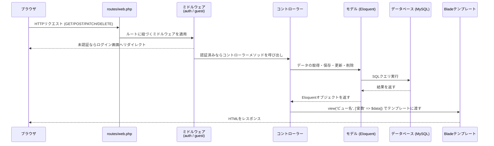
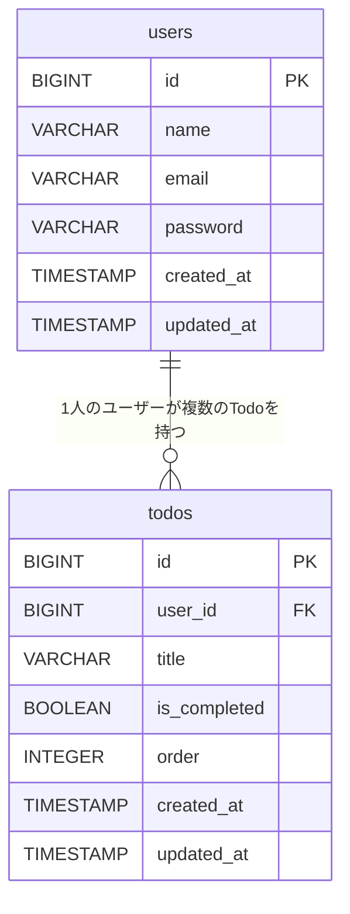
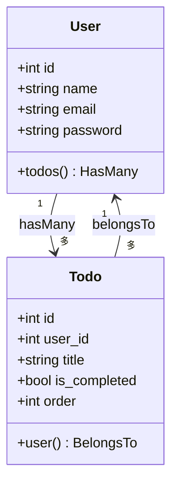
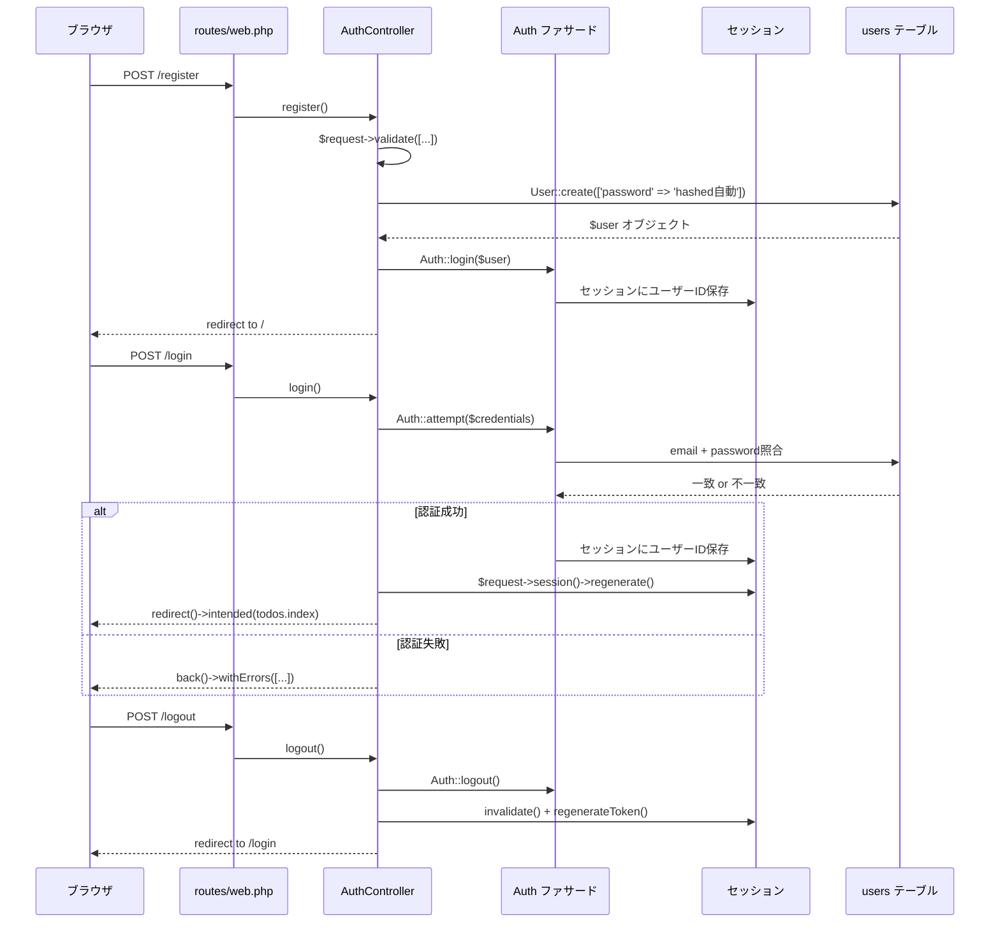
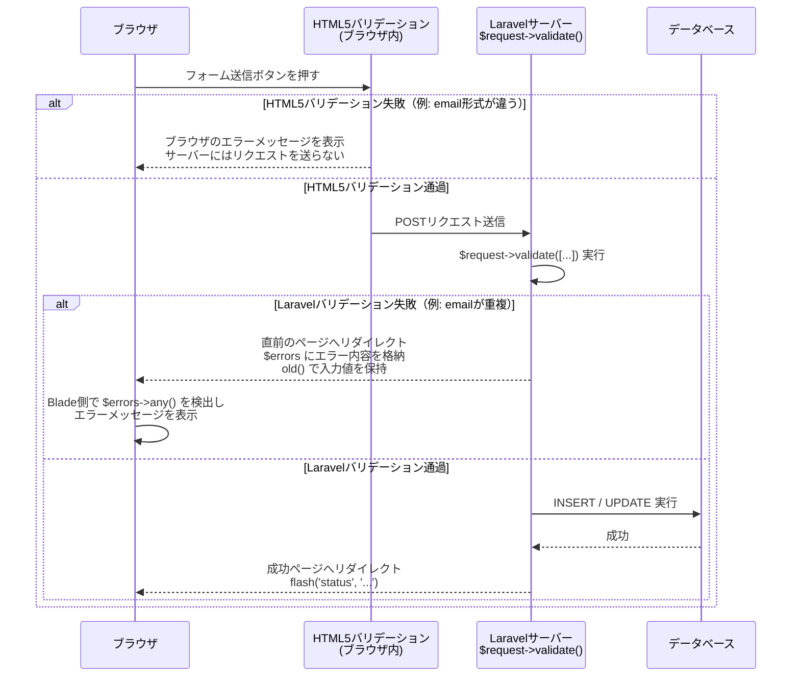
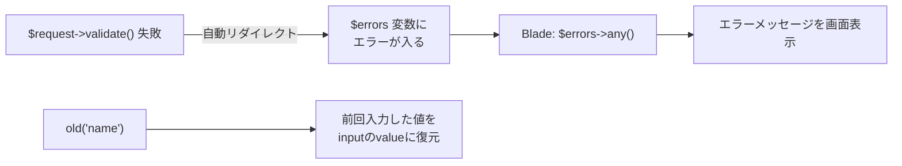
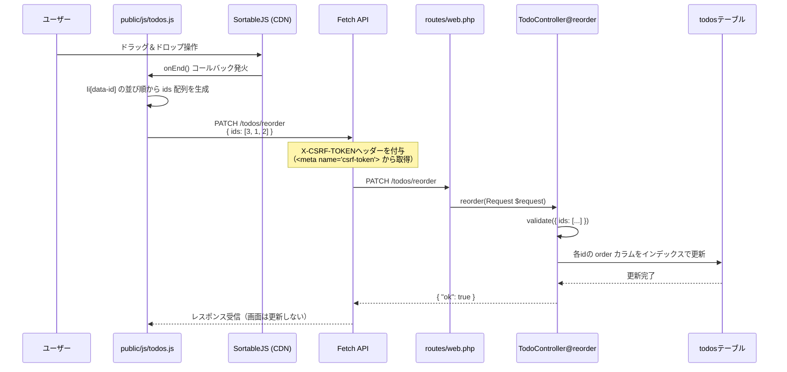
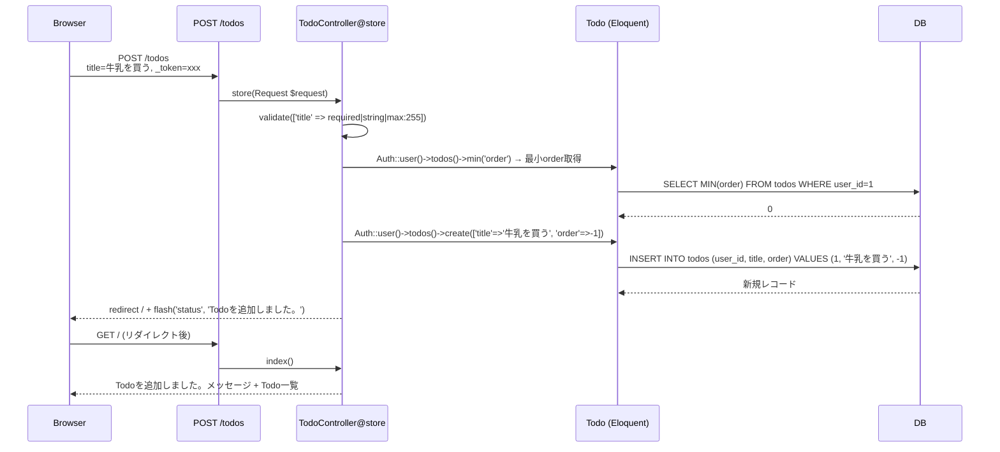
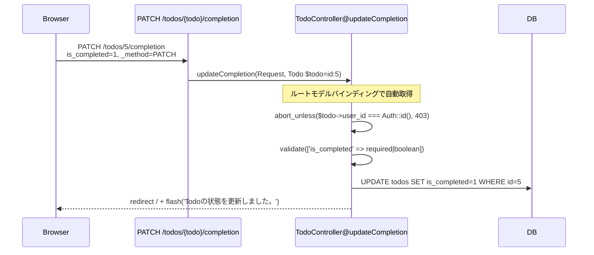
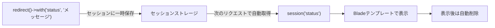

# Laravel Todo アプリ コード完全解説

> 対象リポジトリ: [chie-lab/Laravel-todo-app (feature/add-todo-app)](https://github.com/chie-lab/Laravel-todo-app/tree/feature/add-todo-app)

---

## 目次

1. [アプリケーション概要](#1-アプリケーション概要)
2. [ディレクトリ構成](#2-ディレクトリ構成)
3. [全体のリクエスト処理フロー](#3-全体のリクエスト処理フロー)
4. [データベース設計（マイグレーション）](#4-データベース設計マイグレーション)
5. [ルーティング](#5-ルーティング)
6. [モデル（Eloquent ORM）](#6-モデルeloquent-orm)
7. [コントローラー](#7-コントローラー)
8. [ビュー（Bladeテンプレート）](#8-ビューbladeテンプレート)
9. [認証の仕組み](#9-認証の仕組み)
10. [バリデーション](#10-バリデーション)
11. [ドラッグ＆ドロップ並び替え機能](#11-ドラッグドロップ並び替え機能)
12. [各機能のデータフロー詳細](#12-各機能のデータフロー詳細)

---

## 1. アプリケーション概要

このアプリはLaravelの学習用Todoアプリで、以下の機能を実装している。

| 機能                  | 説明                                              |
| --------------------- | ------------------------------------------------- |
| ユーザー登録          | 名前・メール・パスワードでアカウント作成          |
| ログイン / ログアウト | セッションベースの認証                            |
| Todo追加              | タイトルを入力して追加                            |
| Todo完了切り替え      | チェックボックスで完了 / 未完了をトグル           |
| Todo削除              | 削除ボタンで1件削除                               |
| 並び替え              | ドラッグ＆ドロップで表示順を変更（Fetch API経由） |
| ユーザー分離          | ログインユーザー自身のTodoのみ表示・操作可能      |

---

## 2. ディレクトリ構成

Laravelの標準ディレクトリ構成に沿って実装されている。

```
src/
├── app/
│   ├── Http/Controllers/
│   │   ├── Controller.php          # 基底コントローラー（Laravel標準）
│   │   ├── AuthController.php      # 認証（登録・ログイン・ログアウト）
│   │   └── TodoController.php      # Todo CRUD + 並び替え
│   ├── Models/
│   │   ├── User.php                # ユーザーモデル
│   │   └── Todo.php                # Todoモデル
│   └── Providers/
├── database/
│   └── migrations/
│       ├── 0001_01_01_000000_create_users_table.php
│       ├── 2026_05_06_000003_create_todos_table.php
│       ├── 2026_05_06_000004_add_is_completed_to_todos_table.php
│       ├── 2026_05_06_000005_add_order_to_todos_table.php
│       └── 2026_05_06_000006_add_user_id_to_todos_table.php
├── resources/
│   └── views/
│       ├── layouts/
│       │   └── app.blade.php       # 共通レイアウト
│       ├── auth/
│       │   ├── register.blade.php  # 新規登録画面
│       │   └── login.blade.php     # ログイン画面
│       └── todos/
│           ├── index.blade.php     # Todo一覧画面
│           └── partials/
│               ├── alerts.blade.php      # フラッシュメッセージ
│               ├── create-form.blade.php # Todo追加フォーム
│               └── todo-item.blade.php   # Todo1件分のHTML
├── routes/
│   └── web.php                     # URLルーティング定義
└── public/
    ├── css/todos.css
    └── js/todos.js                 # ドラッグ＆ドロップ処理
```

---

## 3. 全体のリクエスト処理フロー

Laravelは **MVC（Model-View-Controller）アーキテクチャ** を採用している。  
ブラウザからのリクエストは以下の順番で処理される。



**公式ドキュメント参照:**
- [ルーティング](https://laravel.com/docs/routing)
- [コントローラー](https://laravel.com/docs/controllers)
- [ビュー](https://laravel.com/docs/views)
- [Eloquent ORM](https://laravel.com/docs/eloquent)

---

## 4. データベース設計（マイグレーション）

### 4-1. マイグレーションとは

マイグレーションはデータベースの「設計書」をPHPコードで管理する仕組み。  
`php artisan migrate` を実行すると、マイグレーションファイルが順番に実行されてテーブルが作られる。

> 公式: [Database: Migrations](https://laravel.com/docs/migrations)

### 4-2. テーブル構成（最終形）

#### users テーブル（Laravel標準生成）

| カラム                  | 型               | 説明                       |
| ----------------------- | ---------------- | -------------------------- |
| id                      | BIGINT (PK)      | 主キー（自動採番）         |
| name                    | VARCHAR          | ユーザー名                 |
| email                   | VARCHAR (UNIQUE) | メールアドレス             |
| email_verified_at       | TIMESTAMP        | メール認証日時（未使用）   |
| password                | VARCHAR          | ハッシュ化されたパスワード |
| remember_token          | VARCHAR          | ログイン状態保持用トークン |
| created_at / updated_at | TIMESTAMP        | 自動管理タイムスタンプ     |

#### todos テーブル（段階的に追加）

| カラム                  | 型          | 説明                         | 追加されたマイグレーション        |
| ----------------------- | ----------- | ---------------------------- | --------------------------------- |
| id                      | BIGINT (PK) | 主キー                       | `create_todos_table`              |
| user_id                 | BIGINT (FK) | todos.users へ外部キー       | `add_user_id_to_todos_table`      |
| title                   | VARCHAR     | Todoのタイトル               | `create_todos_table`              |
| is_completed            | BOOLEAN     | 完了フラグ（default: false） | `add_is_completed_to_todos_table` |
| order                   | INTEGER     | 表示順（default: 0）         | `add_order_to_todos_table`        |
| created_at / updated_at | TIMESTAMP   | 自動管理タイムスタンプ       | `create_todos_table`              |

### 4-3. マイグレーションファイルの実際のコード

#### todos テーブルの作成

```php
// database/migrations/2026_05_06_000003_create_todos_table.php
Schema::create('todos', function (Blueprint $table) {
    $table->id();              // BIGINT AUTO_INCREMENT PRIMARY KEY
    $table->string('title');   // VARCHAR(255)
    $table->timestamps();      // created_at, updated_at を自動追加
});
```

#### user_id 外部キーの追加

```php
// database/migrations/2026_05_06_000006_add_user_id_to_todos_table.php
Schema::table('todos', function (Blueprint $table) {
    $table->foreignId('user_id')     // BIGINT NOT NULL
        ->after('id')                // id カラムの直後に配置
        ->constrained()              // users.id への外部キー制約を自動設定
        ->cascadeOnDelete();         // ユーザー削除時にTodoも削除
});
```

`foreignId('user_id')->constrained()` は、Laravelの規約に従って  
「`user_id` → `users` テーブルの `id`」への外部キー制約を **自動的に** 設定してくれる。



---

## 5. ルーティング

### 5-1. ルートの定義

> 公式: [Routing](https://laravel.com/docs/routing)

```php
// routes/web.php

// ゲスト専用（ログイン済みはアクセス不可）
Route::middleware('guest')->group(function () {
    Route::get('/register',  [AuthController::class, 'showRegister'])->name('register');
    Route::post('/register', [AuthController::class, 'register']);
    Route::get('/login',     [AuthController::class, 'showLogin'])->name('login');
    Route::post('/login',    [AuthController::class, 'login']);
});

// ログアウト（認証済みのみ）
Route::post('/logout', [AuthController::class, 'logout'])->name('logout')->middleware('auth');

// 認証済み専用
Route::middleware('auth')->group(function () {
    Route::get('/',                          [TodoController::class, 'index'])->name('todos.index');
    Route::post('/todos',                    [TodoController::class, 'store'])->name('todos.store');
    Route::patch('/todos/reorder',           [TodoController::class, 'reorder'])->name('todos.reorder');
    Route::patch('/todos/{todo}/completion', [TodoController::class, 'updateCompletion'])->name('todos.update-completion');
    Route::delete('/todos/{todo}',           [TodoController::class, 'destroy'])->name('todos.destroy');
});
```

### 5-2. ルート一覧

| メソッド | URL                        | コントローラー#メソッド         | 役割                   | ミドルウェア |
| -------- | -------------------------- | ------------------------------- | ---------------------- | ------------ |
| GET      | `/register`                | AuthController@showRegister     | 登録画面表示           | guest        |
| POST     | `/register`                | AuthController@register         | ユーザー登録処理       | guest        |
| GET      | `/login`                   | AuthController@showLogin        | ログイン画面表示       | guest        |
| POST     | `/login`                   | AuthController@login            | ログイン処理           | guest        |
| POST     | `/logout`                  | AuthController@logout           | ログアウト             | auth         |
| GET      | `/`                        | TodoController@index            | Todo一覧表示           | auth         |
| POST     | `/todos`                   | TodoController@store            | Todo追加               | auth         |
| PATCH    | `/todos/reorder`           | TodoController@reorder          | 並び順更新（JSON API） | auth         |
| PATCH    | `/todos/{todo}/completion` | TodoController@updateCompletion | 完了状態更新           | auth         |
| DELETE   | `/todos/{todo}`            | TodoController@destroy          | Todo削除               | auth         |

### 5-3. ミドルウェアによるアクセス制御

```mermaid
flowchart TD
    A[ブラウザからリクエスト] --> B{ルートのミドルウェア確認}
    B -->|middleware('auth')| C{ログイン済み?}
    B -->|middleware('guest')| D{未ログイン?}
    B -->|ミドルウェアなし| G[コントローラー実行]
    C -->|Yes| G
    C -->|No| E[/login へリダイレクト]
    D -->|Yes| G
    D -->|No| F[/todos.index へリダイレクト]
```

### 5-4. 名前付きルートと `route()` ヘルパー

`->name('todos.index')` で命名することで、ビューやコントローラーで  
`route('todos.index')` と書けばURLを直書きせずに済む。URLが変わっても一箇所を直すだけでよい。

```blade
{{-- Bladeテンプレートでの使用例 --}}
<form action="{{ route('todos.store') }}" method="POST">
```

```php
// コントローラーでの使用例
return redirect()->route('todos.index');
```

---

## 6. モデル（Eloquent ORM）

> 公式: [Eloquent: Getting Started](https://laravel.com/docs/eloquent)

### 6-1. Todo モデル

```php
// app/Models/Todo.php
class Todo extends Model
{
    use HasFactory;

    // 一括代入（mass assignment）を許可するカラム
    protected $fillable = [
        'user_id',
        'title',
        'is_completed',
        'order',
    ];

    // カラムの型キャスト（DB値をPHP型に自動変換）
    protected $casts = [
        'is_completed' => 'boolean',  // 0/1 → true/false に自動変換
    ];

    // リレーション: Todoは1人のUserに属する（BelongsTo）
    public function user(): BelongsTo
    {
        return $this->belongsTo(User::class);
    }
}
```

### 6-2. User モデル

```php
// app/Models/User.php

// PHP8.1アトリビュートで一括代入許可カラムを宣言（Laravel 11新記法）
#[Fillable(['name', 'email', 'password'])]
#[Hidden(['password', 'remember_token'])]
class User extends Authenticatable  // 認証対応のベースクラス
{
    use HasFactory, Notifiable;

    protected function casts(): array
    {
        return [
            'email_verified_at' => 'datetime',
            'password'          => 'hashed',  // 保存時に自動でbcryptハッシュ化
        ];
    }

    // リレーション: 1人のUserは複数のTodoを持つ（HasMany）
    public function todos(): HasMany
    {
        return $this->hasMany(Todo::class);
    }
}
```

### 6-3. リレーションの構造



### 6-4. リレーションを使ったクエリ

コントローラーでは `Auth::user()->todos()` でリレーションを経由して  
**ログイン中のユーザーのTodoだけ** を取得している。

```php
// TodoController@index より
$todos = Auth::user()->todos()
    ->orderBy('order')   // order カラムで昇順ソート
    ->get();             // Collectionとして全件取得
```

これは内部的に以下のSQLを発行する:

```sql
SELECT * FROM todos
WHERE user_id = [ログイン中のユーザーID]
ORDER BY order ASC;
```

---

## 7. コントローラー

> 公式: [Controllers](https://laravel.com/docs/controllers)

### 7-1. AuthController — 認証コントローラー

```php
// app/Http/Controllers/AuthController.php

class AuthController extends Controller
{
    // GET /register → 登録フォームを表示するだけ
    public function showRegister(): View
    {
        return view('auth.register');
    }

    // POST /register → バリデーション → User作成 → 自動ログイン → 一覧へ
    public function register(Request $request): RedirectResponse
    {
        $validated = $request->validate([
            'name'     => ['required', 'string', 'max:255'],
            'email'    => ['required', 'string', 'email', 'max:255', 'unique:users'],
            'password' => ['required', 'string', 'min:8', 'confirmed'],
        ]);

        $user = User::create([
            'name'     => $validated['name'],
            'email'    => $validated['email'],
            'password' => $validated['password'],  // casts設定でハッシュ化される
        ]);

        Auth::login($user);  // 登録直後に自動ログイン

        return redirect()->route('todos.index');
    }

    // POST /login → 認証 → セッション再生成 → 意図したページへ
    public function login(Request $request): RedirectResponse
    {
        $credentials = $request->validate([
            'email'    => ['required', 'string', 'email'],
            'password' => ['required', 'string'],
        ]);

        if (! Auth::attempt($credentials, $request->boolean('remember'))) {
            return back()
                ->withInput($request->only('email'))
                ->withErrors(['email' => 'メールアドレスまたはパスワードが正しくありません。']);
        }

        $request->session()->regenerate();  // セッション固定化攻撃を防ぐ

        return redirect()->intended(route('todos.index'));
    }

    // POST /logout → セッション破棄 → ログイン画面へ
    public function logout(Request $request): RedirectResponse
    {
        Auth::logout();
        $request->session()->invalidate();     // セッションデータ全削除
        $request->session()->regenerateToken(); // CSRFトークン再生成

        return redirect()->route('login');
    }
}
```

### 7-2. TodoController — Todo操作コントローラー

```php
// app/Http/Controllers/TodoController.php

class TodoController extends Controller
{
    // GET / → ログインユーザーのTodoを order 昇順で取得してビューに渡す
    public function index(): View
    {
        $todos = Auth::user()->todos()
            ->orderBy('order')
            ->get();

        return view('todos.index', ['todos' => $todos]);
    }

    // POST /todos → バリデーション → 先頭に追加（order最小値-1）
    public function store(Request $request): RedirectResponse
    {
        $validated = $request->validate([
            'title' => ['required', 'string', 'max:255'],
        ]);

        $minOrder = Auth::user()->todos()->min('order') ?? 1;
        Auth::user()->todos()->create(array_merge($validated, ['order' => $minOrder - 1]));

        return redirect()->route('todos.index')->with('status', 'Todoを追加しました。');
    }

    // PATCH /todos/{todo}/completion → 認可チェック → 完了状態を更新
    public function updateCompletion(Request $request, Todo $todo): RedirectResponse
    {
        abort_unless($todo->user_id === Auth::id(), 403);  // 他人のTodoを操作させない

        $validated = $request->validate([
            'is_completed' => ['required', 'boolean'],
        ]);

        $todo->update($validated);

        return redirect()->route('todos.index')->with('status', 'Todoの状態を更新しました。');
    }

    // DELETE /todos/{todo} → 認可チェック → 削除
    public function destroy(Todo $todo): RedirectResponse
    {
        abort_unless($todo->user_id === Auth::id(), 403);

        $todo->delete();

        return redirect()->route('todos.index')->with('status', 'Todoを削除しました。');
    }

    // PATCH /todos/reorder → 並び順をまとめて更新（JSON API）
    public function reorder(Request $request): JsonResponse
    {
        $validated = $request->validate([
            'ids'   => ['required', 'array'],
            'ids.*' => ['required', 'integer', 'exists:todos,id'],
        ]);

        $userTodoIds = Auth::user()->todos()->pluck('id')->all();

        foreach ($validated['ids'] as $order => $id) {
            if (in_array($id, $userTodoIds, true)) {  // 自分のTodoのみ更新
                Todo::query()->where('id', $id)->update(['order' => $order]);
            }
        }

        return response()->json(['ok' => true]);
    }
}
```

### 7-3. ルートモデルバインディング（Route Model Binding）

> 公式: [Route Model Binding](https://laravel.com/docs/routing#route-model-binding)

`/todos/{todo}` のルートに対して、コントローラーのメソッド引数に `Todo $todo` と書くだけで、  
Laravelが自動的に `todos.id = {todo}` でDBを検索してオブジェクトを注入してくれる。

```php
// ルート定義
Route::delete('/todos/{todo}', [TodoController::class, 'destroy']);

// コントローラー側は $todo が自動的にTodoモデルのインスタンスになっている
public function destroy(Todo $todo): RedirectResponse
{
    // $todo はすでにDBから取得済みのオブジェクト
    $todo->delete();
}
```

---

## 8. ビュー（Bladeテンプレート）

> 公式: [Blade Templates](https://laravel.com/docs/blade)

### 8-1. テンプレート継承（@extends / @section / @yield）

Bladeはテンプレートの **継承** 機能を持つ。  
共通レイアウトを1つ定義しておき、各ページはその枠を埋める形で書く。

```blade
{{-- layouts/app.blade.php（親レイアウト） --}}
<!DOCTYPE html>
<html lang="{{ str_replace('_', '-', app()->getLocale()) }}">
<head>
    <meta name="csrf-token" content="{{ csrf_token() }}">  {{-- CSRFトークンをメタタグに埋め込む --}}
    <title>@yield('title', 'Todo App')</title>             {{-- 子ページでタイトルを上書き可能 --}}
</head>
<body>
    @auth                                                   {{-- ログイン済みの場合のみ表示 --}}
        <header>
            <span>{{ Auth::user()->name }}</span>
            <form action="{{ route('logout') }}" method="POST">
                @csrf
                <button type="submit">ログアウト</button>
            </form>
        </header>
    @endauth
    @yield('content')   {{-- 各ページのコンテンツが挿入される場所 --}}
</body>
</html>
```

```blade
{{-- todos/index.blade.php（子ページ） --}}
@extends('layouts.app')       {{-- 親レイアウトを継承 --}}

@section('title', 'Todo App') {{-- 親の @yield('title') を埋める --}}

@section('content')           {{-- 親の @yield('content') を埋める --}}
    ...
@endsection
```

### 8-2. コンポーネント分割（@include）

ページの一部を別ファイルに切り出して `@include` で読み込む。

```blade
{{-- todos/index.blade.php --}}
@include('todos.partials.alerts')       {{-- フラッシュメッセージ --}}
@include('todos.partials.create-form') {{-- 追加フォーム --}}

@foreach ($todos as $todo)
    @include('todos.partials.todo-item', ['todo' => $todo])  {{-- 変数を渡せる --}}
@endforeach
```

### 8-3. 主なBlade構文まとめ

| 構文                      | 用途                             | 使用箇所                     |
| ------------------------- | -------------------------------- | ---------------------------- |
| `{{ $var }}`              | 変数の出力（XSSエスケープあり）  | `{{ $todo->title }}`         |
| `@if / @else / @endif`    | 条件分岐                         | `@if ($todos->isEmpty())`    |
| `@foreach / @endforeach`  | ループ                           | `@foreach ($todos as $todo)` |
| `@auth / @endauth`        | ログイン済み判定                 | ヘッダーのユーザー名表示     |
| `@csrf`                   | CSRFトークンhidden入力を生成     | すべてのPOSTフォーム         |
| `@method('PATCH')`        | PATCHメソッドのスプーフィング    | 完了切り替えフォーム         |
| `@method('DELETE')`       | DELETEメソッドのスプーフィング   | 削除フォーム                 |
| `@checked($bool)`         | checked属性の条件付き出力        | チェックボックス             |
| `@extends`                | レイアウト継承                   | 各ページ                     |
| `@section / @endsection`  | セクション定義                   | 各ページ                     |
| `@yield('name')`          | セクション挿入箇所の指定         | レイアウト                   |
| `@include('view', $data)` | 部分ビューの読み込み             | index.blade.php              |
| `@stack('scripts')`       | スタックされたスクリプトを出力   | layouts/app.blade.php        |
| `session('status')`       | フラッシュメッセージの取得       | alerts.blade.php             |
| `old('name')`             | バリデーション失敗時の入力値保持 | フォーム input の value      |

### 8-4. HTTPメソッドスプーフィング

HTMLフォームは `GET` と `POST` しか送れない。  
LaravelはPATCH・DELETEを使うために `@method('PATCH')` / `@method('DELETE')` を用意している。

```blade
{{-- todos/partials/todo-item.blade.php --}}
<form action="{{ route('todos.update-completion', $todo) }}" method="POST">
    @csrf
    @method('PATCH')   {{-- <input type="hidden" name="_method" value="PATCH"> が生成される --}}
    <input type="hidden" name="is_completed" value="0">
    <input type="checkbox" name="is_completed" value="1"
           @checked($todo->is_completed)
           onchange="this.form.submit()">
</form>

<form action="{{ route('todos.destroy', $todo) }}" method="POST">
    @csrf
    @method('DELETE')
    <button type="submit">削除</button>
</form>
```

---

## 9. 認証の仕組み

> 公式: [Authentication](https://laravel.com/docs/authentication)

### 9-1. 認証フロー（登録〜ログイン〜ログアウト）



### 9-2. Auth ファサードの主な使い方

| コード                        | 意味                             |
| ----------------------------- | -------------------------------- |
| `Auth::user()`                | ログイン中のUserモデルを取得     |
| `Auth::id()`                  | ログイン中のユーザーIDを取得     |
| `Auth::login($user)`          | 指定ユーザーをログイン状態にする |
| `Auth::attempt($credentials)` | メール・パスワードで認証試行     |
| `Auth::logout()`              | ログアウト                       |

### 9-3. 認可（Authorization） — abort_unless

他のユーザーのTodoを操作されないよう、コントローラーで明示的にチェックしている。

```php
// TodoController@updateCompletion / destroy
abort_unless($todo->user_id === Auth::id(), 403);
// 条件が false（他人のTodo）なら 403 Forbidden を返す
```

> 公式: [Authorization](https://laravel.com/docs/authorization)

---

## 10. バリデーション

> 公式: [Validation](https://laravel.com/docs/validation)

このアプリのバリデーションは **フロントエンド（HTML5）** と **サーバーサイド（Laravel）** の2段階で行われている。

### 10-1. バリデーションの記載場所

#### フロントエンドバリデーション（HTML5属性）

**記載場所: `resources/views/` 以下のBladeファイル**

ブラウザが送信前に自動チェックする。JavaScriptは不要。

| ファイル                               | フィールド            | HTML属性                       | 意味                               |
| -------------------------------------- | --------------------- | ------------------------------ | ---------------------------------- |
| `auth/register.blade.php`              | name                  | `type="text"` + `required`     | 空欄不可                           |
| `auth/register.blade.php`              | email                 | `type="email"` + `required`    | メール形式チェック＋空欄不可       |
| `auth/register.blade.php`              | password              | `type="password"` + `required` | 空欄不可                           |
| `auth/register.blade.php`              | password_confirmation | `type="password"` + `required` | 空欄不可                           |
| `auth/login.blade.php`                 | email                 | `type="email"` + `required`    | メール形式チェック＋空欄不可       |
| `auth/login.blade.php`                 | password              | `type="password"` + `required` | 空欄不可                           |
| `todos/partials/create-form.blade.php` | title                 | `maxlength="255"` のみ         | 255文字制限のみ（`required` なし） |

#### サーバーサイドバリデーション（Laravel）

**記載場所: `app/Http/Controllers/` 以下のコントローラー**

```php
// AuthController@register
$request->validate([
    'name'     => ['required', 'string', 'max:255'],
    'email'    => ['required', 'string', 'email', 'max:255', 'unique:users'],  // users.emailに重複不可
    'password' => ['required', 'string', 'min:8', 'confirmed'],               // password_confirmationと一致確認
]);

// AuthController@login
$request->validate([
    'email'    => ['required', 'string', 'email'],
    'password' => ['required', 'string'],
]);

// TodoController@store
$request->validate([
    'title' => ['required', 'string', 'max:255'],
]);

// TodoController@updateCompletion
$request->validate([
    'is_completed' => ['required', 'boolean'],
]);

// TodoController@reorder
$request->validate([
    'ids'   => ['required', 'array'],
    'ids.*' => ['required', 'integer', 'exists:todos,id'],  // todosテーブルに存在するidのみ許可
]);
```

### 10-2. 処理の流れ（2段階バリデーション）



### 10-3. 重要なポイント

#### フロントのバリデーションは「迂回できる」

HTML5の `required` や `type="email"` はブラウザが行うチェックなので、開発者ツールやcurlで直接POSTすればスキップできてしまう。

```bash
# required をスキップしてPOSTできる例
curl -X POST http://localhost:8080/todos -d "title="
```

そのため**サーバーサイドバリデーションが本当のセキュリティライン**になる。フロントのバリデーションはあくまでUX向上（送信前に即座にフィードバック）が目的。

#### `create-form.blade.php` には `required` がない

```blade
{{-- フロントには required がない --}}
<input type="text" name="title" maxlength="255">
```

```php
// サーバー側では required を設定している
$request->validate(['title' => ['required', ...]]);
```

`title` の入力欄はHTMLに `required` がないため空欄のまま送信ボタンを押せてしまうが、サーバー側で `required` チェックがあるため最終的には弾かれる。フロントのチェックが甘い実装といえる。

#### `unique:users` はサーバーサイドでしか判定できない

DBに同じメールアドレスが既に存在するかどうかはブラウザ側では確認できない。

```php
'email' => ['unique:users'] // DBのusersテーブルにないことを確認
```

### 10-4. バリデーション失敗時のエラー表示

バリデーション失敗 → **自動的に前のページへリダイレクト**  
エラーメッセージは `$errors` 変数としてBladeテンプレートで受け取れる。

```blade
{{-- todos/partials/alerts.blade.php --}}
@if ($errors->any())
    <div class="alert alert-error">
        <ul>
            @foreach ($errors->all() as $error)
                <li>{{ $error }}</li>
            @endforeach
        </ul>
    </div>
@endif
```



### 10-5. 入力値の保持（old()）

バリデーション失敗後に入力値をフォームに残す。

```blade
<input type="text" name="title" value="{{ old('title') }}">
```

---

## 11. ドラッグ＆ドロップ並び替え機能

この機能だけは **Fetch API（非同期通信）** を使っており、ページ遷移なしで動作する。

### 11-1. 処理の流れ



### 11-2. フロントエンド実装

```javascript
// public/js/todos.js
const list = document.getElementById('todo-list');

if (list) {
    Sortable.create(list, {
        animation: 150,
        handle: '.drag-handle',      // ⠿ アイコンがドラッグハンドル
        ghostClass: 'todo-item-ghost',
        onEnd() {
            // 現在の並び順からidの配列を生成
            const ids = Array.from(list.querySelectorAll('.todo-item'))
                .map((el) => parseInt(el.dataset.id, 10));

            // LaravelのAPIエンドポイントにPATCHリクエスト
            fetch(list.dataset.reorderUrl, {  // data-reorder-url="{{ route('todos.reorder') }}"
                method: 'PATCH',
                headers: {
                    'Content-Type': 'application/json',
                    'X-CSRF-TOKEN': document.querySelector('meta[name="csrf-token"]').content,
                },
                body: JSON.stringify({ ids }),
            });
        },
    });
}
```

### 11-3. HTMLとのデータ連携

```blade
{{-- todos/index.blade.php --}}
{{-- reorder APIのURLをHTMLに埋め込んでJSから参照 --}}
<ul id="todo-list" data-reorder-url="{{ route('todos.reorder') }}">

{{-- todos/partials/todo-item.blade.php --}}
{{-- Todoのidをdata属性に持たせてJSから取得 --}}
<li class="todo-item" data-id="{{ $todo->id }}">
    <span class="drag-handle" aria-hidden="true">⠿</span>
```

### 11-4. CSRFトークンのSPA対応

Fetch APIからPATCHリクエストを送る場合もCSRF検証が必要。  
ヘッダーに `X-CSRF-TOKEN` を付与することでLaravelが正規リクエストと判断する。

```html
{{-- layouts/app.blade.php --}}
<meta name="csrf-token" content="{{ csrf_token() }}">
```

```javascript
headers: {
    'X-CSRF-TOKEN': document.querySelector('meta[name="csrf-token"]').content,
}
```

---

## 12. 各機能のデータフロー詳細

### 12-1. Todo追加フロー



### 12-2. 完了状態切り替えフロー



### 12-3. セッション・フラッシュメッセージの仕組み



`with('status', '...')` でリダイレクト先のレスポンスまでの間だけセッションにデータを保持する（フラッシュデータ）。  
Bladeでは `session('status')` で取り出すと同時に削除される。

---

## まとめ：Laravelの機能活用一覧

| Laravel機能                    | 使用箇所                                                | 公式ドキュメント                                                                  |
| ------------------------------ | ------------------------------------------------------- | --------------------------------------------------------------------------------- |
| **ルーティング**               | `routes/web.php`                                        | [Routing](https://laravel.com/docs/routing)                                       |
| **ミドルウェア**               | `middleware('auth')`, `middleware('guest')`             | [Middleware](https://laravel.com/docs/middleware)                                 |
| **コントローラー**             | `AuthController`, `TodoController`                      | [Controllers](https://laravel.com/docs/controllers)                               |
| **Eloquent ORM**               | `Todo::create()`, `$user->todos()->get()`               | [Eloquent](https://laravel.com/docs/eloquent)                                     |
| **リレーション**               | `hasMany`, `belongsTo`                                  | [Eloquent Relationships](https://laravel.com/docs/eloquent-relationships)         |
| **マイグレーション**           | `database/migrations/`                                  | [Migrations](https://laravel.com/docs/migrations)                                 |
| **ルートモデルバインディング** | `destroy(Todo $todo)`                                   | [Route Model Binding](https://laravel.com/docs/routing#route-model-binding)       |
| **リクエストバリデーション**   | `$request->validate([...])`                             | [Validation](https://laravel.com/docs/validation)                                 |
| **認証 (Auth)**                | `Auth::attempt()`, `Auth::login()`                      | [Authentication](https://laravel.com/docs/authentication)                         |
| **認可**                       | `abort_unless(...)`                                     | [Authorization](https://laravel.com/docs/authorization)                           |
| **Bladeテンプレート**          | `resources/views/**/*.blade.php`                        | [Blade Templates](https://laravel.com/docs/blade)                                 |
| **名前付きルート**             | `route('todos.index')`                                  | [Named Routes](https://laravel.com/docs/routing#named-routes)                     |
| **リダイレクト**               | `redirect()->route()`                                   | [Redirects](https://laravel.com/docs/responses#redirects)                         |
| **フラッシュメッセージ**       | `->with('status', '...')`                               | [Flash Data](https://laravel.com/docs/session#flash-data)                         |
| **CSRFトークン**               | `@csrf`, `X-CSRF-TOKEN` ヘッダー                        | [CSRF Protection](https://laravel.com/docs/csrf)                                  |
| **キャスト (Casts)**           | `'is_completed' => 'boolean'`, `'password' => 'hashed'` | [Attribute Casting](https://laravel.com/docs/eloquent-mutators#attribute-casting) |
| **Mass Assignment**            | `$fillable`, `#[Fillable]`                              | [Mass Assignment](https://laravel.com/docs/eloquent#mass-assignment)              |
| **JSON レスポンス**            | `response()->json([...])`                               | [JSON Responses](https://laravel.com/docs/responses#json-responses)               |
