# 一日の生活サイクル

## ガントチャート（春・秋）起床 06:30

```mermaid
gantt
    title 一日の生活サイクル［春・秋］
    dateFormat HH:mm
    axisFormat %H:%M
    tickInterval 1hour

    section 朝
    軸調整            :done, 05:00, 1m
    起床・微妙な二度寝                :06:30, 30m
    自由時間             :crit, 07:00, 1h
    野菜ジュース飲む     :08:00, 1m
    弁当用意     :08:00, 30m

    section 仕事
    通勤             :08:30, 30m
    午前の作業        :09:00, 3h
    昼食・休憩        :12:00, 1h
    午後の作業        :13:00, 5h
    帰宅             :18:00, 30m

    section 夜
    風呂掃除        :18:30, 5m
    湯船貯める        :18:35, 20m
    R-1飲む        :18:35, 1m
    弁当洗う        :18:36, 10m
    夕食の下準備        :18:46, 9m
    入浴・動画視聴        :18:55, 20m
    ストレッチ        :19:15, 10m
    夕食準備        :19:25, 10m
    夕食・動画視聴        :19:35, 20m
    洗い物・家事        :19:55, 30m
    自由時間          :crit, 20:25, 155m
    就寝準備          :23:00, 30m
    軸調整終          :done, 23:59, 1m
```

> **睡眠:** 23:30 〜 翌06:30（7時間）  
> **自由時間合計:** 朝1h + 夜2h35m = **3時間35分**

## ガントチャート（夏）起床 05:30

```mermaid
gantt
    title 一日の生活サイクル［夏］
    dateFormat HH:mm
    axisFormat %H:%M
    tickInterval 1hour

    section 朝
    軸調整            :done, 05:00, 1m
    起床・微妙な二度寝                :05:30, 30m
    自由時間             :crit, 06:00, 2h
    野菜ジュース飲む     :08:00, 1m
    弁当用意     :08:00, 30m

    section 仕事
    通勤             :08:30, 30m
    午前の作業        :09:00, 3h
    昼食・休憩        :12:00, 1h
    午後の作業        :13:00, 5h
    帰宅             :18:00, 30m

    section 夜
    風呂掃除        :18:30, 5m
    湯槽貯める        :18:35, 20m
    R-1飲む        :18:35, 1m
    弁当洗う        :18:36, 10m
    夕食の下準備        :18:46, 9m
    入浴・動画視聴        :18:55, 20m
    ストレッチ        :19:15, 10m
    夕食準備        :19:25, 10m
    夕食・動画視聴        :19:35, 20m
    洗い物・家事        :19:55, 30m
    自由時間          :crit, 20:25, 95m
    就寝準備          :22:00, 30m
    軸調整終          :done, 23:59, 1m
```

> **睡眠:** 22:30 〜 翌05:30（7時間）  
> **自由時間合計:** 朝2h + 夜1h35m = **3時間35分**

## ガントチャート（冬）起床 07:00

```mermaid
gantt
    title 一日の生活サイクル［冬］
    dateFormat HH:mm
    axisFormat %H:%M
    tickInterval 1hour

    section 朝
    軸調整            :done, 05:00, 1m
    起床・微妙な二度寝                :07:00, 30m
    自由時間             :crit, 07:30, 30m
    野菜ジュース飲む     :08:00, 1m
    弁当用意     :08:00, 30m

    section 仕事
    通勤             :08:30, 30m
    午前の作業        :09:00, 3h
    昼食・休憩        :12:00, 1h
    午後の作業        :13:00, 5h
    帰宅             :18:00, 30m

    section 夜
    風呂掃除        :18:30, 5m
    湯槽貯める        :18:35, 20m
    R-1飲む        :18:35, 1m
    弁当洗う        :18:36, 10m
    夕食の下準備        :18:46, 9m
    入浴・動画視聴        :18:55, 20m
    ストレッチ        :19:15, 10m
    夕食準備        :19:25, 10m
    夕食・動画視聴        :19:35, 20m
    洗い物・家事        :19:55, 30m
    自由時間          :crit, 20:25, 185m
    就寝準備          :23:30, 29m
    軸調整終          :done, 23:59, 1m
```

> **睡眠:** 00:00 〜 翌07:00（7時間）  
> **自由時間合計:** 朝30m + 夜3h5m = **3時間35分**

## 時間ブロック一覧

| 時間         | 活動               | 所要時間 | 季節による変動                |
| ------------ | ------------------ | -------- | ----------------------------- |
| 05:00        | （軸調整）         | -        | 共通                          |
| 05:30〜07:00 | 起床・微妙な二度寝 | 30分     | 夏05:30 / 春秋06:30 / 冬07:00 |
| 起床後       | 自由時間（朝）     | 可変     | 夏2h / 春秋1h / 冬30m         |
| 08:00        | 野菜ジュース飲む   | 1分      | 共通                          |
| 08:00        | 弁当用意           | 30分     | 共通                          |
| 08:30        | 通勤               | 30分     | 共通                          |
| 09:00        | 午前の作業         | 3時間    | 共通                          |
| 12:00        | 昼食・休憩         | 1時間    | 共通                          |
| 13:00        | 午後の作業         | 5時間    | 共通                          |
| 18:00        | 帰宅               | 30分     | 共通                          |
| 18:30        | 風呂掃除           | 5分      | 共通                          |
| 18:35        | 湯船貯める         | 20分     | 共通                          |
| 18:35        | R-1飲む            | 1分      | 共通                          |
| 18:36        | 弁当洗う           | 10分     | 共通                          |
| 18:46        | 夕食の下準備       | 9分      | 共通                          |
| 18:55        | 入浴・動画視聴     | 20分     | 共通                          |
| 19:15        | ストレッチ         | 10分     | 共通                          |
| 19:25        | 夕食準備           | 10分     | 共通                          |
| 19:35        | 夕食・動画視聴     | 20分     | 共通                          |
| 19:55        | 洗い物・家事       | 30分     | 共通                          |
| 20:25        | 自由時間（夜）     | 可変     | 夏95m / 春秋155m / 冬185m     |
| 22:00〜23:30 | 就寝準備           | 30分     | 夏22:00 / 春秋23:00 / 冬23:30 |
| 22:30〜00:00 | 睡眠               | 7時間    | 夏22:30 / 春秋23:30 / 冬00:00 |
