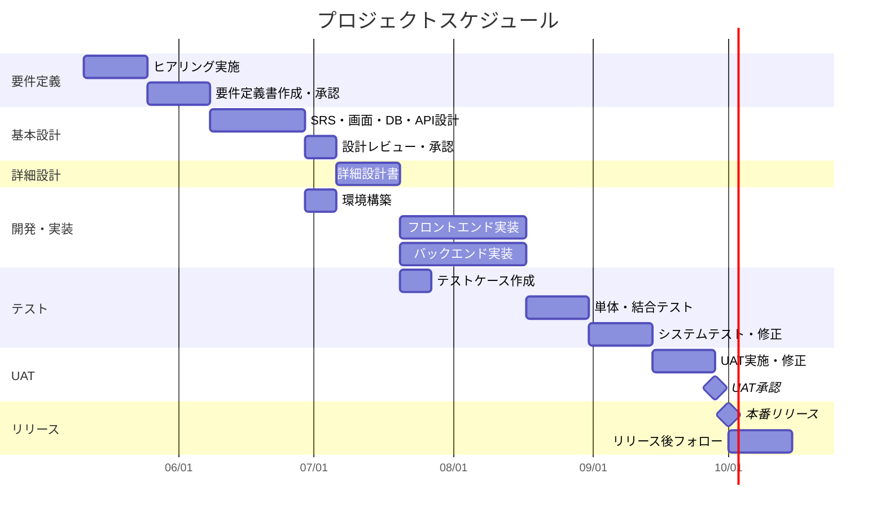

# プロジェクト計画書 / WBS

> **位置づけ：** プロジェクト全体のスコープ・スケジュール・体制・マイルストーンを定義する文書。キックオフ前に作成し、プロジェクト終了まで最新の状態を維持する。

---

## ドキュメント情報

| 項目               | 内容       |
| ------------------ | ---------- |
| **プロジェクト名** |            |
| **文書バージョン** | v1.0       |
| **作成日**         | YYYY-MM-DD |
| **最終更新日**     | YYYY-MM-DD |
| **作成者**         |            |
| **承認者**         |            |

---

## 1. プロジェクト基本情報

| 項目                 | 内容                                           |
| -------------------- | ---------------------------------------------- |
| **目的・概要**       |                                                |
| **本番稼働目標日**   | YYYY-MM-DD                                     |
| **プロジェクト期間** | YYYY-MM-DD 〜 YYYY-MM-DD                       |
| **予算上限**         | 〇〇円（税込）                                 |
| **開発方式**         | ウォーターフォール / アジャイル / ハイブリッド |
| **関連文書**         | 要件定義書 v〇〇 / SRS v〇〇                   |

---

## 2. プロジェクト体制

| 役割                           | 氏名 | 所属 | 責任範囲                           |
| ------------------------------ | ---- | ---- | ---------------------------------- |
| プロジェクトオーナー           |      |      | 最終意思決定・予算承認             |
| PM（プロジェクトマネージャー） |      |      | 全体進行管理・ステークホルダー調整 |
| 業務リーダー（発注者側）       |      |      | 要件合意・UAT実施                  |
| 技術リーダー                   |      |      | 設計・開発の技術判断               |
| 開発担当                       |      |      | 設計・実装・単体テスト             |
| テスト担当                     |      |      | テスト設計・実施                   |
| インフラ担当                   |      |      | 環境構築・運用設計                 |

---

## 3. マイルストーン

| #   | マイルストーン             | 目標日     | 完了条件                                                | 状況    |
| --- | -------------------------- | ---------- | ------------------------------------------------------- | ------- |
| M1  | 要件定義完了・承認         | YYYY-MM-DD | 要件定義書がステークホルダー承認済みであること          | 未 / 済 |
| M2  | 基本設計完了・レビュー合格 | YYYY-MM-DD | レビューチェックリストの全指摘が解消済みであること      | 未 / 済 |
| M3  | 開発完了・内部テスト合格   | YYYY-MM-DD | 必須機能の全テストケースがPASSであること                | 未 / 済 |
| M4  | UAT開始                    | YYYY-MM-DD | テスト環境が準備完了し、UATシナリオが合意済みであること | 未 / 済 |
| M5  | UAT完了・本番リリース承認  | YYYY-MM-DD | 未解決の重大バグが0件であること                         | 未 / 済 |
| M6  | 本番リリース               | YYYY-MM-DD |                                                         | 未 / 済 |

---

## 4. WBS（Work Breakdown Structure）

<!-- 工数の単位は「人日」（1人が1日フルで作業する量）。 -->
<!-- 進捗は週次定例で更新する。 -->

| WBS#  | フェーズ / タスク                 | 担当者 | 開始日 | 終了日 | 工数（人日） | 進捗 | 備考 |
| ----- | --------------------------------- | ------ | ------ | ------ | ------------ | ---- | ---- |
| **1** | **要件定義**                      |        | MM-DD  | MM-DD  |              |      |      |
| 1.1   | ヒアリング実施（第1回〜第〇回）   |        | MM-DD  | MM-DD  |              | 0%   |      |
| 1.2   | 要件定義書 初版作成               |        | MM-DD  | MM-DD  |              | 0%   |      |
| 1.3   | 要件定義書 レビュー・修正         |        | MM-DD  | MM-DD  |              | 0%   |      |
| 1.4   | 要件定義書 承認取得               |        | MM-DD  | MM-DD  |              | 0%   |      |
| **2** | **基本設計**                      |        | MM-DD  | MM-DD  |              |      |      |
| 2.1   | SRS（ソフトウェア要件仕様書）作成 |        | MM-DD  | MM-DD  |              | 0%   |      |
| 2.2   | 画面設計・UI設計                  |        | MM-DD  | MM-DD  |              | 0%   |      |
| 2.3   | DB設計（ER図・テーブル定義）      |        | MM-DD  | MM-DD  |              | 0%   |      |
| 2.4   | API設計                           |        | MM-DD  | MM-DD  |              | 0%   |      |
| 2.5   | インフラ・ネットワーク設計        |        | MM-DD  | MM-DD  |              | 0%   |      |
| 2.6   | 基本設計レビュー・承認            |        | MM-DD  | MM-DD  |              | 0%   |      |
| **3** | **詳細設計**                      |        | MM-DD  | MM-DD  |              |      |      |
| 3.1   | 詳細設計書作成                    |        | MM-DD  | MM-DD  |              | 0%   |      |
| 3.2   | 詳細設計レビュー                  |        | MM-DD  | MM-DD  |              | 0%   |      |
| **4** | **開発・実装**                    |        | MM-DD  | MM-DD  |              |      |      |
| 4.1   | 環境構築（開発・ステージング）    |        | MM-DD  | MM-DD  |              | 0%   |      |
| 4.2   | フロントエンド実装                |        | MM-DD  | MM-DD  |              | 0%   |      |
| 4.3   | バックエンド実装                  |        | MM-DD  | MM-DD  |              | 0%   |      |
| 4.4   | DB構築・マイグレーション          |        | MM-DD  | MM-DD  |              | 0%   |      |
| 4.5   | 外部システム連携実装              |        | MM-DD  | MM-DD  |              | 0%   |      |
| **5** | **テスト**                        |        | MM-DD  | MM-DD  |              |      |      |
| 5.1   | テストケース作成                  |        | MM-DD  | MM-DD  |              | 0%   |      |
| 5.2   | 単体テスト                        |        | MM-DD  | MM-DD  |              | 0%   |      |
| 5.3   | 結合テスト                        |        | MM-DD  | MM-DD  |              | 0%   |      |
| 5.4   | システムテスト                    |        | MM-DD  | MM-DD  |              | 0%   |      |
| 5.5   | 不具合修正                        |        | MM-DD  | MM-DD  |              | 0%   |      |
| **6** | **UAT（受入テスト）**             |        | MM-DD  | MM-DD  |              |      |      |
| 6.1   | UAT環境準備・データ投入           |        | MM-DD  | MM-DD  |              | 0%   |      |
| 6.2   | UATシナリオ合意                   |        | MM-DD  | MM-DD  |              | 0%   |      |
| 6.3   | UAT実施（ユーザー）               |        | MM-DD  | MM-DD  |              | 0%   |      |
| 6.4   | UAT不具合修正・再テスト           |        | MM-DD  | MM-DD  |              | 0%   |      |
| 6.5   | UAT完了承認取得                   |        | MM-DD  | MM-DD  |              | 0%   |      |
| **7** | **リリース・移行**                |        | MM-DD  | MM-DD  |              |      |      |
| 7.1   | 本番環境構築                      |        | MM-DD  | MM-DD  |              | 0%   |      |
| 7.2   | データ移行リハーサル              |        | MM-DD  | MM-DD  |              | 0%   |      |
| 7.3   | 操作マニュアル作成                |        | MM-DD  | MM-DD  |              | 0%   |      |
| 7.4   | ユーザー研修                      |        | MM-DD  | MM-DD  |              | 0%   |      |
| 7.5   | 本番リリース・切り替え            |        | MM-DD  | MM-DD  |              | 0%   |      |
| 7.6   | リリース後フォロー（〇週間）      |        | MM-DD  | MM-DD  |              | 0%   |      |

**工数合計：**　〇〇 人日

---

## 5. ガントチャート

<!-- 日付・フェーズを実際のプロジェクトに合わせて書き換える。 -->

---

## 6. リスク管理

| #   | リスク内容                         | 影響度       | 発生確率     | 対応策                             | 担当 |
| --- | ---------------------------------- | ------------ | ------------ | ---------------------------------- | ---- |
| 1   | 要件の追加・変更によるスコープ拡大 | 高           | 高           | 変更要求票による変更管理を徹底する | PM   |
| 2   |                                    | 高 / 中 / 低 | 高 / 中 / 低 |                                    |      |
| 3   |                                    |              |              |                                    |      |

---

## 7. コミュニケーション計画

| 会議名                   | 頻度                  | 参加者                     | 目的                 | 成果物                 |
| ------------------------ | --------------------- | -------------------------- | -------------------- | ---------------------- |
| 定例進捗会議             | 週次（〇曜日 〇〇時） | PM・開発リーダー・業務担当 | 進捗確認・課題共有   | 議事録                 |
| ステークホルダーレビュー | マイルストーンごと    | PO・PM・関係者全員         | 成果物承認・方針決定 | 議事録・承認済み成果物 |
| 不具合・課題対応MTG      | 随時                  | 関係者                     | 重要課題の即時対応   | 議事録                 |

---

## 8. 変更管理方針

| 項目                                     | 内容                                            |
| ---------------------------------------- | ----------------------------------------------- |
| 変更の申請方法                           | 変更要求票（CR票）を発行して書面で申請する      |
| 軽微な変更（工数3人日以内）              | PM判断でメール承認                              |
| 重要な変更（工数3人日超 / スコープ影響） | PO・PM・ベンダー三者で書面承認                  |
| 本文書の更新                             | 承認された変更はWBSを更新し、バージョンを上げる |
