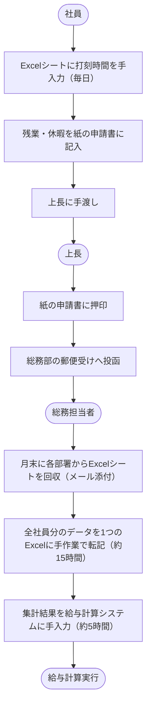
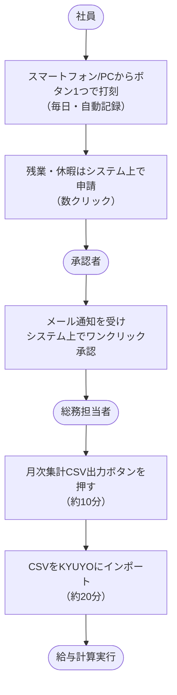

# 要件定義書

> **対応規格：** ISO/IEC/IEEE 29148:2018（BRS / StRS 相当）
> **位置づけ：** 「何を実現するか（What）」を定義する文書。設計方法（How）は記載しない。

---

## ドキュメント情報

| 項目               | 内容                                 |
| ------------------ | ------------------------------------ |
| **プロジェクト名** | 社内勤怠管理システム刷新プロジェクト |
| **システム名**     | 勤怠管理システム（KINTA）            |
| **文書バージョン** | v1.2                                 |
| **作成日**         | 2026-04-01                           |
| **最終更新日**     | 2026-05-10                           |
| **作成者**         | 山田 太郎（情報システム部）          |
| **承認者**         | 鈴木 部長（管理部）                  |
| **ステータス**     | レビュー中                           |

### 改訂履歴

| バージョン | 日付       | 変更者    | 変更内容                                         |
| ---------- | ---------- | --------- | ------------------------------------------------ |
| v1.0       | 2026-04-01 | 山田 太郎 | 初版作成                                         |
| v1.1       | 2026-04-20 | 山田 太郎 | ステークホルダーレビューを受け、非機能要件を追記 |
| v1.2       | 2026-05-10 | 山田 太郎 | スコープ外項目を明確化                           |

---

## 1. プロジェクト概要

### 1.1 背景・目的

現在、社員の勤怠管理はExcelの打刻シートと紙の申請書で行われており、以下の課題が発生している。

- 月末の集計作業に総務担当者が月 **約20時間** を費やしている
- 申請書の紛失・記入ミスによる給与計算の誤りが月平均 **3件** 発生している
- テレワーク勤務時の打刻方法が統一されておらず、不正打刻リスクがある

本システムの導入により、勤怠データの入力・承認・集計を電子化し、**総務工数を月20時間→3時間以下に削減**することを目的とする。

### 1.2 スコープ（対象範囲）

**対象とするもの：**
- 社員の日次打刻（出勤・退勤・休憩）
- 残業・休暇・遅刻・早退の申請と上長承認
- 月次勤怠データの集計・CSV出力（給与計算システム連携用）
- 管理者による勤怠データの閲覧・修正

**対象外とするもの：**
- 給与計算処理そのもの（連携先の給与計算システムが担当）
- 採用・人事評価などの人事管理機能
- 経費精算機能

### 1.3 用語集

| 用語             | 定義                                                     |
| ---------------- | -------------------------------------------------------- |
| 打刻             | 出勤・退勤・休憩の開始・終了時刻を記録する操作           |
| 勤務区分         | 通常勤務・テレワーク・直行直帰などの勤務形態の分類       |
| 承認者           | 部下の申請（残業・休暇等）を承認・否認する権限を持つ上長 |
| 締め日           | 月次勤怠集計の基準日（毎月25日）                         |
| 給与計算システム | 連携先の既存システム（KYUYO）。本システムの対象外        |

### 1.4 参照文書

| 文書名                                    | バージョン   | 作成日     |
| ----------------------------------------- | ------------ | ---------- |
| 勤怠管理規程（就業規則 第3章）            | 2025年改訂版 | 2025-04-01 |
| 情報セキュリティポリシー                  | v3.0         | 2024-10-01 |
| 給与計算システム（KYUYO）データ連携仕様書 | v2.1         | 2023-06-01 |

---

## 2. ステークホルダー

| ステークホルダー           | 役割                         | 関心事                                     |
| -------------------------- | ---------------------------- | ------------------------------------------ |
| **管理部長（鈴木部長）**   | スポンサー・最終承認者       | 導入コスト・ROI、法令遵守（労働基準法）    |
| **総務担当者（3名）**      | 主要ユーザー・管理者         | 月次集計工数の削減、操作のしやすさ         |
| **一般社員（全150名）**    | エンドユーザー（打刻・申請） | スマートフォンからの打刻、申請の手軽さ     |
| **各部署の上長（20名）**   | 申請承認者                   | 承認作業の効率化、部下の勤怠状況の可視化   |
| **情報システム部（山田）** | システム管理・開発窓口       | セキュリティ、保守性、既存システムとの連携 |
| **外部開発ベンダー**       | 設計・開発・テスト実施       | 要件の明確性、変更管理のルール             |

---

## 3. 現状分析（As-Is）

### 3.1 現状の業務フロー

### 3.2 現状の課題

| #   | 課題                                                | 影響                       | 優先度 |
| --- | --------------------------------------------------- | -------------------------- | ------ |
| 1   | 月次集計に総務が約20時間を費やしている              | 本来業務の圧迫、残業増加   | 高     |
| 2   | 申請書の紛失・記入ミスによる給与計算誤りが月3件発生 | 社員の不満、修正対応コスト | 高     |
| 3   | テレワーク時の打刻方法が不統一（メール・LINE等）    | 不正打刻リスク、集計の手間 | 高     |
| 4   | 上長が部下の残業状況をリアルタイムに把握できない    | 36協定違反リスクの見落とし | 中     |
| 5   | 過去の勤怠データの検索・参照に時間がかかる          | 問い合わせ対応の非効率     | 低     |

---

## 4. ビジネス要件

### 4.1 目標・成果指標（KPI）

| #   | 目標                         | 指標（測定方法）                     | 目標値                 |
| --- | ---------------------------- | ------------------------------------ | ---------------------- |
| 1   | 月次集計工数の削減           | 総務担当者の集計作業時間（月次）     | **20時間 → 3時間以下** |
| 2   | 給与計算誤りの撲滅           | 打刻・集計起因の給与修正件数（月次） | **0件**                |
| 3   | 申請・承認のリードタイム短縮 | 申請から承認完了までの平均日数       | **3日 → 当日中**       |
| 4   | 36協定違反の事前検知         | 月80時間超残業の事前アラート検知率   | **100%**               |

---

## 5. ユーザー要件

### 5.1 ユーザー種別

| ユーザー種別   | 説明                                     | 想定スキルレベル                             |
| -------------- | ---------------------------------------- | -------------------------------------------- |
| 一般社員       | 日次打刻・各種申請を行う                 | PCの基本操作が可能。スマートフォン利用者多数 |
| 承認者（上長） | 部下の申請を承認・否認する               | PCの基本操作が可能                           |
| 総務管理者     | 全社員の勤怠データを管理・修正・集計する | Excelを日常的に使用するレベル                |
| システム管理者 | ユーザー・マスタ管理、システム設定を行う | IT部門担当者                                 |

### 5.2 ユースケース一覧

| UC#    | ユースケース名       | 主アクター | 概要                                           |
| ------ | -------------------- | ---------- | ---------------------------------------------- |
| UC-001 | 打刻する             | 一般社員   | 出勤・退勤・休憩の打刻を行う                   |
| UC-002 | 残業申請する         | 一般社員   | 事前・事後の残業申請を行う                     |
| UC-003 | 休暇申請する         | 一般社員   | 有給休暇等の申請を行う                         |
| UC-004 | 申請を承認する       | 承認者     | 部下からの各種申請を承認・否認する             |
| UC-005 | 月次勤怠を集計する   | 総務管理者 | 月次の勤怠データを集計してCSV出力する          |
| UC-006 | 勤怠データを修正する | 総務管理者 | 打刻漏れ・ミス等のデータを管理者権限で修正する |

### 5.3 ユースケース詳細

#### UC-001：打刻する

| 項目               | 内容                                                                                                                                                                 |
| ------------------ | -------------------------------------------------------------------------------------------------------------------------------------------------------------------- |
| **ユースケース名** | 打刻する                                                                                                                                                             |
| **アクター**       | 一般社員                                                                                                                                                             |
| **事前条件**       | 社員がシステムにログイン済みである                                                                                                                                   |
| **事後条件**       | 打刻時刻が記録され、当日の勤怠画面に反映される                                                                                                                       |
| **基本フロー**     | 1. 社員がホーム画面の「出勤」ボタンを押す 2. システムが現在時刻を出勤時刻として記録する 3. 画面に「出勤打刻しました（HH:MM）」と表示される                     |
| **代替フロー**     | A1. テレワーク勤務の場合、勤務区分で「テレワーク」を選択してから打刻する                                                                                             |
| **例外フロー**     | E1. 既に当日の出勤打刻がある場合、「本日はすでに出勤済みです」と表示し、打刻を受け付けない E2. ネットワーク接続がない場合、エラーメッセージを表示し、再試行を促す |

#### UC-003：休暇申請する

| 項目               | 内容                                                                                                                                                                                                   |
| ------------------ | ------------------------------------------------------------------------------------------------------------------------------------------------------------------------------------------------------ |
| **ユースケース名** | 休暇申請する                                                                                                                                                                                           |
| **アクター**       | 一般社員                                                                                                                                                                                               |
| **事前条件**       | 社員がシステムにログイン済みである。申請対象日が締め日前である                                                                                                                                         |
| **事後条件**       | 申請が登録され、承認者にメール通知が送信される                                                                                                                                                         |
| **基本フロー**     | 1. 社員が「休暇申請」メニューを選択する 2. 休暇種別（有給・特別休暇等）・取得日・理由を入力する 3. 確認画面で内容を確認し、「申請する」を押す 4. 申請が登録され、承認者にメール通知が送られる |
| **代替フロー**     | A1. 半日休暇の場合、午前 / 午後の区分を選択する                                                                                                                                                        |
| **例外フロー**     | E1. 有給残日数が不足している場合、「有給残日数が不足しています（残：〇日）」と表示して申請を不可とする                                                                                                 |

---

## 6. 機能要件

### 6.1 機能要件一覧

| 要件ID | 機能名            | 要件説明                                                                    | 優先度 | 対応UC# |
| ------ | ----------------- | --------------------------------------------------------------------------- | ------ | ------- |
| FR-001 | 打刻機能          | 社員は出勤・退勤・休憩開始・休憩終了の打刻ができる                          | 必須   | UC-001  |
| FR-002 | 勤務区分設定      | 打刻時に通常勤務・テレワーク・直行直帰等の勤務区分を選択できる              | 必須   | UC-001  |
| FR-003 | 残業申請機能      | 社員は事前・事後の残業申請ができる                                          | 必須   | UC-002  |
| FR-004 | 休暇申請機能      | 社員は有給休暇・特別休暇・代休等の申請ができる                              | 必須   | UC-003  |
| FR-005 | 申請承認機能      | 承認者は部下の申請を承認・否認でき、コメントを付けられる                    | 必須   | UC-004  |
| FR-006 | 月次集計・CSV出力 | 総務管理者は月次の勤怠データを集計し、給与計算システム連携用CSVを出力できる | 必須   | UC-005  |
| FR-007 | 管理者修正機能    | 総務管理者は打刻漏れ・ミスのデータを修正でき、修正履歴が残る                | 必須   | UC-006  |
| FR-008 | 残業アラート通知  | 月の残業時間が一定時間（設定値）を超えた社員の承認者に自動メール通知する    | 必須   | -       |
| FR-009 | 有給残日数表示    | 社員は自分の有給残日数・取得履歴をいつでも確認できる                        | 推奨   | -       |
| FR-010 | カレンダー表示    | 社員は自分の月間勤怠をカレンダー形式で確認できる                            | 推奨   | -       |

### 6.2 機能要件詳細

#### FR-006：月次集計・CSV出力

| 項目           | 内容                                                                                                                                                   |
| -------------- | ------------------------------------------------------------------------------------------------------------------------------------------------------ |
| **要件ID**     | FR-006                                                                                                                                                 |
| **機能名**     | 月次集計・CSV出力                                                                                                                                      |
| **説明**       | 総務管理者が指定した年月・部署の勤怠データを集計し、給与計算システム（KYUYO）が読み込めるCSV形式で出力できる                                           |
| **入力**       | 集計年月、対象部署（全社 or 部署指定）                                                                                                                 |
| **出力**       | 勤怠集計CSVファイル（KYUYO連携仕様準拠）                                                                                                               |
| **業務ルール** | ・未承認の申請が残っている社員がいる場合は警告を表示する（出力は可能とする） ・出力後も何度でも再出力できる ・出力履歴（日時・出力者）を記録する |
| **優先度**     | 必須                                                                                                                                                   |
| **備考**       | CSV仕様の詳細は「給与計算システム（KYUYO）データ連携仕様書 v2.1」を参照                                                                                |

---

## 7. 非機能要件

### 7.1 可用性

| 要件ID    | 要件説明                    | 目標値                                                            |
| --------- | --------------------------- | ----------------------------------------------------------------- |
| NFR-A-001 | システム稼働率              | 99.5% 以上（年間）。月次締め処理期間（毎月25〜27日）は 99.9% 以上 |
| NFR-A-002 | 計画停止時間                | 月 4 時間以内（深夜帯に限定）                                     |
| NFR-A-003 | 障害時の許容停止時間（RTO） | 4 時間以内                                                        |
| NFR-A-004 | 目標復旧時点（RPO）         | 1 時間前まで（最大1時間分のデータロスを許容）                     |

### 7.2 性能・拡張性

| 要件ID    | 要件説明                 | 目標値                                       |
| --------- | ------------------------ | -------------------------------------------- |
| NFR-P-001 | 画面応答時間（通常時）   | 3 秒以内（打刻・一覧表示等の主要操作）       |
| NFR-P-002 | 画面応答時間（ピーク時） | 5 秒以内（始業・終業時間帯の集中打刻）       |
| NFR-P-003 | 同時接続ユーザー数       | 150 名（全社員が同時打刻しても問題ないこと） |
| NFR-P-004 | データ保持期間           | 5 年（労働基準法第109条に基づく）            |

### 7.3 セキュリティ

| 要件ID    | 要件説明           | 内容                                                                           |
| --------- | ------------------ | ------------------------------------------------------------------------------ |
| NFR-S-001 | 認証方式           | ID・パスワード認証 + 社内SSO（ActiveDirectory）連携                            |
| NFR-S-002 | パスワードポリシー | 8文字以上・英数字記号混在・90日毎に変更要求（SSOで管理するため不要な場合あり） |
| NFR-S-003 | アクセス制御       | ロールベースアクセス制御（一般社員・承認者・総務管理者・システム管理者の4種）  |
| NFR-S-004 | 通信暗号化         | 全通信をTLS 1.2 以上で暗号化                                                   |
| NFR-S-005 | 監査ログ           | ログイン・打刻・申請・承認・管理者修正の操作ログを5年間保存                    |

### 7.4 運用・保守性

| 要件ID    | 要件説明             | 内容                                                                                |
| --------- | -------------------- | ----------------------------------------------------------------------------------- |
| NFR-O-001 | バックアップ方式     | フルバックアップ（日次）＋差分バックアップ（1時間毎）                               |
| NFR-O-002 | バックアップ保持期間 | 日次：3ヶ月 / 世代保持：1年                                                         |
| NFR-O-003 | 監視要件             | 死活監視・CPU・メモリ・ディスク・応答時間を24時間監視し、異常時に担当者へメール通知 |
| NFR-O-004 | ログ保存期間         | アプリケーションログ・アクセスログを1年間保存                                       |

### 7.5 移行性

| 要件ID    | 要件説明       | 内容                                                                                   |
| --------- | -------------- | -------------------------------------------------------------------------------------- |
| NFR-M-001 | 移行対象データ | 社員マスタ（150名分）、過去2年分の勤怠実績データ（Excelから）                          |
| NFR-M-002 | 移行期間       | 本番稼働開始の1ヶ月前に移行作業完了                                                    |
| NFR-M-003 | 移行方式       | 社員マスタはActiveDirectoryから自動インポート。過去勤怠データはCSVでベンダーが一括登録 |

### 7.6 システム環境・制約

| 要件ID    | 要件説明     | 内容                                                                           |
| --------- | ------------ | ------------------------------------------------------------------------------ |
| NFR-E-001 | 対応ブラウザ | Chrome（最新版）、Edge（最新版）、Safari（最新版）                             |
| NFR-E-002 | モバイル対応 | スマートフォン（iOS / Android）のブラウザで打刻・申請操作が可能なこと          |
| NFR-E-003 | 法規制対応   | 労働基準法・労働安全衛生法（働き方改革関連法）に準拠した勤怠データの管理・保存 |

---

## 8. 外部インターフェース要件

### 8.1 外部システム連携

| #   | 連携先システム                  | 連携方向 | データ内容                   | 連携方式              | 連携頻度                   |
| --- | ------------------------------- | -------- | ---------------------------- | --------------------- | -------------------------- |
| 1   | 給与計算システム（KYUYO）       | 出力     | 月次勤怠集計データ           | CSVファイル（手動DL） | 月次（25日締め後）         |
| 2   | ActiveDirectory（社内認証基盤） | 入力     | 社員情報・認証               | LDAP連携              | リアルタイム（ログイン時） |
| 3   | メールサーバー                  | 出力     | 承認通知・残業アラートメール | SMTP                  | 随時（イベント発生時）     |

---

## 9. 制約条件・前提条件

### 9.1 制約条件

| #   | 制約内容                                    | 理由                                                 |
| --- | ------------------------------------------- | ---------------------------------------------------- |
| 1   | 2026年10月1日までに本番稼働開始すること     | 次期就業規則改訂（11月施行）の前に運用を確立するため |
| 2   | 開発予算は 500万円以内                      | 当期IT投資予算の上限                                 |
| 3   | 既存の給与計算システム（KYUYO）は改修しない | KYUYO側のベンダーサポート契約の制約                  |

### 9.2 前提条件

| #   | 前提内容                                                                   |
| --- | -------------------------------------------------------------------------- |
| 1   | 全社員がPCまたはスマートフォンからインターネットにアクセスできる環境を持つ |
| 2   | ActiveDirectoryに全社員の最新情報が登録・管理されている                    |
| 3   | 総務担当者が新システムの操作研修（2時間程度）を受講する                    |

### 9.3 リスク・懸念事項

| #   | リスク内容                                                               | 影響度 | 発生確率 | 対応策                                                              |
| --- | ------------------------------------------------------------------------ | ------ | -------- | ------------------------------------------------------------------- |
| 1   | 高齢社員がスマートフォン操作に慣れず、打刻操作が定着しない               | 高     | 中       | 操作マニュアル整備・打刻端末（タブレット）を各フロアに設置          |
| 2   | 過去2年分の勤怠データのExcel形式が部署によって異なり、移行に手間がかかる | 中     | 高       | 移行前に全部署のExcelフォーマットを確認し、変換スクリプトを事前作成 |
| 3   | 本番稼働直後の締め処理（月次集計）で問題が発生する                       | 高     | 低       | 本番稼働の1ヶ月前にリハーサル環境で全手順を通し確認する             |

---

## 10. 受入基準

| 要件ID    | 検証項目                                     | 検証方法                      | 合格基準                                    |
| --------- | -------------------------------------------- | ----------------------------- | ------------------------------------------- |
| FR-001    | 出勤・退勤・休憩の打刻が正しく記録される     | テスト                        | 打刻時刻が±1秒以内で記録されること          |
| FR-005    | 承認操作後に申請者へ通知メールが届く         | テスト                        | 承認・否認操作後5分以内にメールが届くこと   |
| FR-006    | CSV出力結果がKYUYO連携仕様に準拠している     | KYUYOへの取込テスト           | KYUYOへのインポートがエラーなく完了すること |
| NFR-P-001 | 打刻操作の応答時間が3秒以内                  | 負荷テスト（150ユーザー同時） | 95パーセンタイルで3秒以内であること         |
| NFR-S-003 | 一般社員が他の社員の勤怠データを閲覧できない | セキュリティテスト            | アクセス制御が正しく機能すること            |

---

## 付録

### A. 業務フロー図（To-Be）

> ※ 手作業転記・紙の申請書・郵便受けへの投函 → すべて不要

### B. 課題・未決事項リスト

| #   | 課題・質問                                                          | 担当者          | 期限       | ステータス |
| --- | ------------------------------------------------------------------- | --------------- | ---------- | ---------- |
| 1   | 直行直帰時の打刻方法（GPS位置情報を取得するか）を決定する必要がある | 山田 / 鈴木部長 | 2026-05-31 | 未対応     |
| 2   | 過去勤怠データの移行範囲（2年分 or 5年分）を確認する                | 山田 / 総務     | 2026-05-20 | 対応中     |
