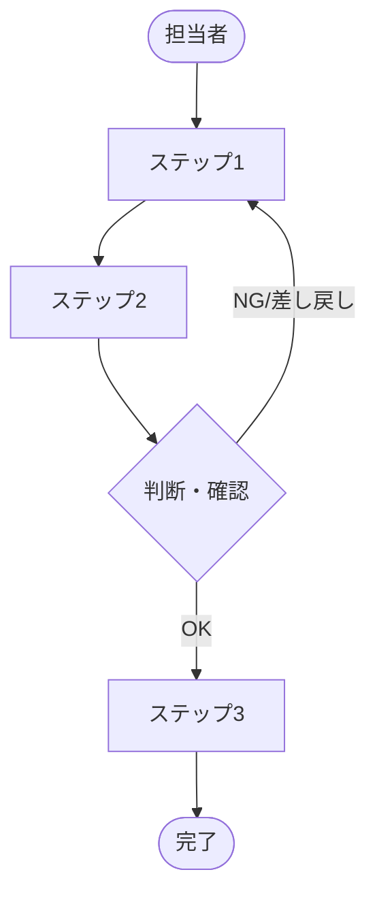
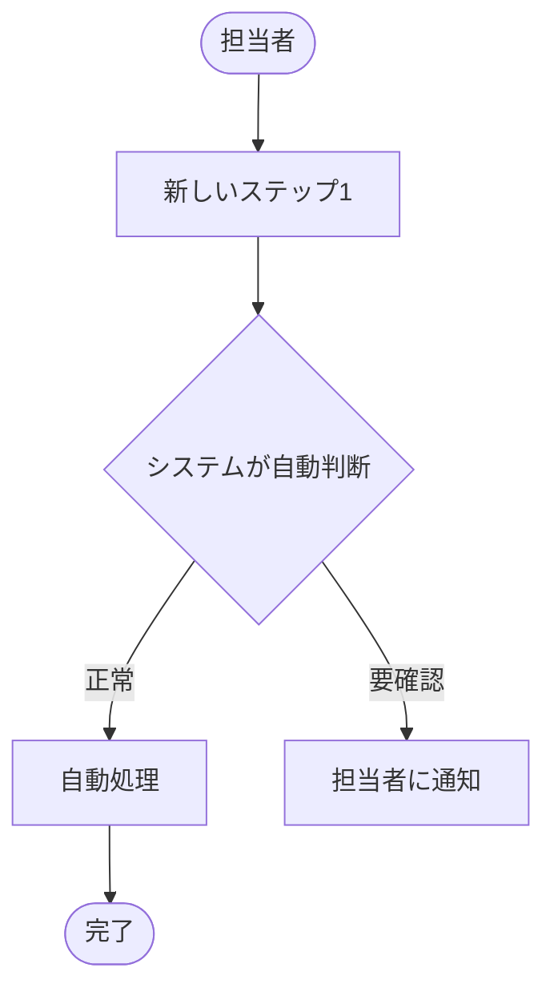

# 掘り下げヒアリングシート

> **位置づけ：** 特定のテーマ（業務フロー・機能・課題）を深掘りするときに使用する。
> **ゴール：** 表面的な要望の背後にある「本質的なニーズ・根本原因・制約」を明らかにし、あるべき姿（To-Be）を合意する。
> **所要時間の目安：** 60〜120分（テーマ1つにつき1シート）
> **前提：** 初回ヒアリングで全体像が把握できた後に実施する。

---

## ドキュメント情報

| 項目               | 内容                               |
| ------------------ | ---------------------------------- |
| **プロジェクト名** |                                    |
| **今回のテーマ**   |                                    |
| **実施日時**       | YYYY-MM-DD HH:MM〜HH:MM            |
| **実施場所**       | 〇〇会議室 / オンライン（Teams等） |
| **記録者**         |                                    |
| **作成日**         | YYYY-MM-DD                         |

---

## 1. 参加者

<!-- テーマに直接関わる担当者を呼ぶ。人数は少数精鋭（3〜5名）が理想。 -->

| 所属・役職 | 氏名 | 参加理由（このテーマの専門家として） |
| ---------- | ---- | ------------------------------------ |
|            |      |                                      |
|            |      |                                      |
|            |      |                                      |

---

## 2. テーマの設定

<!-- ヒアリング開始前に、今日掘り下げるテーマを1文で定義する。 -->

**今日掘り下げるテーマ（1文で）：**

> 例）「月次勤怠集計業務において、なぜ総務担当者が月20時間を費やすことになるのかを明らかにし、システム化後の理想フローを合意する」

**このテーマを選んだ理由：**

**このヒアリングで答えを出したい問い：**

| #   | 問い |
| --- | ---- |
| 1   |      |
| 2   |      |
| 3   |      |

---

## 3. 現状の詳細把握（As-Is）

### 3.1 業務フローの詳細

<!-- 「誰が・何を・どの順番で・どのツールを使って」を一緒に書き起こす。 -->
<!-- 業務担当者に実際にやってもらっているつもりで話してもらうと漏れが減る。 -->

**フロー補足メモ：**

| ステップ | 実施者 | 使用ツール・帳票 | 所要時間（目安） | 備考・例外 |
| -------- | ------ | ---------------- | ---------------- | ---------- |
| 1        |        |                  |                  |            |
| 2        |        |                  |                  |            |
| 3        |        |                  |                  |            |

### 3.2 業務の発生タイミング・量

| 質問                                                                    | 回答・メモ |
| ----------------------------------------------------------------------- | ---------- |
| この業務はどのくらいの頻度で発生しますか？（日次 / 週次 / 月次 / 随時） |            |
| 一度に処理する件数・量はどのくらいですか？                              |            |
| ピーク時期はいつですか？（月末・決算期等）                              |            |
| 年間を通じて量が変動しますか？                                          |            |

---

## 4. 問題・課題の根本原因分析

<!-- 表面的な症状（現象）の背後にある根本原因を探る。「なぜ？」を繰り返す（5 Whys）。 -->
<!-- 「何が問題か」より「なぜそうなっているか」が重要。 -->

### 4.1 現状の問題リスト

| #   | 問題・症状（現象） | 発生頻度 | 誰が困っているか | 影響（定量的に） |
| --- | ------------------ | -------- | ---------------- | ---------------- |
| 1   |                    |          |                  |                  |
| 2   |                    |          |                  |                  |
| 3   |                    |          |                  |                  |

### 4.2 根本原因分析（問題ごとに実施）

**【問題 #〇〇：〇〇〇〇】**

| 階層              | なぜ？                       | 回答 |
| ----------------- | ---------------------------- | ---- |
| なぜ①（現象）     | なぜ、〔問題〕が起きるのか？ |      |
| なぜ②（直接原因） | なぜ、〔①の回答〕なのか？    |      |
| なぜ③             | なぜ、〔②の回答〕なのか？    |      |
| なぜ④             | なぜ、〔③の回答〕なのか？    |      |
| なぜ⑤（根本原因） | なぜ、〔④の回答〕なのか？    |      |

**根本原因のまとめ：**

---

## 5. あるべき姿の合意（To-Be）

<!-- 「何を変えれば課題が解決するか」を具体的に合意する。 -->
<!-- この場で合意できなかったものは持ち帰り事項にする。 -->

### 5.1 理想の業務フロー（To-Be）

**変化のポイント：**

| 現状（As-Is） | 導入後（To-Be） |
| ------------- | --------------- |
|               |                 |
|               |                 |

### 5.2 このテーマで実現したいこと（機能レベル）

<!-- 「〇〇できるようにしたい」の形で記述する。 -->

| #   | 実現したいこと | 優先度       | 備考 |
| --- | -------------- | ------------ | ---- |
| 1   |                | 高 / 中 / 低 |      |
| 2   |                | 高 / 中 / 低 |      |
| 3   |                | 高 / 中 / 低 |      |

### 5.3 「やらないこと」の合意

<!-- スコープ外を明確にすることは、スコープ内を明確にするのと同じくらい重要。 -->

| #   | このヒアリングのテーマのスコープ外とすること | 理由 |
| --- | -------------------------------------------- | ---- |
| 1   |                                              |      |
| 2   |                                              |      |

---

## 6. 制約・前提条件

<!-- 「こうしたいが、これは変えられない」という条件を洗い出す。 -->

| #   | 制約・前提 | 理由 | 変更可否          |
| --- | ---------- | ---- | ----------------- |
| 1   |            |      | 変更可 / 変更不可 |
| 2   |            |      | 変更可 / 変更不可 |

---

## 7. 引き出した要件（ドラフト）

<!-- このヒアリングで浮かび上がった要件を速報で記録する。後で要件定義書に転記・整理する。 -->

| 要件ID（仮） | 要件内容 | 種別                 | 優先度       |
| ------------ | -------- | -------------------- | ------------ |
| FR-（仮）    |          | 機能 / 非機能 / 制約 | 高 / 中 / 低 |
|              |          |                      |              |

---

## 8. 持ち帰り事項・未解決の問い

| #   | 内容 | 確認先 | 回答期限   |
| --- | ---- | ------ | ---------- |
| 1   |      |        | YYYY-MM-DD |
| 2   |      |        | YYYY-MM-DD |

---

## 9. 合意事項まとめ

<!-- ヒアリング終了前10分で、この場で合意できた内容を読み上げて確認する。 -->

| #   | 合意した内容 | 合意者（全員 / 〇〇さん） |
| --- | ------------ | ------------------------- |
| 1   |              |                           |
| 2   |              |                           |

---

## 10. 次回アクション

| #   | アクション                   | 担当者   | 期限       |
| --- | ---------------------------- | -------- | ---------- |
| 1   | 本シートを送付・内容確認依頼 | 記録担当 | YYYY-MM-DD |
| 2   |                              |          | YYYY-MM-DD |
