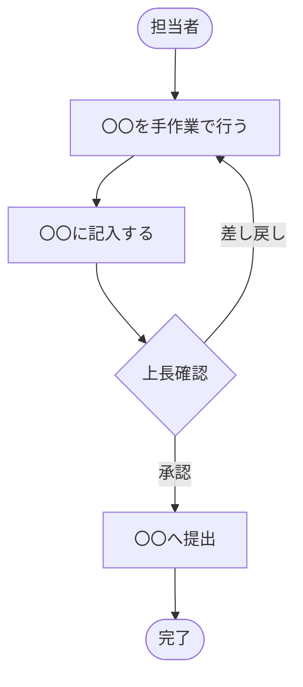
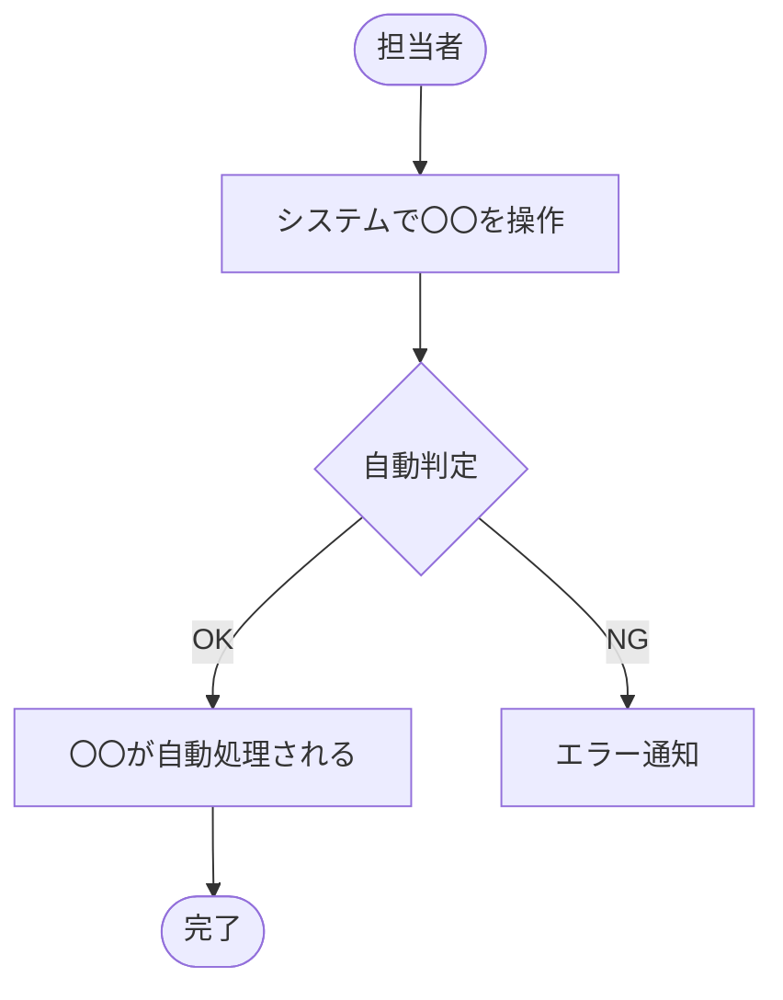

# 要件定義書（標準版）

> **対応規格：** ISO/IEC/IEEE 29148:2018（BRS / StRS 相当）
> **対象：** 中規模システム（ユーザー数 10〜100名、開発期間 3〜12ヶ月）
> **位置づけ：** 「何を実現するか（What）」を定義する文書。設計方法（How）は記載しない。

---

## ドキュメント情報

| 項目               | 内容                         |
| ------------------ | ---------------------------- |
| **プロジェクト名** |                              |
| **システム名**     |                              |
| **文書バージョン** | v1.0                         |
| **作成日**         | YYYY-MM-DD                   |
| **最終更新日**     | YYYY-MM-DD                   |
| **作成者**         |                              |
| **承認者**         |                              |
| **ステータス**     | 草稿 / レビュー中 / 承認済み |

### 改訂履歴（任意）

<!-- Git管理している場合はコミット履歴が代替となるため省略可。
     外部ステークホルダー（発注者・監査機関等）へ送付する場合は記載を推奨。 -->

| バージョン | 日付       | 変更者 | 変更内容 |
| ---------- | ---------- | ------ | -------- |
| v1.0       | YYYY-MM-DD |        | 初版作成 |

---

## 1. プロジェクト概要

### 1.1 背景・目的

<!-- なぜこのシステムを開発するのか。現状の課題・ビジネス上の目標を記載する。 -->

### 1.2 スコープ（対象範囲）

**対象とするもの：**
- 

**対象外とするもの：**
- 

### 1.3 用語集

| 用語 | 定義 |
| ---- | ---- |
|      |      |

### 1.4 参照文書

| 文書名 | バージョン | 作成日 |
| ------ | ---------- | ------ |
|        |            |        |

---

## 2. ステークホルダー

<!-- システムに関わる全ての関係者を識別する（ISO/IEC/IEEE 29148:2018）。 -->

| ステークホルダー         | 役割                   | 関心事                         |
| ------------------------ | ---------------------- | ------------------------------ |
| **（例）経営層**         | スポンサー・最終承認者 | コスト削減効果、ROI            |
| **（例）業務担当者**     | エンドユーザー         | 操作性、業務効率               |
| **（例）システム管理者** | 運用・保守担当         | 安定稼働、メンテナンス性       |
| **（例）IT部門**         | システム基盤管理       | セキュリティ、既存システム連携 |
|                          |                        |                                |

---

## 3. 現状分析（As-Is）

### 3.1 現状の業務フロー

<!-- 現状の業務の流れを Mermaid flowchart で記述する。 -->

### 3.2 現状の課題

| #   | 課題 | 影響 | 優先度       |
| --- | ---- | ---- | ------------ |
| 1   |      |      | 高 / 中 / 低 |
| 2   |      |      |              |

---

## 4. ビジネス要件

<!-- 高レベルの業務目標・達成すべき成果を記載する。How（実現方法）は記載しない。 -->

### 4.1 目標・成果指標（KPI）

| #   | 目標 | 指標（測定方法） | 目標値 |
| --- | ---- | ---------------- | ------ |
| 1   |      |                  |        |
| 2   |      |                  |        |

---

## 5. ユーザー要件

<!-- ユーザーがシステムを通じて達成したいことを、ユーザー視点で記述する。 -->

### 5.1 ユーザー種別

| ユーザー種別         | 説明                               | 想定スキルレベル       |
| -------------------- | ---------------------------------- | ---------------------- |
| （例）一般ユーザー   | 日常業務でシステムを使用する担当者 | PCの基本操作が可能     |
| （例）管理者ユーザー | ユーザー管理・設定変更を行う担当者 | システムの基礎知識あり |
|                      |                                    |                        |

### 5.2 ユースケース一覧

| UC#    | ユースケース名 | 主アクター | 概要 |
| ------ | -------------- | ---------- | ---- |
| UC-001 |                |            |      |
| UC-002 |                |            |      |

### 5.3 ユースケース詳細

#### UC-001：〇〇〇〇

| 項目               | 内容                                                           |
| ------------------ | -------------------------------------------------------------- |
| **ユースケース名** |                                                                |
| **アクター**       |                                                                |
| **事前条件**       |                                                                |
| **事後条件**       |                                                                |
| **基本フロー**     | 1. ユーザーが〇〇を行う 2. システムが〇〇を表示する 3. … |
| **代替フロー**     | A1. 〇〇の場合、〇〇する                                       |
| **例外フロー**     | E1. 〇〇エラーが発生した場合、〇〇メッセージを表示する         |

---

## 6. 機能要件

<!-- システムが「何をすべきか」を記述する。実装方法の記載は避ける。 -->
<!-- 各要件には一意のIDを付与し、トレーサビリティを確保する。 -->

### 6.1 機能要件一覧

| 要件ID | 機能名 | 要件説明 | 優先度             | 対応UC# |
| ------ | ------ | -------- | ------------------ | ------- |
| FR-001 |        |          | 必須 / 推奨 / 任意 |         |
| FR-002 |        |          |                    |         |

### 6.2 機能要件詳細

#### FR-001：〇〇機能

| 項目           | 内容               |
| -------------- | ------------------ |
| **要件ID**     | FR-001             |
| **機能名**     |                    |
| **説明**       |                    |
| **入力**       |                    |
| **出力**       |                    |
| **業務ルール** |                    |
| **優先度**     | 必須 / 推奨 / 任意 |
| **備考**       |                    |

---

## 7. 非機能要件

<!-- 経済産業省「非機能要求グレード」に準拠した分類で記載する。 -->

### 7.1 可用性

| 要件ID    | 要件説明                    | 目標値             |
| --------- | --------------------------- | ------------------ |
| NFR-A-001 | システム稼働率              | 〇〇% 以上（年間） |
| NFR-A-002 | 計画停止時間                | 月 〇〇 時間以内   |
| NFR-A-003 | 障害時の許容停止時間（RTO） | 〇〇 時間以内      |
| NFR-A-004 | 目標復旧時点（RPO）         | 〇〇 時間前まで    |

### 7.2 性能・拡張性

| 要件ID    | 要件説明                 | 目標値      |
| --------- | ------------------------ | ----------- |
| NFR-P-001 | 画面応答時間（通常時）   | 〇〇 秒以内 |
| NFR-P-002 | 画面応答時間（ピーク時） | 〇〇 秒以内 |
| NFR-P-003 | 同時接続ユーザー数       | 〇〇 人     |
| NFR-P-004 | データ保持期間           | 〇〇 年     |

### 7.3 セキュリティ

| 要件ID    | 要件説明           | 内容                               |
| --------- | ------------------ | ---------------------------------- |
| NFR-S-001 | 認証方式           |                                    |
| NFR-S-002 | パスワードポリシー |                                    |
| NFR-S-003 | アクセス制御       | ロールベースアクセス制御（RBAC）等 |
| NFR-S-004 | 通信暗号化         |                                    |
| NFR-S-005 | 監査ログ           |                                    |

### 7.4 運用・保守性

| 要件ID    | 要件説明         | 内容 |
| --------- | ---------------- | ---- |
| NFR-O-001 | バックアップ方式 |      |
| NFR-O-002 | バックアップ頻度 |      |
| NFR-O-003 | 監視要件         |      |
| NFR-O-004 | ログ保存期間     |      |

### 7.5 移行性

| 要件ID    | 要件説明       | 内容 |
| --------- | -------------- | ---- |
| NFR-M-001 | 移行対象データ |      |
| NFR-M-002 | 移行期間       |      |
| NFR-M-003 | 移行方式       |      |

### 7.6 システム環境・制約

| 要件ID    | 要件説明     | 内容 |
| --------- | ------------ | ---- |
| NFR-E-001 | 対応ブラウザ |      |
| NFR-E-002 | 対応OS       |      |
| NFR-E-003 | 法規制対応   |      |

---

## 8. 外部インターフェース要件

### 8.1 外部システム連携

| #   | 連携先システム | 連携方向             | データ内容 | 連携方式                    | 連携頻度                   |
| --- | -------------- | -------------------- | ---------- | --------------------------- | -------------------------- |
| 1   |                | 入力 / 出力 / 双方向 |            | API / ファイル連携 / DB連携 | リアルタイム / 日次 / 随時 |

---

## 9. 制約条件・前提条件

### 9.1 制約条件

| #   | 制約内容 | 理由 |
| --- | -------- | ---- |
| 1   |          |      |

### 9.2 前提条件

| #   | 前提内容 |
| --- | -------- |
| 1   |          |

### 9.3 リスク・懸念事項

| #   | リスク内容 | 影響度       | 発生確率     | 対応策 |
| --- | ---------- | ------------ | ------------ | ------ |
| 1   |            | 高 / 中 / 低 | 高 / 中 / 低 |        |

---

## 10. 受入基準

| 要件ID | 検証項目 | 検証方法                 | 合格基準 |
| ------ | -------- | ------------------------ | -------- |
| FR-001 |          | テスト / レビュー / デモ |          |

---

## 付録

### A. 業務フロー図（To-Be）

### B. 画面遷移イメージ（参考）

<!-- ワイヤーフレームやモックアップがあれば添付する。 -->

### C. 課題・未決事項リスト

| #   | 課題・質問 | 担当者 | 期限 | ステータス             |
| --- | ---------- | ------ | ---- | ---------------------- |
| 1   |            |        |      | 未対応 / 対応中 / 完了 |

### D. 用語集（補足）
