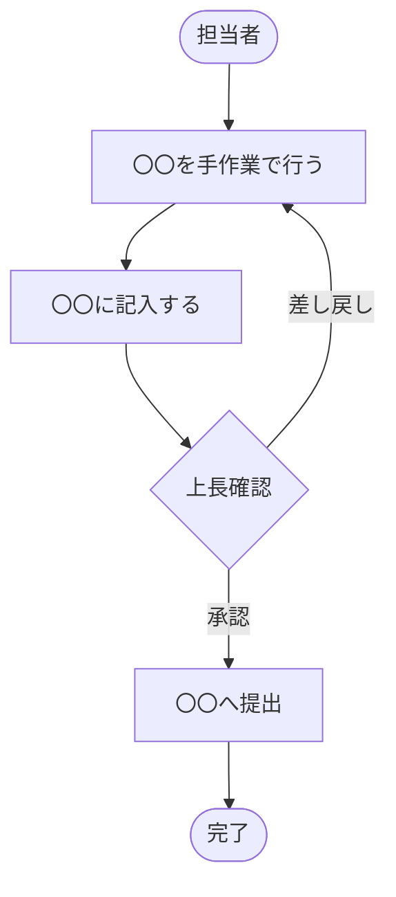
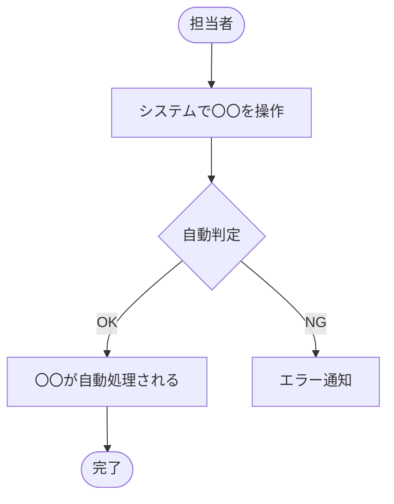

# 要件定義書（外部委託版）

> **対応規格：** ISO/IEC/IEEE 29148:2018（BRS / StRS 相当）、IPA モデル取引・契約書 参考
> **対象：** 外部ベンダーへの発注案件（ユーザー数 50名以上、開発期間 6ヶ月以上、契約を伴う）
> **位置づけ：** 発注者がベンダーに提示する要件定義書。「何を実現するか（What）」と「どう検収するか」を明確にし、認識齟齬・スコープ変更トラブルを防ぐ。
> **注意：** 本文書は契約の参照文書となる。曖昧な表現・定性的な記述は排除し、すべてを測定可能・検証可能な形で記述する。

---

## ドキュメント情報

| 項目                 | 内容                                            |
| -------------------- | ----------------------------------------------- |
| **プロジェクト名**   |                                                 |
| **システム名**       |                                                 |
| **文書バージョン**   | v1.0                                            |
| **作成日**           | YYYY-MM-DD                                      |
| **最終更新日**       | YYYY-MM-DD                                      |
| **作成者（発注者）** |                                                 |
| **承認者（発注者）** |                                                 |
| **ステータス**       | 草稿 / レビュー中 / 承認済み / ベンダー提示済み |

### 改訂履歴

<!-- 外部ベンダーへ送付する文書のため、改訂履歴の管理は必須とする。 -->

| バージョン | 日付       | 変更者 | 変更内容 | 変更区分 |
| ---------- | ---------- | ------ | -------- | -------- |
| v1.0       | YYYY-MM-DD |        | 初版作成 | 新規     |

---

## 1. プロジェクト概要

### 1.1 背景・目的

<!-- 発注者の組織・業務背景、なぜこのシステムが必要かを記載する。 -->
<!-- ベンダーがプロジェクトの文脈を理解できるよう、業界知識がなくても分かる粒度で書く。 -->

### 1.2 スコープ（対象範囲）

<!-- スコープを「対象とするもの」「対象外とするもの」で必ず明示する。 -->
<!-- 「など」「等」を使わず、具体的に列挙する。 -->

**対象とするもの：**
- 

**対象外とするもの（ベンダーへの委託範囲に含まない）：**
- 

**将来フェーズとして検討中のもの（本契約外）：**
- 

### 1.3 用語集

<!-- 業界用語・社内固有の用語を必ず定義する。ベンダーが社内用語で詰まらないようにする。 -->

| 用語 | 定義 |
| ---- | ---- |
|      |      |

### 1.4 参照文書

<!-- 本要件定義書が前提とする文書・規程・規格を列挙する。ベンダーに提供する文書には ✅ をつける。 -->

| 文書名 | バージョン | 発注者提供 |
| ------ | ---------- | ---------- |
|        |            | ✅ / ─      |

---

## 2. ステークホルダー

| ステークホルダー         | 所属・役職 | 役割           | 本プロジェクトでの関わり方   |
| ------------------------ | ---------- | -------------- | ---------------------------- |
| （発注者）最終承認者     |            | スポンサー     | 最終意思決定・予算承認       |
| （発注者）業務担当者     |            | 主要ユーザー   | 要件合意・UAT実施            |
| （発注者）情報システム部 |            | システム窓口   | 技術要件の確認・インフラ調整 |
| （ベンダー）PM           |            | 開発責任者     | 開発全体の管理               |
| （ベンダー）SE           |            | 設計・開発担当 | 要件の実現方式の設計         |

### 2.1 意思決定ルール

<!-- 要件変更・スコープ変更が生じたときに「誰がどう決める」かを明確にする。 -->

| 事項                                            | 意思決定者 | 承認方法                 |
| ----------------------------------------------- | ---------- | ------------------------ |
| 要件変更（軽微：工数 3人日以内）                |            | メール承認               |
| 要件変更（重要：工数 3人日超 / スコープに影響） |            | 書面（変更要求票）+ 押印 |
| スケジュール変更                                |            | 書面 + 押印              |

---

## 3. 現状分析（As-Is）

### 3.1 現状の業務フロー

### 3.2 現状の課題と数値

<!-- 定量的な根拠を示す。「約〇〇」「〜程度」も可だが、後で測定できる形にしておく。 -->

| #   | 課題（現象） | 根拠となる数値・事実 | 優先度       |
| --- | ------------ | -------------------- | ------------ |
| 1   |              |                      | 高 / 中 / 低 |
| 2   |              |                      |              |

### 3.3 現行システム・環境の概要

<!-- ベンダーが既存環境を把握できるよう、現行システムの概要を記載する。 -->

| 項目                                  | 内容 |
| ------------------------------------- | ---- |
| 現在使用しているシステム・ツール      |      |
| インフラ環境（オンプレ / クラウド等） |      |
| 連携している外部サービス              |      |
| ユーザー数・拠点数                    |      |
| 移行が必要なデータ                    |      |

---

## 4. ビジネス要件

### 4.1 目標・成果指標（KPI）

<!-- 全て定量的な目標値を設定する。定性的な目標は「測定方法」も明記する。 -->

| #   | 目標 | 測定方法 | 目標値 | 測定タイミング   |
| --- | ---- | -------- | ------ | ---------------- |
| 1   |      |          |        | 本番稼働〇ヶ月後 |
| 2   |      |          |        |                  |

---

## 5. ユーザー要件

### 5.1 ユーザー種別と規模

| ユーザー種別 | 人数 | 説明 | ITスキルレベル |
| ------------ | ---- | ---- | -------------- |
|              |      |      | 高 / 中 / 低   |
|              |      |      |                |

### 5.2 ユースケース一覧

| UC#    | ユースケース名 | 主アクター | 概要 | 優先度 |
| ------ | -------------- | ---------- | ---- | ------ |
| UC-001 |                |            |      | 必須   |
| UC-002 |                |            |      |        |

### 5.3 ユースケース詳細

#### UC-001：〇〇〇〇

| 項目               | 内容                                                           |
| ------------------ | -------------------------------------------------------------- |
| **ユースケース名** |                                                                |
| **アクター**       |                                                                |
| **事前条件**       |                                                                |
| **事後条件**       |                                                                |
| **基本フロー**     | 1. ユーザーが〇〇を行う 2. システムが〇〇を表示する 3. … |
| **代替フロー**     | A1. 〇〇の場合、〇〇する                                       |
| **例外フロー**     | E1. 〇〇エラーが発生した場合、〇〇メッセージを表示する         |
| **備考・制約**     |                                                                |

---

## 6. 機能要件

### 6.1 機能要件一覧

| 要件ID | 機能名 | 要件説明 | 優先度             | 対応UC# | フェーズ        |
| ------ | ------ | -------- | ------------------ | ------- | --------------- |
| FR-001 |        |          | 必須 / 推奨 / 任意 |         | Phase1 / Phase2 |
| FR-002 |        |          |                    |         |                 |

### 6.2 機能要件詳細

<!-- 各要件は「検証可能」な形で記述する。「〜できること」「〜が表示されること」等、テストで確認できる粒度。 -->

#### FR-001：〇〇機能

| 項目           | 内容               |
| -------------- | ------------------ |
| **要件ID**     | FR-001             |
| **機能名**     |                    |
| **説明**       |                    |
| **入力**       |                    |
| **出力**       |                    |
| **業務ルール** |                    |
| **優先度**     | 必須 / 推奨 / 任意 |
| **合格基準**   |                    |
| **備考**       |                    |

---

## 7. 非機能要件

<!-- 全て定量的な目標値で記載する。「できるだけ速く」「高セキュリティ」は禁止。 -->

### 7.1 可用性

| 要件ID    | 要件説明                    | 目標値             | 根拠 |
| --------- | --------------------------- | ------------------ | ---- |
| NFR-A-001 | システム稼働率              | 〇〇% 以上（年間） |      |
| NFR-A-002 | 計画停止時間                | 月 〇〇 時間以内   |      |
| NFR-A-003 | 障害時の許容停止時間（RTO） | 〇〇 時間以内      |      |
| NFR-A-004 | 目標復旧時点（RPO）         | 〇〇 時間前まで    |      |

### 7.2 性能・拡張性

| 要件ID    | 要件説明                 | 目標値      | 測定条件                 |
| --------- | ------------------------ | ----------- | ------------------------ |
| NFR-P-001 | 画面応答時間（通常時）   | 〇〇 秒以内 | 同時接続〇〇人時         |
| NFR-P-002 | 画面応答時間（ピーク時） | 〇〇 秒以内 | 同時接続〇〇人時         |
| NFR-P-003 | 同時接続ユーザー数       | 〇〇 人     |                          |
| NFR-P-004 | データ保持期間           | 〇〇 年     | 法的根拠：〇〇法第〇〇条 |

### 7.3 セキュリティ

| 要件ID    | 要件説明           | 内容                                |
| --------- | ------------------ | ----------------------------------- |
| NFR-S-001 | 認証方式           |                                     |
| NFR-S-002 | パスワードポリシー |                                     |
| NFR-S-003 | アクセス制御       | ロールベースアクセス制御（RBAC）等  |
| NFR-S-004 | 通信暗号化         | TLS 〇〇 以上                       |
| NFR-S-005 | 監査ログ           |                                     |
| NFR-S-006 | 脆弱性対応         | 〇〇 基準に準拠（例：OWASP Top 10） |

### 7.4 運用・保守性

| 要件ID    | 要件説明         | 内容 |
| --------- | ---------------- | ---- |
| NFR-O-001 | バックアップ方式 |      |
| NFR-O-002 | バックアップ頻度 |      |
| NFR-O-003 | 監視要件         |      |
| NFR-O-004 | ログ保存期間     |      |
| NFR-O-005 | 障害時の連絡体制 |      |

### 7.5 移行性

| 要件ID    | 要件説明       | 内容 |
| --------- | -------------- | ---- |
| NFR-M-001 | 移行対象データ |      |
| NFR-M-002 | 移行期間       |      |
| NFR-M-003 | 移行方式       |      |
| NFR-M-004 | 切り戻し方針   |      |

### 7.6 システム環境・制約

| 要件ID    | 要件説明           | 内容                                    |
| --------- | ------------------ | --------------------------------------- |
| NFR-E-001 | 対応ブラウザ       |                                         |
| NFR-E-002 | 対応OS・端末       |                                         |
| NFR-E-003 | 法規制対応         |                                         |
| NFR-E-004 | インフラ環境の制約 | （例）オンプレ必須 / 特定クラウドのみ可 |

---

## 8. 外部インターフェース要件

### 8.1 外部システム連携

<!-- ベンダーが見積もり・設計できる粒度で記載する。不明な場合は「調査が必要」と明記する。 -->

| #   | 連携先システム | 連携方向             | データ内容 | 連携方式                    | 連携頻度                   | 仕様の入手状況    |
| --- | -------------- | -------------------- | ---------- | --------------------------- | -------------------------- | ----------------- |
| 1   |                | 入力 / 出力 / 双方向 |            | API / ファイル連携 / DB連携 | リアルタイム / 日次 / 随時 | 入手済み / 要調査 |

---

## 9. 制約条件・前提条件

### 9.1 制約条件

| #   | 制約内容                 | 理由       | 変更可否          |
| --- | ------------------------ | ---------- | ----------------- |
| 1   | 本番稼働期限：YYYY-MM-DD | 〇〇の理由 | 変更不可          |
| 2   | 開発予算上限：〇〇円     |            | 変更不可          |
| 3   |                          |            | 変更可 / 変更不可 |

### 9.2 前提条件

<!-- 前提が崩れた場合、スケジュール・費用・要件の見直しが生じることをベンダーと合意しておく。 -->

| #   | 前提内容 | 前提が崩れた場合の影響 |
| --- | -------- | ---------------------- |
| 1   |          |                        |

### 9.3 リスク・懸念事項

| #   | リスク内容 | 影響度       | 発生確率     | 対応策 | 責任分担                 |
| --- | ---------- | ------------ | ------------ | ------ | ------------------------ |
| 1   |            | 高 / 中 / 低 | 高 / 中 / 低 |        | 発注者 / ベンダー / 協議 |

---

## 10. 成果物一覧

<!-- ベンダーが納品すべき成果物を全て列挙する。「何を」「いつまでに」「どの形式で」を明記する。 -->

| #   | 成果物名                 | 提出期限   | 形式            | 備考 |
| --- | ------------------------ | ---------- | --------------- | ---- |
| 1   | 基本設計書               | YYYY-MM-DD | Word / Markdown |      |
| 2   | 詳細設計書               | YYYY-MM-DD |                 |      |
| 3   | ソースコード             | YYYY-MM-DD | Git リポジトリ  |      |
| 4   | テスト仕様書・結果報告書 | YYYY-MM-DD |                 |      |
| 5   | 操作マニュアル           | YYYY-MM-DD |                 |      |
| 6   | 運用・保守マニュアル     | YYYY-MM-DD |                 |      |
| 7   | インフラ構成図           | YYYY-MM-DD |                 |      |

---

## 11. 受入基準・検収方針

<!-- 「これが完成していれば検収OK」の基準を明文化する。曖昧な基準は検収トラブルの原因になる。 -->

### 11.1 受入テストの方針

| 項目             | 内容                                                                    |
| ---------------- | ----------------------------------------------------------------------- |
| 実施タイミング   | 本番稼働 〇 週間前                                                      |
| 実施主体         | 発注者（ユーザー代表）                                                  |
| 合格基準（全体） | 必須要件の全テストケースが合格し、未解決の「重大」バグが 0 件であること |
| 不合格時の対応   | ベンダーが 〇 営業日以内に修正し、再テストを実施する                    |

### 11.2 要件ごとの受入基準

| 要件ID | 検証項目 | 検証方法                 | 合格基準 |
| ------ | -------- | ------------------------ | -------- |
| FR-001 |          | テスト / レビュー / デモ |          |

---

## 12. 変更管理方針

<!-- 要件変更・追加が発生した場合のルールをあらかじめ合意しておく。 -->

| 項目               | 内容                                                             |
| ------------------ | ---------------------------------------------------------------- |
| 変更要求の申請方法 | 変更要求票（CR票）を発行し、書面で申請する                       |
| 影響評価の期間     | 受領後 〇 営業日以内にベンダーが工数・スケジュール影響を回答する |
| 承認権限           | 工数〇人日以内：〇〇が承認 / 超過分：〇〇が承認                  |
| 変更後の文書更新   | 合意後 〇 営業日以内に本要件定義書を改訂する                     |
| 変更要求票の書式   | `変更要求票テンプレート.md` を使用する                           |

---

## 13. 保守・サポート要件

<!-- 本番稼働後の保守・サポートに関する要件を記載する。別契約の場合はその旨を明記する。 -->

| 項目                 | 内容                                                        |
| -------------------- | ----------------------------------------------------------- |
| 保守期間             | 本番稼働後 〇 年間                                          |
| 障害対応時間（SLA）  | 重大障害：〇時間以内に一次回答 / 軽微：〇営業日以内         |
| バージョンアップ対応 | OSS・ライブラリのセキュリティアップデートを〇ヶ月以内に適用 |
| ドキュメント更新     | 改修のたびに関連ドキュメントを更新して納品する              |

---

## 付録

### A. 業務フロー図（To-Be）

### B. 発注者提供物一覧

<!-- ベンダーが作業を進めるために発注者が提供するものを列挙する。 -->

| #   | 提供物                   | 提供予定日 | 備考                   |
| --- | ------------------------ | ---------- | ---------------------- |
| 1   | テスト用アカウント・環境 | YYYY-MM-DD |                        |
| 2   | 連携先システムの仕様書   | YYYY-MM-DD |                        |
| 3   | 現行データのサンプル     | YYYY-MM-DD | 個人情報マスク処理済み |

### C. ベンダー選定・見積要件（RFP補足）

<!-- ベンダー選定時の評価基準がある場合に記載する。契約後は削除してよい。 -->

| 評価項目         | 重み  | 備考               |
| ---------------- | ----- | ------------------ |
| 技術力・実績     | 〇〇% | 類似案件の開発実績 |
| 提案内容の妥当性 | 〇〇% |                    |
| 価格             | 〇〇% |                    |
| 体制・サポート   | 〇〇% |                    |

### D. 課題・未決事項リスト

| #   | 課題・質問 | 担当者 | 期限 | ステータス             |
| --- | ---------- | ------ | ---- | ---------------------- |
| 1   |            |        |      | 未対応 / 対応中 / 完了 |
