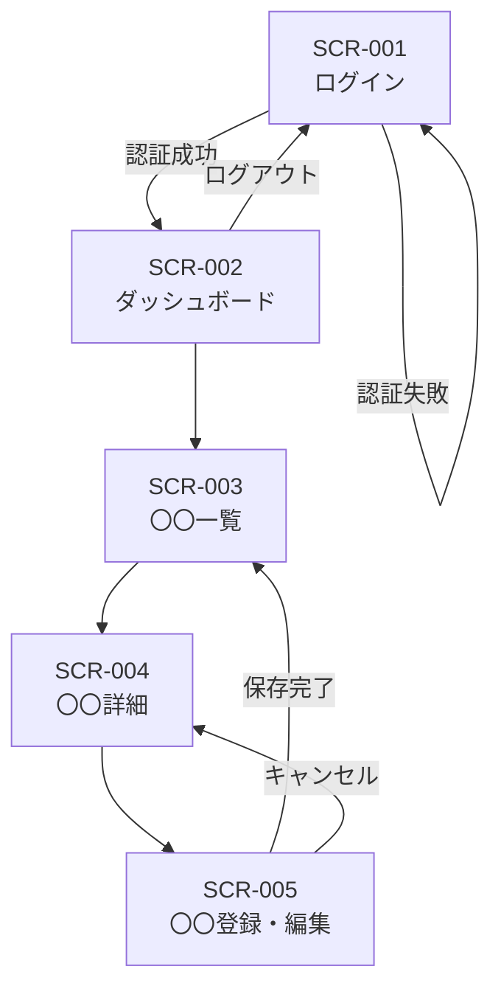

# 画面定義書

> **位置づけ：** 基本設計の一部。画面1枚につき1セクション（または1ファイル）を作成し、実装・テストの基準とする。
> **更新ルール：** 画面仕様を変更する場合は変更要求票を発行し、本書のバージョンを上げる。

---

## ドキュメント情報

| 項目               | 内容                                    |
| ------------------ | --------------------------------------- |
| **システム名**     |                                         |
| **文書バージョン** | v1.0                                    |
| **作成日**         | YYYY-MM-DD                              |
| **最終更新日**     | YYYY-MM-DD                              |
| **作成者**         |                                         |
| **レビュアー**     |                                         |
| **承認者**         |                                         |
| **関連文書**       | システム仕様書 v〇〇 / 要件定義書 v〇〇 |

---

## 画面一覧

| 画面ID  | 画面名         | URL パス   | 対応機能（FR#） | アクセス権限 |
| ------- | -------------- | ---------- | --------------- | ------------ |
| SCR-001 | ログイン       | /login     | FR-001          | 全ユーザー   |
| SCR-002 | ダッシュボード | /dashboard | FR-002          | 認証済み     |
| SCR-003 | 〇〇一覧       | /〇〇      | FR-〇〇〇       |              |
| SCR-004 | 〇〇詳細       | /〇〇/:id  | FR-〇〇〇       |              |
| SCR-005 | 〇〇登録・編集 | /〇〇/new  | FR-〇〇〇       |              |

---

## 画面遷移図

---

## 画面詳細

---

### SCR-001：ログイン

#### 基本情報

| 項目             | 内容                                                     |
| ---------------- | -------------------------------------------------------- |
| **画面ID**       | SCR-001                                                  |
| **画面名**       | ログイン                                                 |
| **URL**          | /login                                                   |
| **HTTPメソッド** | GET（表示）/ POST（送信）                                |
| **対応要件**     | FR-001                                                   |
| **アクセス権限** | 未認証ユーザー（認証済みはダッシュボードへリダイレクト） |
| **備考**         |                                                          |

#### 表示項目

| 項目ID  | 項目名                   | 種別           | 必須 | 初期値 | 備考                   |
| ------- | ------------------------ | -------------- | ---- | ------ | ---------------------- |
| F001-01 | メールアドレス           | テキスト入力   | ○    |        | type="email"           |
| F001-02 | パスワード               | パスワード入力 | ○    |        | type="password"        |
| F001-03 | ログインボタン           | ボタン         | —    | —      | POST送信               |
| F001-04 | パスワードリセットリンク | リンク         | —    | —      | /password/reset へ遷移 |

#### バリデーション

| 項目ID  | 条件             | エラーメッセージ                                                       |
| ------- | ---------------- | ---------------------------------------------------------------------- |
| F001-01 | 必須             | 「メールアドレスを入力してください」                                   |
| F001-01 | メール形式       | 「正しいメールアドレスの形式で入力してください」                       |
| F001-02 | 必須             | 「パスワードを入力してください」                                       |
| —       | 認証失敗         | 「メールアドレスまたはパスワードが正しくありません」（画面上部に表示） |
| —       | アカウントロック | 「アカウントがロックされています。〇分後に再試行してください」         |

#### アクション一覧

| アクション         | トリガー           | 処理                             | 遷移先                                      |
| ------------------ | ------------------ | -------------------------------- | ------------------------------------------- |
| ログイン送信       | ログインボタン押下 | 認証API呼び出し → セッション発行 | 成功: SCR-002 / 失敗: SCR-001（エラー表示） |
| パスワードリセット | リンク押下         | —                                | /password/reset                             |

#### エラーメッセージ一覧

| エラーID   | 表示条件         | 表示場所 | メッセージ                                           |
| ---------- | ---------------- | -------- | ---------------------------------------------------- |
| ERR-001-01 | 認証失敗         | 画面上部 | 「メールアドレスまたはパスワードが正しくありません」 |
| ERR-001-02 | アカウントロック | 画面上部 | 「アカウントがロックされています」                   |

---

### SCR-002：ダッシュボード

#### 基本情報

| 項目               | 内容                                                |
| ------------------ | --------------------------------------------------- |
| **画面ID**         | SCR-002                                             |
| **画面名**         | ダッシュボード                                      |
| **URL**            | /dashboard                                          |
| **対応要件**       | FR-002                                              |
| **アクセス権限**   | 認証済みユーザー（未認証は SCR-001 へリダイレクト） |
| **初期表示データ** | ログインユーザーに紐づく〇〇を取得して表示          |
| **備考**           |                                                     |

#### 表示項目

| 項目ID  | 項目名                 | 種別         | データソース   | 備考                     |
| ------- | ---------------------- | ------------ | -------------- | ------------------------ |
| D002-01 | ユーザー名             | テキスト表示 | セッション情報 | 「〇〇さん、こんにちは」 |
| D002-02 | 〇〇サマリー           | 数値表示     | API取得        |                          |
| D002-03 | 〇〇一覧ショートカット | リンク       | —              | SCR-003 へ               |

#### アクション一覧

| アクション | トリガー             | 処理           | 遷移先  |
| ---------- | -------------------- | -------------- | ------- |
| 〇〇一覧へ | リンク押下           | —              | SCR-003 |
| ログアウト | ログアウトボタン押下 | セッション破棄 | SCR-001 |

---

### SCR-003：〇〇一覧

#### 基本情報

| 項目                 | 内容            |
| -------------------- | --------------- |
| **画面ID**           | SCR-003         |
| **画面名**           | 〇〇一覧        |
| **URL**              | /〇〇           |
| **対応要件**         | FR-〇〇〇       |
| **アクセス権限**     |                 |
| **初期表示データ**   |                 |
| **ページネーション** | 〇〇件 / ページ |
| **備考**             |                 |

#### 表示項目

| 項目ID  | 項目名     | 種別     | データソース | 並び替え | 備考             |
| ------- | ---------- | -------- | ------------ | -------- | ---------------- |
| L003-01 | 〇〇       | テキスト | DB           | ○        |                  |
| L003-02 | 〇〇       | 日付     | DB           | ○        |                  |
| L003-03 | 操作ボタン | ボタン群 | —            | —        | 詳細・編集・削除 |

#### 検索・絞り込み条件

| 条件項目        | 種別         | デフォルト値 | 備考                       |
| --------------- | ------------ | ------------ | -------------------------- |
| キーワード      | テキスト入力 | 空           | 〇〇カラムを対象に部分一致 |
| 期間（From-To） | 日付入力     | 当月         |                            |
| ステータス      | プルダウン   | 全て         |                            |

#### アクション一覧

| アクション | トリガー                    | 処理            | 遷移先              |
| ---------- | --------------------------- | --------------- | ------------------- |
| 詳細表示   | 行クリック or 詳細ボタン    | —               | SCR-004             |
| 新規登録   | 新規登録ボタン              | —               | SCR-005             |
| 削除       | 削除ボタン → 確認ダイアログ | 削除API呼び出し | SCR-003（リロード） |

#### エラーメッセージ一覧

| エラーID   | 表示条件    | 表示場所     | メッセージ                                     |
| ---------- | ----------- | ------------ | ---------------------------------------------- |
| ERR-003-01 | 削除失敗    | トースト通知 | 「削除できませんでした。再度お試しください」   |
| ERR-003-02 | 検索結果0件 | リスト領域   | 「条件に一致するデータが見つかりませんでした」 |

---

### SCR-004：〇〇詳細

<!-- SCR-003と同じ構成で記述する -->

#### 基本情報

| 項目               | 内容                                 |
| ------------------ | ------------------------------------ |
| **画面ID**         | SCR-004                              |
| **画面名**         | 〇〇詳細                             |
| **URL**            | /〇〇/:id                            |
| **対応要件**       | FR-〇〇〇                            |
| **アクセス権限**   |                                      |
| **初期表示データ** | URLパラメーター（id）を使いAPIで取得 |
| **備考**           |                                      |

#### 表示項目

| 項目ID  | 項目名 | 種別         | データソース | 備考 |
| ------- | ------ | ------------ | ------------ | ---- |
| D004-01 | 〇〇   | テキスト表示 | API          |      |
| D004-02 | 〇〇   | 日付表示     | API          |      |

#### アクション一覧

| アクション | トリガー   | 処理 | 遷移先  |
| ---------- | ---------- | ---- | ------- |
| 編集       | 編集ボタン | —    | SCR-005 |
| 一覧へ戻る | 戻るボタン | —    | SCR-003 |

---

### SCR-005：〇〇登録・編集

#### 基本情報

| 項目               | 内容                                                 |
| ------------------ | ---------------------------------------------------- |
| **画面ID**         | SCR-005                                              |
| **画面名**         | 〇〇登録・編集                                       |
| **URL**            | /〇〇/new（新規） / /〇〇/:id/edit（編集）           |
| **対応要件**       | FR-〇〇〇                                            |
| **アクセス権限**   |                                                      |
| **初期表示データ** | 新規: 空 / 編集: 既存データをAPIで取得して初期セット |
| **備考**           |                                                      |

#### 入力項目

| 項目ID  | 項目名 | 種別           | 必須 | 最大文字数 | 初期値           | 備考           |
| ------- | ------ | -------------- | ---- | ---------- | ---------------- | -------------- |
| F005-01 | 〇〇   | テキスト入力   | ○    | 100文字    |                  |                |
| F005-02 | 〇〇   | プルダウン     | ○    | —          | 選択してください | マスタから取得 |
| F005-03 | 〇〇   | 日付入力       |      | —          |                  |                |
| F005-04 | 〇〇   | テキストエリア |      | 1000文字   |                  |                |

#### バリデーション

| 項目ID  | 条件           | エラーメッセージ                        |
| ------- | -------------- | --------------------------------------- |
| F005-01 | 必須           | 「〇〇を入力してください」              |
| F005-01 | 最大文字数超過 | 「〇〇は100文字以内で入力してください」 |
| F005-02 | 必須           | 「〇〇を選択してください」              |

#### アクション一覧

| アクション | トリガー         | 処理                                  | 遷移先                                      |
| ---------- | ---------------- | ------------------------------------- | ------------------------------------------- |
| 保存       | 保存ボタン       | バリデーション → 登録/更新API呼び出し | 成功: SCR-003 / 失敗: SCR-005（エラー表示） |
| キャンセル | キャンセルボタン | 未保存の場合は確認ダイアログを表示    | SCR-004（編集時） / SCR-003（新規時）       |

#### エラーメッセージ一覧

| エラーID   | 表示条件                   | 表示場所 | メッセージ                                   |
| ---------- | -------------------------- | -------- | -------------------------------------------- |
| ERR-005-01 | 保存失敗（サーバーエラー） | 画面上部 | 「保存できませんでした。再度お試しください」 |
| ERR-005-02 | 重複エラー                 | 該当項目 | 「この〇〇はすでに登録されています」         |
