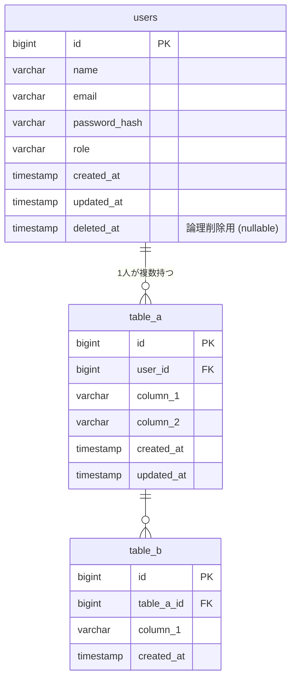

# DB設計書（データベース設計書）

> **位置づけ：** 基本設計の一部。テーブル定義・ER図・インデックス・採番ルールを定義する。
> **更新ルール：** テーブル定義を変更する場合は変更要求票を発行し、マイグレーションファイルと本書を同時に更新する。

---

## ドキュメント情報

| 項目               | 内容                                    |
| ------------------ | --------------------------------------- |
| **システム名**     |                                         |
| **DBMS**           | （例: PostgreSQL 15 / MySQL 8.0）       |
| **文書バージョン** | v1.0                                    |
| **作成日**         | YYYY-MM-DD                              |
| **最終更新日**     | YYYY-MM-DD                              |
| **作成者**         |                                         |
| **レビュアー**     |                                         |
| **承認者**         |                                         |
| **関連文書**       | システム仕様書 v〇〇 / 要件定義書 v〇〇 |

---

## 1. テーブル一覧

| #   | テーブル名（物理名） | テーブル名（論理名） | 概要                         | 主な対応FR# |
| --- | -------------------- | -------------------- | ---------------------------- | ----------- |
| 1   | users                | ユーザー             | システムユーザーのマスタ情報 | FR-001      |
| 2   | 〇〇                 | 〇〇                 |                              |             |
| 3   | 〇〇                 | 〇〇                 |                              |             |

---

## 2. ER図

<!-- リレーション記法: ||--|| (1対1)  ||--o{ (1対多)  }o--o{ (多対多) -->

---

## 3. テーブル定義

<!-- 各テーブルについて以下の形式で記述する。 -->

---

### users（ユーザー）

**概要：** システムにログインするユーザーのマスタテーブル。

| #   | カラム名（物理名） | カラム名（論理名）     | データ型  | 文字数/精度 | NULL     | PK  | FK  | UK  | デフォルト値      | 説明                   |
| --- | ------------------ | ---------------------- | --------- | ----------- | -------- | --- | --- | --- | ----------------- | ---------------------- |
| 1   | id                 | ID                     | BIGINT    | —           | NOT NULL | ○   |     |     | AUTO_INCREMENT    | サロゲートキー         |
| 2   | name               | 氏名                   | VARCHAR   | 100         | NOT NULL |     |     |     |                   |                        |
| 3   | email              | メールアドレス         | VARCHAR   | 255         | NOT NULL |     |     | ○   |                   | ログインID             |
| 4   | password_hash      | パスワード（ハッシュ） | VARCHAR   | 255         | NOT NULL |     |     |     |                   | bcrypt等でハッシュ化   |
| 5   | role               | ロール                 | ENUM      | —           | NOT NULL |     |     |     | 'user'            | admin / manager / user |
| 6   | created_at         | 作成日時               | TIMESTAMP | —           | NOT NULL |     |     |     | CURRENT_TIMESTAMP |                        |
| 7   | updated_at         | 更新日時               | TIMESTAMP | —           | NOT NULL |     |     |     | CURRENT_TIMESTAMP | 更新時自動更新         |
| 8   | deleted_at         | 削除日時               | TIMESTAMP | —           | NULL     |     |     |     | NULL              | 論理削除。NULLで有効   |

**インデックス：**

| インデックス名 | 種別        | 対象カラム | 目的                   |
| -------------- | ----------- | ---------- | ---------------------- |
| PK             | PRIMARY KEY | id         | 主キー                 |
| uk_users_email | UNIQUE      | email      | メールアドレス重複防止 |
| idx_users_role | INDEX       | role       | ロール絞り込み         |

---

### table_a（〇〇）

**概要：**

| #   | カラム名（物理名） | カラム名（論理名） | データ型  | 文字数/精度 | NULL     | PK  | FK  | UK  | デフォルト値      | 説明          |
| --- | ------------------ | ------------------ | --------- | ----------- | -------- | --- | --- | --- | ----------------- | ------------- |
| 1   | id                 | ID                 | BIGINT    | —           | NOT NULL | ○   |     |     | AUTO_INCREMENT    |               |
| 2   | user_id            | ユーザーID         | BIGINT    | —           | NOT NULL |     | ○   |     |                   | users.id 参照 |
| 3   | column_1           | 〇〇               | VARCHAR   | 255         | NOT NULL |     |     |     |                   |               |
| 4   | column_2           | 〇〇               | TEXT      | —           | NULL     |     |     |     | NULL              |               |
| 5   | created_at         | 作成日時           | TIMESTAMP | —           | NOT NULL |     |     |     | CURRENT_TIMESTAMP |               |
| 6   | updated_at         | 更新日時           | TIMESTAMP | —           | NOT NULL |     |     |     | CURRENT_TIMESTAMP |               |

**インデックス：**

| インデックス名      | 種別        | 対象カラム | 目的               |
| ------------------- | ----------- | ---------- | ------------------ |
| PK                  | PRIMARY KEY | id         |                    |
| idx_table_a_user_id | INDEX       | user_id    | ユーザーID絞り込み |

**外部キー制約：**

| 制約名          | カラム  | 参照先テーブル | 参照先カラム | ON DELETE | ON UPDATE |
| --------------- | ------- | -------------- | ------------ | --------- | --------- |
| fk_table_a_user | user_id | users          | id           | RESTRICT  | CASCADE   |

---

## 4. マスタデータ

<!-- 初期投入が必要なマスタデータを記述する。 -->

### usersテーブル 初期データ

| id  | name           | email             | role  | 備考                                   |
| --- | -------------- | ----------------- | ----- | -------------------------------------- |
| 1   | システム管理者 | admin@example.com | admin | 初期アカウント（パスワードは別途連絡） |

---

## 5. 採番・命名ルール

| 対象           | ルール                                         | 例                      |
| -------------- | ---------------------------------------------- | ----------------------- |
| テーブル名     | スネークケース・複数形（英語）                 | `users`, `order_items`  |
| カラム名       | スネークケース                                 | `created_at`, `user_id` |
| インデックス名 | `idx_テーブル名_カラム名`                      | `idx_users_role`        |
| ユニーク制約名 | `uk_テーブル名_カラム名`                       | `uk_users_email`        |
| 外部キー名     | `fk_子テーブル_親テーブル`                     | `fk_table_a_user`       |
| 主キー         | BIGINT AUTO_INCREMENT（全テーブル共通）        | —                       |
| 論理削除       | `deleted_at` TIMESTAMP NULL（NULL = 有効）     | —                       |
| タイムスタンプ | `created_at` / `updated_at` を全テーブルに付与 | —                       |

---

## 6. 特記事項・設計上の注意点

| #   | 内容                                                                                                               |
| --- | ------------------------------------------------------------------------------------------------------------------ |
| 1   | 論理削除を採用しているテーブルでは、アプリ側で `deleted_at IS NULL` の絞り込みを忘れないこと。                     |
| 2   | パスワードは平文で保存しないこと。bcrypt（コスト係数12以上）でハッシュ化すること。                                 |
| 3   | 外部キー制約の ON DELETE RESTRICT は業務データを誤って消さないための安全策。削除が必要な場合は論理削除を使うこと。 |
| 4   | （その他プロジェクト固有の注意点を記述する）                                                                       |
