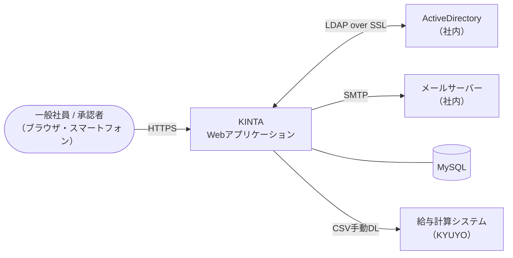
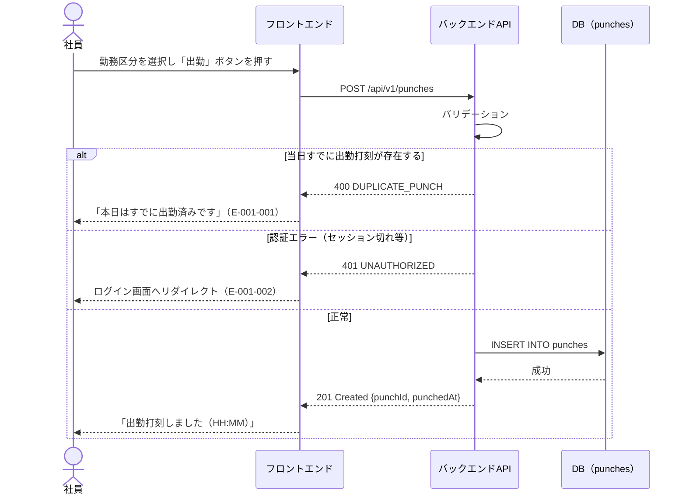
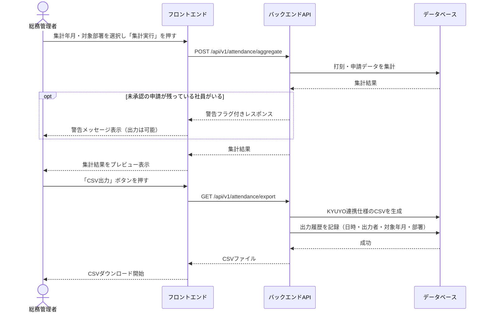
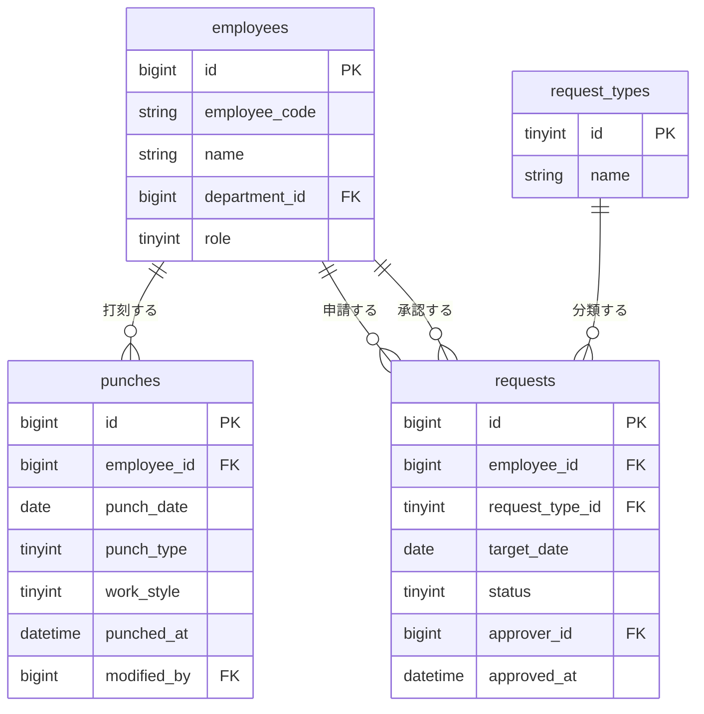

# ソフトウェア要件仕様書（SRS）

> **対応規格：** ISO/IEC/IEEE 29148:2018 / IEEE 830-1998（SRS 相当）
> **位置づけ：** 「どのように実現するか（How）」を定義する文書。要件定義書を受けて作成する。

---

## ドキュメント情報

| 項目               | 内容                                 |
| ------------------ | ------------------------------------ |
| **プロジェクト名** | 社内勤怠管理システム刷新プロジェクト |
| **システム名**     | 勤怠管理システム（KINTA）            |
| **文書バージョン** | v1.0                                 |
| **作成日**         | 2026-05-10                           |
| **最終更新日**     | 2026-05-10                           |
| **作成者**         | 佐藤 花子（外部開発ベンダー）        |
| **承認者**         | 山田 太郎（情報システム部）          |
| **ステータス**     | 草稿                                 |

### 改訂履歴

| バージョン | 日付       | 変更者    | 変更内容 |
| ---------- | ---------- | --------- | -------- |
| v1.0       | 2026-05-10 | 佐藤 花子 | 初版作成 |

### 関連文書

| 文書名                                    | バージョン | 備考                |
| ----------------------------------------- | ---------- | ------------------- |
| 要件定義書（勤怠管理システム刷新PJ）      | v1.2       | 本仕様書の上位文書  |
| 給与計算システム（KYUYO）データ連携仕様書 | v2.1       | CSV出力仕様の参照先 |

---

## 1. 目的・概要

### 1.1 システム概要

社員150名規模の企業向け社内勤怠管理システム。社員の日次打刻・各種申請と上長承認・月次集計のCSV出力を主要機能として提供するWebアプリケーション。

### 1.2 本文書の目的・対象読者

本文書は、要件定義書で定義された「何を実現するか」を受けて、「どのように実現するか」を開発チームが実装できるレベルで定義する。

**対象読者：** 外部開発ベンダー（設計・開発・テスト担当）、情報システム部（レビュー・受入）

### 1.3 用語・略語定義

| 用語 / 略語 | 定義                                      |
| ----------- | ----------------------------------------- |
| KINTA       | 本システムの略称（Kintai management App） |
| JWT         | JSON Web Token。認証トークン形式          |
| RTC         | Real-time Clock。サーバー側の基準時刻     |
| CSR         | Client-Side Rendering                     |
| SSR         | Server-Side Rendering                     |

### 1.4 参照規格・文書

| 文書名 / 規格                             | バージョン |
| ----------------------------------------- | ---------- |
| ISO/IEC/IEEE 29148:2018                   | 2018       |
| 要件定義書（勤怠管理システム刷新PJ）      | v1.2       |
| 給与計算システム（KYUYO）データ連携仕様書 | v2.1       |

---

## 2. システム全体概要

### 2.1 システムコンテキスト図



### 2.2 システム構成概要

| コンポーネント                 | 役割                             | 技術スタック（案） |
| ------------------------------ | -------------------------------- | ------------------ |
| フロントエンド                 | ブラウザ上で動作するUI           | React + TypeScript |
| バックエンドAPI                | ビジネスロジック・データアクセス | Laravel（PHP）     |
| データベース                   | 勤怠データ・マスタデータの永続化 | MySQL 8.0          |
| 認証基盤連携                   | ActiveDirectoryとのSSO           | LDAP over SSL      |
| Webサーバー / リバースプロキシ | HTTPS終端・静的ファイル配信      | Nginx              |

### 2.3 ユーザー種別と権限

| ユーザー種別   | 権限レベル                   | 主な操作範囲                       |
| -------------- | ---------------------------- | ---------------------------------- |
| 一般社員       | 自分のデータのみ参照・操作   | 打刻、申請、自分の勤怠確認         |
| 承認者         | 自分＋部下のデータ参照       | 打刻、申請、部下の申請承認・確認   |
| 総務管理者     | 全社員データ参照・修正・出力 | 全機能（打刻修正・集計・CSV出力）  |
| システム管理者 | 全権限                       | マスタ管理・システム設定・ログ参照 |

---

## 3. 機能仕様

### 3.1 機能一覧

| 機能ID | 機能名                | 概要                                   | 対応要件ID     |
| ------ | --------------------- | -------------------------------------- | -------------- |
| F-001  | 打刻機能              | 出退勤・休憩の打刻を記録する           | FR-001, FR-002 |
| F-002  | 残業申請機能          | 残業申請の登録・閲覧を行う             | FR-003         |
| F-003  | 休暇申請機能          | 休暇申請の登録・閲覧を行う             | FR-004         |
| F-004  | 申請承認機能          | 申請の承認・否認を行う                 | FR-005         |
| F-005  | 月次集計・CSV出力機能 | 月次勤怠データの集計とCSV出力を行う    | FR-006         |
| F-006  | 管理者修正機能        | 勤怠データを管理者権限で修正する       | FR-007         |
| F-007  | 残業アラート通知機能  | 残業時間超過を自動検知しメール送信する | FR-008         |

---

### F-001：打刻機能

> **対応要件：** FR-001, FR-002

#### F-001.1 概要

社員がログイン後のホーム画面から、出勤・休憩開始・休憩終了・退勤の4種の打刻を行う。打刻はサーバー側で受信した時刻（RTC）を記録し、クライアント時刻には依存しない。

#### F-001.2 画面仕様

| 画面ID  | 画面名             | 説明                                                     |
| ------- | ------------------ | -------------------------------------------------------- |
| SCR-001 | ホーム（打刻）画面 | ログイン後のトップ画面。打刻ボタンと当日の勤怠状況を表示 |

**画面項目定義（SCR-001）：**

| 項目名         | 種別               | 必須 | 説明                                                |
| -------------- | ------------------ | ---- | --------------------------------------------------- |
| 勤務区分       | 選択（プルダウン） | 必須 | 通常勤務 / テレワーク / 直行 / 直帰（打刻前に選択） |
| 出勤ボタン     | ボタン             | -    | 未出勤の場合のみ活性表示                            |
| 休憩開始ボタン | ボタン             | -    | 出勤済み・休憩中でない場合のみ活性表示              |
| 休憩終了ボタン | ボタン             | -    | 休憩中の場合のみ活性表示                            |
| 退勤ボタン     | ボタン             | -    | 出勤済み・退勤していない場合のみ活性表示            |
| 当日打刻状況   | テキスト表示       | -    | 出勤 HH:MM / 休憩 HH:MM〜HH:MM / 退勤 HH:MM を表示  |

#### F-001.3 処理仕様

**入力：**

| 項目     | 型                                                     | 必須               | バリデーション |
| -------- | ------------------------------------------------------ | ------------------ | -------------- |
| 打刻種別 | enum（CLOCK_IN / BREAK_START / BREAK_END / CLOCK_OUT） | 必須               | -              |
| 勤務区分 | enum（NORMAL / REMOTE / DIRECT_GO / DIRECT_RETURN）    | 必須（出勤時のみ） | -              |

**処理フロー（出勤打刻）：**



**出力：**

| 項目      | 型       | 説明                             |
| --------- | -------- | -------------------------------- |
| punchId   | string   | 登録された打刻レコードのID       |
| punchType | string   | 打刻種別                         |
| punchedAt | datetime | サーバー記録時刻（ISO 8601形式） |

#### F-001.4 業務ルール

| ルールID  | ルール内容                                                                                 |
| --------- | ------------------------------------------------------------------------------------------ |
| BR-001-01 | 同一日・同一打刻種別は1件のみ登録可能（管理者修正機能を除く）                              |
| BR-001-02 | 打刻時刻はサーバー受信時刻（UTC基準、表示はJST）を使用し、クライアント側の時刻は使用しない |
| BR-001-03 | 退勤時刻が翌日にまたがる場合（深夜勤務）も同日の勤怠として記録する（日付は出勤日で管理）   |

#### F-001.5 エラー仕様

| エラーコード | 発生条件                       | メッセージ                                                                                  | 対処                                   |
| ------------ | ------------------------------ | ------------------------------------------------------------------------------------------- | -------------------------------------- |
| E-001-001    | 当日すでに同種の打刻が存在する | 「本日はすでに出勤済みです」                                                                | 画面でメッセージ表示。打刻不可         |
| E-001-002    | 認証エラー（セッション切れ等） | 「セッションが切れました。再度ログインしてください」                                        | ログイン画面へリダイレクト             |
| E-001-003    | サーバーエラー                 | 「システムエラーが発生しました。時間をおいて再度お試しください（エラーコード：E-001-003）」 | エラーログを記録。画面でリトライを促す |

---

### F-005：月次集計・CSV出力機能

> **対応要件：** FR-006

#### F-005.1 概要

総務管理者が指定年月・対象部署を選択し、勤怠データを集計して給与計算システム（KYUYO）連携用のCSVを出力する。

#### F-005.2 画面仕様

| 画面ID  | 画面名       | 説明                                            |
| ------- | ------------ | ----------------------------------------------- |
| SCR-010 | 月次集計画面 | 集計条件入力・集計結果プレビュー・CSV出力ボタン |

**画面項目定義（SCR-010）：**

| 項目名             | 種別               | 必須 | 説明                                   |
| ------------------ | ------------------ | ---- | -------------------------------------- |
| 集計年月           | 日付（年月）       | 必須 | 対象月を選択（デフォルト：前月）       |
| 対象部署           | 選択（プルダウン） | 必須 | 全社 / 部署選択                        |
| 集計実行ボタン     | ボタン             | -    | 押下で集計結果をプレビュー表示         |
| 未承認申請アラート | テキスト表示       | -    | 未承認申請がある場合に警告表示（赤色） |
| CSV出力ボタン      | ボタン             | -    | 集計実行後に活性化                     |

#### F-005.3 処理仕様

**入力：**

| 項目            | 型                    | 必須 | バリデーション        |
| --------------- | --------------------- | ---- | --------------------- |
| targetYearMonth | string（YYYY-MM形式） | 必須 | 当月以前のみ指定可能  |
| departmentId    | integer / null        | 必須 | null の場合は全社集計 |

**処理フロー：**



**CSV出力形式（KYUYO連携仕様 v2.1 準拠）：**

```csv
社員番号,氏名,出勤日数,総労働時間,残業時間,深夜残業時間,休日出勤時間,有給取得日数
E001,山田太郎,21,168.5,8.5,0.0,0.0,1
E002,鈴木花子,20,160.0,0.0,0.0,8.0,2
```

#### F-005.4 業務ルール

| ルールID  | ルール内容                                                        |
| --------- | ----------------------------------------------------------------- |
| BR-005-01 | 締め日（25日）を過ぎた月のみ集計・出力可能とする                  |
| BR-005-02 | 未承認の申請がある場合は警告を表示するが、出力は許可する          |
| BR-005-03 | CSV出力は何度でも実行可能（再出力可）。出力のたびに履歴を記録する |
| BR-005-04 | 管理者修正済みのデータは修正後の値を集計に使用する                |

#### F-005.5 エラー仕様

| エラーコード | 発生条件                        | メッセージ                                     | 対処     |
| ------------ | ------------------------------- | ---------------------------------------------- | -------- |
| E-005-001    | 当月（締め日前）を指定した場合  | 「締め日（25日）を過ぎた月を指定してください」 | 出力不可 |
| E-005-002    | 集計対象の打刻データが0件の場合 | 「指定した条件のデータが見つかりません」       | 出力不可 |

---

## 4. 外部インターフェース仕様

### 4.1 ユーザーインターフェース

- 対応ブラウザ：Chrome（最新版）、Edge（最新版）、Safari（最新版）
- レスポンシブ対応：有（ブレークポイント：768px / 1024px）
- 多言語対応：無（日本語のみ）
- アクセシビリティ基準：JIS X 8341-3 レベル A 準拠を目標とする

### 4.2 APIインターフェース

#### API共通仕様

| 項目           | 内容                                                           |
| -------------- | -------------------------------------------------------------- |
| ベースURL      | `https://kinta.example.co.jp/api/v1`                           |
| 認証方式       | Bearer Token（JWT）。有効期限：60分。リフレッシュトークン：7日 |
| リクエスト形式 | `application/json`（ファイルDLは除く）                         |
| レスポンス形式 | `application/json`                                             |
| 文字コード     | UTF-8                                                          |
| タイムゾーン   | Asia/Tokyo（JST）。APIの日時フィールドはISO 8601形式（+09:00） |

#### APIエンドポイント一覧（打刻関連）

| メソッド | エンドポイント             | 概要                 | 認証 |
| -------- | -------------------------- | -------------------- | ---- |
| POST     | `/punches`                 | 打刻登録             | 要   |
| GET      | `/punches/today`           | 当日の打刻状況取得   | 要   |
| GET      | `/punches?month={YYYY-MM}` | 指定月の打刻一覧取得 | 要   |

#### API詳細：打刻登録

**リクエスト**

```http
POST /api/v1/punches
Authorization: Bearer {jwt_token}
Content-Type: application/json
```

```json
{
  "punchType": "CLOCK_IN",
  "workStyle": "REMOTE"
}
```

| パラメータ | 種別 | 型     | 必須     | 説明                                                                                  |
| ---------- | ---- | ------ | -------- | ------------------------------------------------------------------------------------- |
| punchType  | Body | string | 必須     | `CLOCK_IN` / `BREAK_START` / `BREAK_END` / `CLOCK_OUT`                                |
| workStyle  | Body | string | 条件付き | 打刻種別が`CLOCK_IN`の場合は必須。`NORMAL` / `REMOTE` / `DIRECT_GO` / `DIRECT_RETURN` |

**レスポンス（201 Created）**

```json
{
  "punchId": "a1b2c3d4-e5f6-7890-abcd-ef1234567890",
  "punchType": "CLOCK_IN",
  "workStyle": "REMOTE",
  "punchedAt": "2026-05-10T09:02:35+09:00"
}
```

**エラーレスポンス**

| HTTPステータス | エラーコード          | 説明                                 |
| -------------- | --------------------- | ------------------------------------ |
| 400            | INVALID_PUNCH_TYPE    | 不正な打刻種別                       |
| 400            | DUPLICATE_PUNCH       | 当日すでに同種の打刻が存在する       |
| 401            | UNAUTHORIZED          | 認証エラー（トークン無効・期限切れ） |
| 500            | INTERNAL_SERVER_ERROR | サーバー内部エラー                   |

### 4.3 外部システム連携仕様

| #   | 連携先システム            | 連携方式                              | 頻度                       | データ形式                 | 連携内容                         |
| --- | ------------------------- | ------------------------------------- | -------------------------- | -------------------------- | -------------------------------- |
| 1   | ActiveDirectory           | LDAP over SSL（ポート636）            | ログイン時（リアルタイム） | -                          | 社員の認証情報取得・SSO          |
| 2   | メールサーバー            | SMTP（ポート587、STARTTLS）           | イベント発生時（随時）     | -                          | 承認通知・残業アラートメール送信 |
| 3   | 給与計算システム（KYUYO） | CSVファイル（手動DL・手動インポート） | 月次                       | CSV（Shift-JIS、CRLF改行） | 月次勤怠集計データ連携           |

---

## 5. データ仕様

### 5.1 データモデル概要



### 5.2 テーブル定義

#### テーブル名：打刻テーブル（`punches`）

**概要：** 社員の打刻記録を管理するテーブル

| カラム名      | 型       | 長さ | NULL     | PK / UK / FK       | デフォルト        | 説明                                                |
| ------------- | -------- | ---- | -------- | ------------------ | ----------------- | --------------------------------------------------- |
| `id`          | BIGINT   | -    | NOT NULL | PK                 | AUTO_INCREMENT    | 打刻ID                                              |
| `employee_id` | BIGINT   | -    | NOT NULL | FK（employees.id） | -                 | 社員ID                                              |
| `punch_date`  | DATE     | -    | NOT NULL | -                  | -                 | 打刻日（出勤日基準）                                |
| `punch_type`  | TINYINT  | -    | NOT NULL | -                  | -                 | 1:出勤 2:休憩開始 3:休憩終了 4:退勤                 |
| `work_style`  | TINYINT  | -    | NULL     | -                  | NULL              | 1:通常 2:テレワーク 3:直行 4:直帰（出勤打刻時のみ） |
| `punched_at`  | DATETIME | -    | NOT NULL | -                  | -                 | 打刻時刻（サーバー受信時刻、JST）                   |
| `modified_by` | BIGINT   | -    | NULL     | FK（employees.id） | NULL              | 修正した管理者のID（管理者修正時のみ）              |
| `modified_at` | DATETIME | -    | NULL     | -                  | NULL              | 修正日時                                            |
| `created_at`  | DATETIME | -    | NOT NULL | -                  | CURRENT_TIMESTAMP | 作成日時                                            |
| `updated_at`  | DATETIME | -    | NOT NULL | -                  | CURRENT_TIMESTAMP | 更新日時                                            |

**インデックス：**

| インデックス名              | カラム                                    | 種別   |
| --------------------------- | ----------------------------------------- | ------ |
| `idx_punches_employee_date` | `employee_id`, `punch_date`               | INDEX  |
| `uq_punches_emp_date_type`  | `employee_id`, `punch_date`, `punch_type` | UNIQUE |

#### テーブル名：申請テーブル（`requests`）

**概要：** 残業・休暇等の各種申請を管理するテーブル

| カラム名           | 型       | 長さ | NULL     | PK / UK / FK           | デフォルト        | 説明                            |
| ------------------ | -------- | ---- | -------- | ---------------------- | ----------------- | ------------------------------- |
| `id`               | BIGINT   | -    | NOT NULL | PK                     | AUTO_INCREMENT    | 申請ID                          |
| `employee_id`      | BIGINT   | -    | NOT NULL | FK（employees.id）     | -                 | 申請者の社員ID                  |
| `request_type_id`  | TINYINT  | -    | NOT NULL | FK（request_types.id） | -                 | 申請種別                        |
| `target_date`      | DATE     | -    | NOT NULL | -                      | -                 | 申請対象日                      |
| `status`           | TINYINT  | -    | NOT NULL | -                      | 1                 | 1:申請中 2:承認 3:否認 4:取下げ |
| `reason`           | VARCHAR  | 500  | NULL     | -                      | NULL              | 申請理由                        |
| `approver_id`      | BIGINT   | -    | NULL     | FK（employees.id）     | NULL              | 承認者の社員ID                  |
| `approved_at`      | DATETIME | -    | NULL     | -                      | NULL              | 承認・否認日時                  |
| `approver_comment` | VARCHAR  | 500  | NULL     | -                      | NULL              | 承認者コメント                  |
| `created_at`       | DATETIME | -    | NOT NULL | -                      | CURRENT_TIMESTAMP | 申請日時                        |
| `updated_at`       | DATETIME | -    | NOT NULL | -                      | CURRENT_TIMESTAMP | 更新日時                        |

### 5.3 データ保持・削除ポリシー

| データ種別 | 保持期間                         | 削除方法                               |
| ---------- | -------------------------------- | -------------------------------------- |
| 打刻データ | 5年（労働基準法第109条に基づく） | 保持期間経過後に物理削除（バッチ処理） |
| 申請データ | 5年                              | 同上                                   |
| 操作ログ   | 5年                              | 同上                                   |
| 出力履歴   | 5年                              | 同上                                   |

---

## 6. 非機能要件の実現方式

### 6.1 可用性・信頼性

| 要件ID    | 要件内容          | 実現方式                                                                        |
| --------- | ----------------- | ------------------------------------------------------------------------------- |
| NFR-A-001 | 稼働率 99.5% 以上 | Webサーバー・APサーバーの冗長構成（Active-Active）。DBはプライマリ-レプリカ構成 |
| NFR-A-003 | RTO 4時間以内     | CloudWatch監視 + 自動フェイルオーバー + 障害対応手順書の整備                    |
| NFR-A-004 | RPO 1時間以内     | 差分バックアップを1時間毎に取得                                                 |

### 6.2 性能

| 要件ID    | 要件内容                     | 実現方式                                                          |
| --------- | ---------------------------- | ----------------------------------------------------------------- |
| NFR-P-001 | 応答時間 3秒以内（通常時）   | 打刻テーブルに複合インデックス設定。N+1クエリの排除               |
| NFR-P-002 | 応答時間 5秒以内（ピーク時） | 打刻APIはステートレス設計でAPサーバーを水平スケーリング可能にする |

### 6.3 セキュリティ

| 要件ID    | 要件内容     | 実現方式                                                                                                                   |
| --------- | ------------ | -------------------------------------------------------------------------------------------------------------------------- |
| NFR-S-001 | 認証方式     | ActiveDirectoryとLDAP over SSLで連携。JWT（HS256）を発行しAPIリクエストを認証                                              |
| NFR-S-003 | アクセス制御 | バックエンドAPIで各エンドポイントにロール検証ミドルウェアを実装。フロントエンドはUI非表示では不十分なため、必ずAPI層で制御 |
| NFR-S-004 | 通信暗号化   | NginxでTLS 1.2以上を強制。HTTP → HTTPSリダイレクト設定                                                                     |
| NFR-S-005 | 監査ログ     | 打刻・申請・承認・管理者修正の操作はDBの操作ログテーブルに記録。アクセスログはNginxログとして保存                          |

### 6.4 運用・保守

| 要件ID    | 要件内容     | 実現方式                                                                                                    |
| --------- | ------------ | ----------------------------------------------------------------------------------------------------------- |
| NFR-O-001 | バックアップ | mysqldumpによる日次フルバックアップ（深夜2時）＋ バイナリログで1時間毎の差分バックアップ                    |
| NFR-O-003 | 監視         | CloudWatch（またはDatadog）でCPU/メモリ/ディスク/APIレスポンスタイムを監視。閾値超過でSlack通知＋メール通知 |

---

## 7. 移行仕様

### 7.1 移行対象データ

| 移行元                | 移行先テーブル          | データ件数（概算）        | 移行方式                                              |
| --------------------- | ----------------------- | ------------------------- | ----------------------------------------------------- |
| ActiveDirectory       | employees（社員マスタ） | 150件                     | LDAPから自動インポートスクリプト                      |
| Excelシート（各部署） | punches（打刻データ）   | 約65,000件（150名×2年分） | ベンダー作成の変換スクリプトでCSVに変換後、一括INSERT |

### 7.2 移行手順概要

```
1. 各部署のExcelシートを総務が収集（統一フォーマットへ変換依頼）
2. ベンダーがExcel→CSV変換スクリプトを作成・実行
3. 検証環境でデータ投入・件数・合計時間のチェック
4. 本番移行リハーサル（本番環境と同等の構成で実施）
5. 本番移行（深夜0時〜、社員非稼働時間帯）
6. 移行後データ検証（件数照合・サンプルチェック）
7. 総務担当者による確認・承認
```

### 7.3 切り戻し方針

本番移行後6時間以内に問題が発見された場合、旧Excelシート運用に戻す。移行前のDB状態のスナップショットを保存しておき、リストア手順をあらかじめ文書化・確認しておく。

---

## 8. テスト要件

### 8.1 テストレベル

| テストレベル      | 目的                                                     | 担当                                |
| ----------------- | -------------------------------------------------------- | ----------------------------------- |
| 単体テスト        | 各API・ビジネスロジックの動作確認                        | 開発者（PHPUnit）                   |
| 結合テスト        | API間連携・LDAP連携・メール送信の動作確認                | 開発者                              |
| システムテスト    | 全機能の動作確認・非機能要件（負荷・セキュリティ）の確認 | テスト担当者                        |
| 受入テスト（UAT） | 総務担当者・承認者・一般社員によるシナリオベースの確認   | 情報システム部立会い / ユーザー代表 |

### 8.2 要件トレーサビリティマトリクス（RTM）

| 要件ID（要件定義書） | 機能ID（本仕様書） | テストケースID                               |
| -------------------- | ------------------ | -------------------------------------------- |
| FR-001               | F-001              | TC-001〜TC-010                               |
| FR-002               | F-001              | TC-011〜TC-015                               |
| FR-003               | F-002              | TC-016〜TC-025                               |
| FR-004               | F-003              | TC-026〜TC-035                               |
| FR-005               | F-004              | TC-036〜TC-045                               |
| FR-006               | F-005              | TC-046〜TC-055                               |
| NFR-P-001            | F-001（打刻API）   | TC-LT-001（負荷テスト：150同時接続）         |
| NFR-S-003            | 全API              | TC-SEC-001〜TC-SEC-010（アクセス制御テスト） |

---

## 付録

### A. 画面一覧

| 画面ID  | 画面名                 | 概要                                 | 対応機能     |
| ------- | ---------------------- | ------------------------------------ | ------------ |
| SCR-001 | ホーム（打刻）画面     | 打刻ボタン・当日勤怠表示             | F-001        |
| SCR-002 | 月次勤怠確認画面       | カレンダー形式で月間勤怠を表示       | -            |
| SCR-003 | 残業申請画面           | 残業申請フォーム                     | F-002        |
| SCR-004 | 休暇申請画面           | 休暇申請フォーム                     | F-003        |
| SCR-005 | 申請一覧画面（申請者） | 自分の申請一覧・ステータス確認       | F-002, F-003 |
| SCR-006 | 承認待ち一覧画面       | 部下の承認待ち申請一覧               | F-004        |
| SCR-007 | 申請詳細・承認画面     | 申請内容確認・承認/否認操作          | F-004        |
| SCR-008 | 部下勤怠一覧画面       | 承認者が部下の勤怠状況を確認         | -            |
| SCR-009 | 全社員勤怠管理画面     | 総務管理者が全社員の勤怠を確認・修正 | F-006        |
| SCR-010 | 月次集計・CSV出力画面  | 月次集計実行・CSV出力                | F-005        |
| SCR-011 | ログイン画面           | ID/パスワード入力・AD連携認証        | -            |

### B. バッチ処理一覧

| バッチID | バッチ名                   | 実行タイミング   | 概要                                                      |
| -------- | -------------------------- | ---------------- | --------------------------------------------------------- |
| BAT-001  | 残業アラートチェックバッチ | 毎日 18:00       | 当月の残業時間を集計し、閾値超過者の承認者にメール送信    |
| BAT-002  | データ削除バッチ           | 毎月1日 深夜3:00 | 保持期間（5年）を経過した打刻・申請・ログデータを物理削除 |
| BAT-003  | ADユーザー同期バッチ       | 毎日 深夜2:00    | ActiveDirectoryの社員情報をemployeesテーブルに同期        |

### C. メッセージ定義一覧

| メッセージID | 種別            | メッセージ文言                                               |
| ------------ | --------------- | ------------------------------------------------------------ |
| MSG-001      | 成功（打刻）    | 「出勤打刻しました（{HH:MM}）」                              |
| MSG-002      | 成功（申請）    | 「申請を送信しました。承認者への通知メールを送信しました。」 |
| MSG-003      | エラー          | 「本日はすでに出勤済みです」                                 |
| MSG-004      | エラー          | 「セッションが切れました。再度ログインしてください」         |
| MSG-005      | 警告（CSV出力） | 「未承認の申請が {N} 件あります。このまま出力しますか？」    |

### D. 課題・未決事項リスト

| #   | 課題・質問                                              | 担当者           | 期限       | ステータス |
| --- | ------------------------------------------------------- | ---------------- | ---------- | ---------- |
| 1   | 直行・直帰時の位置情報取得の要否を確認（GPS打刻の検討） | 山田 / 佐藤      | 2026-05-31 | 未対応     |
| 2   | CSVのエンコード（Shift-JIS）についてKYUYO側と最終確認   | 佐藤 / KYUYO担当 | 2026-05-20 | 対応中     |
