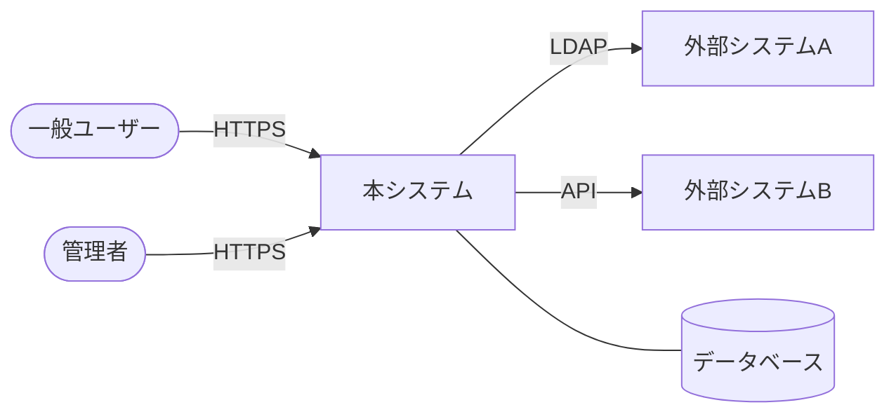
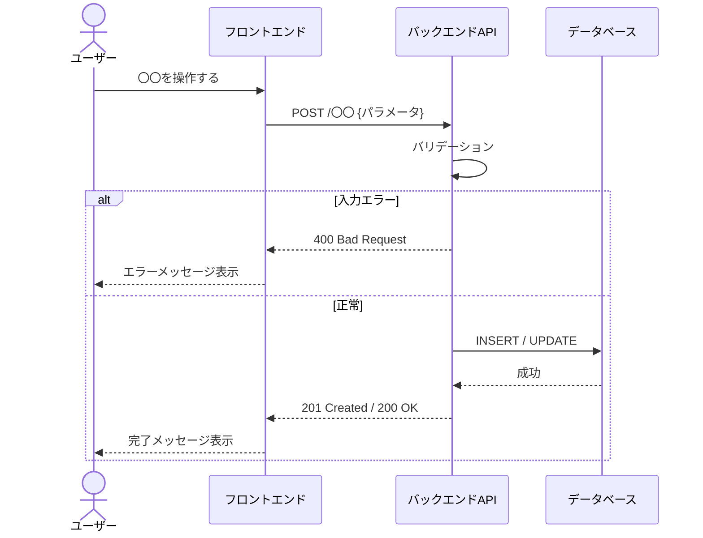
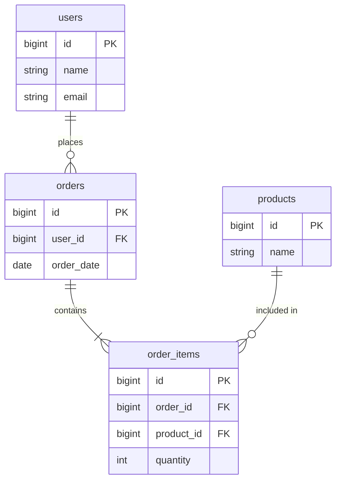

# ソフトウェア要件仕様書（SRS）

> **対応規格：** ISO/IEC/IEEE 29148:2018 / IEEE 830-1998（SRS 相当）
> **位置づけ：** 「どのように実現するか（How）」を定義する文書。要件定義書を受けて作成する。

---

## ドキュメント情報

| 項目               | 内容                         |
| ------------------ | ---------------------------- |
| **プロジェクト名** |                              |
| **システム名**     |                              |
| **文書バージョン** | v1.0                         |
| **作成日**         | YYYY-MM-DD                   |
| **最終更新日**     | YYYY-MM-DD                   |
| **作成者**         |                              |
| **承認者**         |                              |
| **ステータス**     | 草稿 / レビュー中 / 承認済み |

### 改訂履歴（任意）

<!-- Git管理している場合はコミット履歴が代替となるため省略可。
     外部ステークホルダー（発注者・監査機関等）へ送付する場合は記載を推奨。 -->

| バージョン | 日付       | 変更者 | 変更内容 |
| ---------- | ---------- | ------ | -------- |
| v1.0       | YYYY-MM-DD |        | 初版作成 |

### 関連文書

| 文書名     | バージョン | 備考               |
| ---------- | ---------- | ------------------ |
| 要件定義書 |            | 本仕様書の上位文書 |
|            |            |                    |

---

## 1. 目的・概要

### 1.1 システム概要

<!-- 本システムが何をするシステムかを簡潔に説明する。 -->

### 1.2 本文書の目的・対象読者

<!-- 誰がこの文書を利用するか。 -->

**対象読者：** 開発エンジニア、テスト担当者、プロジェクトマネージャー

### 1.3 用語・略語定義

| 用語 / 略語 | 定義 |
| ----------- | ---- |
|             |      |

### 1.4 参照規格・文書

| 文書名 / 規格                | バージョン |
| ---------------------------- | ---------- |
| ISO/IEC/IEEE 29148:2018      | 2018       |
| 要件定義書（プロジェクト名） |            |

---

## 2. システム全体概要

### 2.1 システムコンテキスト図

<!-- 本システムと外部システム・ユーザーの関係を Mermaid flowchart で図示する。 -->



### 2.2 システム構成概要

<!-- サーバー構成・レイヤー構成等の概要を記載する。詳細はアーキテクチャ設計書に委ねる。 -->

| コンポーネント | 役割 |
| -------------- | ---- |
| フロントエンド |      |
| バックエンド   |      |
| データベース   |      |
| 外部API連携    |      |

### 2.3 ユーザー種別と権限

| ユーザー種別   | 権限レベル             | 主な操作範囲 |
| -------------- | ---------------------- | ------------ |
| 一般ユーザー   | 参照・自分のデータ編集 |              |
| 管理者         | 全データ参照・設定変更 |              |
| システム管理者 | 全権限                 |              |

---

## 3. 機能仕様

<!-- 各機能の入力・処理・出力・業務ルールを詳細に定義する。 -->
<!-- 要件定義書の FR-XXX と対応するトレーサビリティを明記する。 -->

### 3.1 機能一覧

| 機能ID | 機能名 | 概要 | 対応要件ID |
| ------ | ------ | ---- | ---------- |
| F-001  |        |      | FR-001     |
| F-002  |        |      | FR-002     |

---

### 3.X：〇〇機能

> **対応要件：** FR-XXX

#### 3.X.1 概要

<!-- 機能の目的・動作概要を記載する。 -->

#### 3.X.2 画面仕様

| 画面ID     | 画面名 | 説明 |
| ---------- | ------ | ---- |
| SCR-XXX-01 |        |      |

**画面レイアウト・項目定義：**

| 項目名 | 種別                                     | 必須        | 最大文字数 | 形式・バリデーション | 備考 |
| ------ | ---------------------------------------- | ----------- | ---------- | -------------------- | ---- |
|        | テキスト / 数値 / 日付 / 選択 / チェック | 必須 / 任意 |            |                      |      |

#### 3.X.3 処理仕様

**入力：**

| 項目 | 型  | 必須 | バリデーション |
| ---- | --- | ---- | -------------- |
|      |     |      |                |

**処理フロー：**



**出力：**

| 項目 | 型  | 説明 |
| ---- | --- | ---- |
|      |     |      |

#### 3.X.4 業務ルール

| ルールID  | ルール内容 |
| --------- | ---------- |
| BR-XXX-01 |            |
| BR-XXX-02 |            |

#### 3.X.5 エラー仕様

| エラーコード | 発生条件 | メッセージ | 対処 |
| ------------ | -------- | ---------- | ---- |
| E-XXX-001    |          |            |      |

---

## 4. 外部インターフェース仕様

### 4.1 ユーザーインターフェース

<!-- UI全体の共通仕様を記載する（デザインガイドライン等）。 -->

- 対応ブラウザ：
- レスポンシブ対応：有 / 無
- 多言語対応：有（対応言語：　） / 無
- アクセシビリティ基準：（例）JIS X 8341-3 レベル AA

### 4.2 APIインターフェース

<!-- REST API等の外部公開インターフェースを記載する。 -->

#### API共通仕様

| 項目           | 内容                                      |
| -------------- | ----------------------------------------- |
| ベースURL      | `https://api.example.com/v1`              |
| 認証方式       | Bearer Token（JWT） / APIキー / OAuth 2.0 |
| リクエスト形式 | `application/json`                        |
| レスポンス形式 | `application/json`                        |
| 文字コード     | UTF-8                                     |
| タイムゾーン   | Asia/Tokyo（JST）                         |

#### APIエンドポイント一覧

| メソッド | エンドポイント    | 概要             | 認証 |
| -------- | ----------------- | ---------------- | ---- |
| GET      | `/resources`      | リソース一覧取得 | 要   |
| GET      | `/resources/{id}` | リソース詳細取得 | 要   |
| POST     | `/resources`      | リソース作成     | 要   |
| PUT      | `/resources/{id}` | リソース更新     | 要   |
| DELETE   | `/resources/{id}` | リソース削除     | 要   |

#### API詳細：〇〇取得

**リクエスト**

```http
GET /resources/{id}
Authorization: Bearer {token}
```

| パラメータ | 種別 | 型     | 必須 | 説明       |
| ---------- | ---- | ------ | ---- | ---------- |
| id         | Path | string | 必須 | リソースID |

**レスポンス（200 OK）**

```json
{
  "id": "string",
  "name": "string",
  "createdAt": "2024-01-01T00:00:00+09:00"
}
```

**エラーレスポンス**

| HTTPステータス | エラーコード          | 説明                 |
| -------------- | --------------------- | -------------------- |
| 400            | INVALID_PARAMETER     | パラメータ不正       |
| 401            | UNAUTHORIZED          | 認証エラー           |
| 403            | FORBIDDEN             | 権限不足             |
| 404            | NOT_FOUND             | リソースが存在しない |
| 500            | INTERNAL_SERVER_ERROR | サーバー内部エラー   |

### 4.3 外部システム連携仕様

| #   | 連携先システム | 連携方式                 | 頻度                       | データ形式       | 連携内容 |
| --- | -------------- | ------------------------ | -------------------------- | ---------------- | -------- |
| 1   |                | REST API / ファイル / DB | リアルタイム / 日次 / 随時 | JSON / CSV / XML |          |

---

## 5. データ仕様

### 5.1 データモデル概要

<!-- テーブル間のリレーションを Mermaid erDiagram で図示する。 -->



### 5.2 テーブル定義

#### テーブル名：〇〇テーブル（`table_name`）

**概要：** 〇〇を管理するテーブル

| カラム名     | 型       | 長さ | NULL     | PK / UK / FK | デフォルト        | 説明                        |
| ------------ | -------- | ---- | -------- | ------------ | ----------------- | --------------------------- |
| `id`         | BIGINT   |      | NOT NULL | PK           | AUTO_INCREMENT    | ID                          |
| `name`       | VARCHAR  | 255  | NOT NULL |              |                   | 名称                        |
| `status`     | TINYINT  |      | NOT NULL |              | 1                 | ステータス（1:有効 0:無効） |
| `created_at` | DATETIME |      | NOT NULL |              | CURRENT_TIMESTAMP | 作成日時                    |
| `updated_at` | DATETIME |      | NOT NULL |              | CURRENT_TIMESTAMP | 更新日時                    |

**インデックス：**

| インデックス名  | カラム | 種別  |
| --------------- | ------ | ----- |
| `idx_xxxx_name` | `name` | INDEX |

### 5.3 データ保持・削除ポリシー

| データ種別 | 保持期間 | 削除方法            |
| ---------- | -------- | ------------------- |
|            |          | 物理削除 / 論理削除 |

---

## 6. 非機能要件の実現方式

<!-- 要件定義書の非機能要件（NFR-XXX）に対して、どのように実現するかを定義する。 -->

### 6.1 可用性・信頼性

| 要件ID    | 要件内容          | 実現方式                                         |
| --------- | ----------------- | ------------------------------------------------ |
| NFR-A-001 | 稼働率 〇〇% 以上 | 冗長構成（Active-Standby）、ロードバランサー配置 |
| NFR-A-003 | RTO 〇〇時間以内  | 自動フェイルオーバー、監視アラート設定           |

### 6.2 性能

| 要件ID    | 要件内容              | 実現方式                                       |
| --------- | --------------------- | ---------------------------------------------- |
| NFR-P-001 | 応答時間 〇〇秒以内   | インデックス設計、クエリ最適化、キャッシュ利用 |
| NFR-P-003 | 同時接続 〇〇ユーザー | 水平スケーリング対応構成                       |

### 6.3 セキュリティ

| 要件ID    | 要件内容     | 実現方式                                      |
| --------- | ------------ | --------------------------------------------- |
| NFR-S-001 | 認証方式     | JWT（有効期限：〇〇分）＋リフレッシュトークン |
| NFR-S-003 | アクセス制御 | ロールベースアクセス制御（RBAC）実装          |
| NFR-S-004 | 通信暗号化   | TLS 1.2 以上を強制                            |

### 6.4 運用・保守

| 要件ID    | 要件内容     | 実現方式                                                   |
| --------- | ------------ | ---------------------------------------------------------- |
| NFR-O-001 | バックアップ | 〇〇方式、〇〇に保存                                       |
| NFR-O-003 | 監視         | 〇〇ツールで CPU/メモリ/応答時間を監視、閾値超過でアラート |

---

## 7. 移行仕様

### 7.1 移行対象データ

| 移行元 | 移行先テーブル | データ件数（概算） | 移行方式                   |
| ------ | -------------- | ------------------ | -------------------------- |
|        |                |                    | スクリプト / 手動 / ツール |

### 7.2 移行手順概要

```
1. 移行データの抽出・変換（ETL処理）
2. 検証環境での移行リハーサル
3. 本番移行（メンテナンス時間帯）
4. 移行後データ検証
5. 切り戻し手順の確認
```

### 7.3 切り戻し方針

<!-- 移行失敗時の切り戻し手順・判断基準を記載する。 -->

---

## 8. テスト要件

<!-- 各要件に対するテスト方針を定義する。詳細はテスト設計書に委ねる。 -->

### 8.1 テストレベル

| テストレベル      | 目的                             | 担当         |
| ----------------- | -------------------------------- | ------------ |
| 単体テスト        | 個々のモジュールの動作確認       | 開発者       |
| 結合テスト        | モジュール間・外部連携の動作確認 | 開発者       |
| システムテスト    | システム全体の機能・非機能確認   | テスト担当者 |
| 受入テスト（UAT） | ユーザー視点での動作確認         | ユーザー代表 |

### 8.2 要件トレーサビリティマトリクス（RTM）

<!-- 要件定義書の要件IDと機能仕様・テストケースの対応を管理する。 -->

| 要件ID（要件定義書） | 機能ID（本仕様書） | テストケースID |
| -------------------- | ------------------ | -------------- |
| FR-001               | F-001              | TC-001         |

---

## 付録

### A. 画面一覧

| 画面ID  | 画面名 | 概要 | 対応機能 |
| ------- | ------ | ---- | -------- |
| SCR-001 |        |      |          |

### B. バッチ処理一覧

| バッチID | バッチ名 | 実行タイミング | 概要 |
| -------- | -------- | -------------- | ---- |
| BAT-001  |          | 日次（〇〇時） |      |

### C. メッセージ定義一覧

| メッセージID | 種別   | メッセージ文言 |
| ------------ | ------ | -------------- |
| MSG-001      | エラー |                |
| MSG-002      | 情報   |                |

### D. 課題・未決事項リスト

| #   | 課題・質問 | 担当者 | 期限 | ステータス             |
| --- | ---------- | ------ | ---- | ---------------------- |
| 1   |            |        |      | 未対応 / 対応中 / 完了 |
