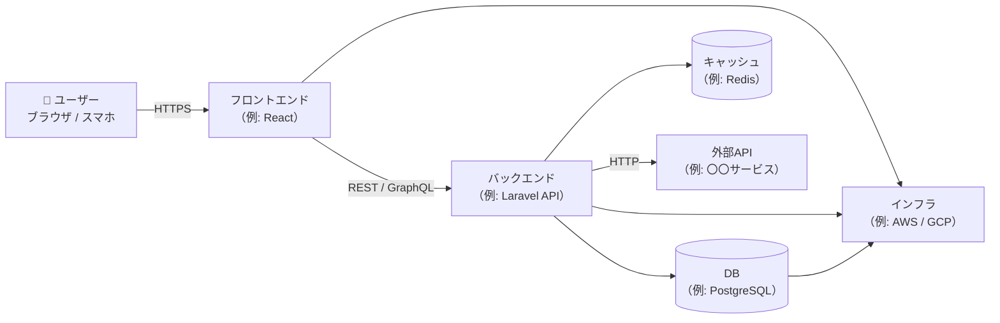
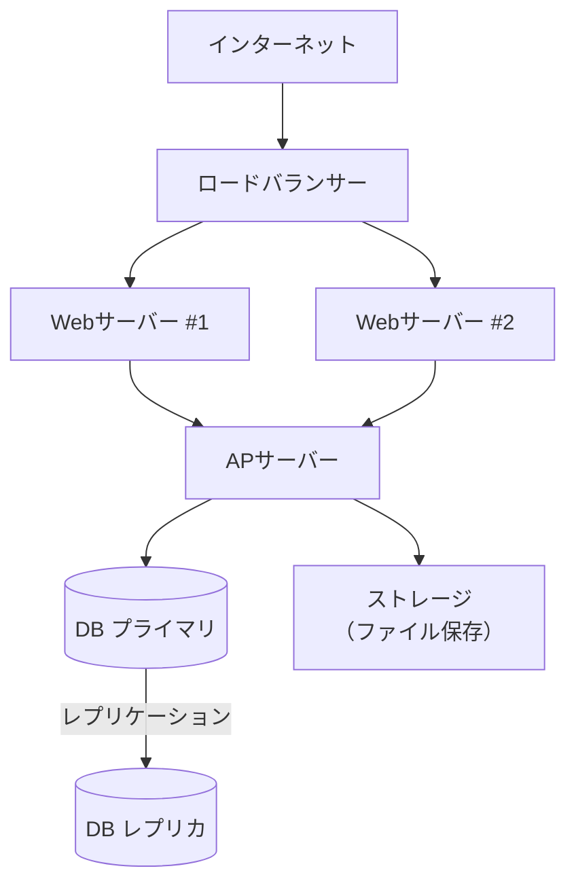
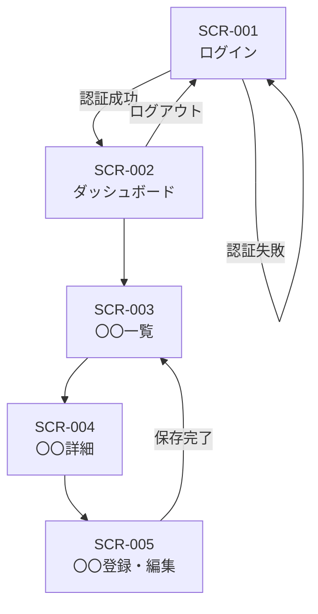
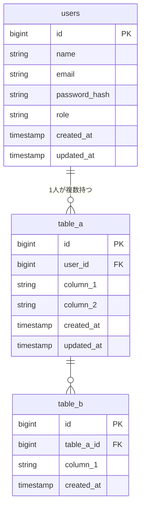

# システム仕様書（基本設計書）

> **位置づけ：** 要件定義書・SRSで定義した「何を作るか（What）」を受け、「どのように作るか（How）」を設計する文書。開発チームとステークホルダーが共通の設計方針を確認するための合意文書でもある。
> **対象読者：** 開発者・インフラ担当・テスト担当・PM（技術的な詳細を含む）

---

## ドキュメント情報

| 項目               | 内容                         |
| ------------------ | ---------------------------- |
| **システム名**     |                              |
| **文書バージョン** | v1.0                         |
| **作成日**         | YYYY-MM-DD                   |
| **最終更新日**     | YYYY-MM-DD                   |
| **作成者**         |                              |
| **レビュアー**     |                              |
| **承認者**         |                              |
| **関連文書**       | 要件定義書 v〇〇 / SRS v〇〇 |

---

## 1. システム概要

| 項目                     | 内容                            |
| ------------------------ | ------------------------------- |
| **目的**                 |                                 |
| **対象ユーザー数**       |                                 |
| **本番稼働予定日**       | YYYY-MM-DD                      |
| **開発方式**             | ウォーターフォール / アジャイル |
| **ライセンス・利用制限** |                                 |

---

## 2. システムアーキテクチャ

### 2.1 全体構成図

<!-- システム全体の構成要素（フロントエンド・バックエンド・DB・外部API等）と
     それらの関係をコンテキスト図として示す。 -->



### 2.2 技術スタック

| レイヤー       | 採用技術・バージョン | 選定理由 |
| -------------- | -------------------- | -------- |
| フロントエンド |                      |          |
| バックエンド   |                      |          |
| データベース   |                      |          |
| キャッシュ     |                      |          |
| 認証           |                      |          |
| インフラ       |                      |          |
| CI/CD          |                      |          |
| ロギング・監視 |                      |          |

---

## 3. インフラ・環境構成

### 3.1 環境一覧

| 環境          | 用途             | URL                   | 備考             |
| ------------- | ---------------- | --------------------- | ---------------- |
| 開発（local） | 開発者個人の開発 | http://localhost:〇〇 | Docker Compose等 |
| ステージング  | 結合テスト・UAT  | https://stg.〇〇.〇〇 |                  |
| 本番          | サービス提供     | https://〇〇.〇〇     |                  |

### 3.2 インフラ構成図

<!-- ロードバランサー・Webサーバー・APサーバー・DBサーバー等の構成を記述する。 -->



### 3.3 非機能要件（インフラ観点）

| 項目             | 要件                                  | 実現方法 |
| ---------------- | ------------------------------------- | -------- |
| 可用性           | 稼働率 〇〇% 以上                     |          |
| 性能             | ページ表示 〇秒以内（同時接続〇〇人） |          |
| スケーラビリティ |                                       |          |
| バックアップ     | 〇〇時間ごと、〇日保持                |          |
| セキュリティ     | HTTPS強制・WAF等                      |          |

---

## 4. 画面設計

### 4.1 画面一覧

| 画面ID  | 画面名         | URL        | 対応機能（FR#） | アクセス権限     |
| ------- | -------------- | ---------- | --------------- | ---------------- |
| SCR-001 | ログイン画面   | /login     | FR-001          | 全ユーザー       |
| SCR-002 | ダッシュボード | /dashboard | FR-002          | 認証済みユーザー |
| SCR-003 | 〇〇一覧       | /〇〇      | FR-〇〇〇       |                  |
| SCR-004 | 〇〇詳細       | /〇〇/:id  | FR-〇〇〇       |                  |
| SCR-005 | 〇〇登録・編集 | /〇〇/new  | FR-〇〇〇       |                  |

### 4.2 画面遷移図



### 4.3 画面詳細

<!-- 主要画面のみ記述。全画面が必要な場合は別ファイル（画面定義書）を作成する。 -->

#### SCR-001：ログイン画面

| 項目               | 内容                                                   |
| ------------------ | ------------------------------------------------------ |
| 目的               | ユーザー認証を行い、システムへのアクセスを許可する     |
| 表示項目           | メールアドレス入力欄、パスワード入力欄、ログインボタン |
| 入力バリデーション | メール形式チェック、必須項目チェック                   |
| エラー時の表示     | 「メールアドレスまたはパスワードが正しくありません」   |
| 備考               | パスワードリセットリンクあり                           |

---

## 5. データベース設計

### 5.1 テーブル一覧

| テーブル名 | 論理名   | 概要                                 |
| ---------- | -------- | ------------------------------------ |
| users      | ユーザー | システムにログインするユーザーの情報 |
| 〇〇       | 〇〇     |                                      |
| 〇〇       | 〇〇     |                                      |

### 5.2 ER図



### 5.3 テーブル定義

#### users テーブル

| カラム名      | データ型     | NULL     | PK/FK/UK | デフォルト        | 説明                     |
| ------------- | ------------ | -------- | -------- | ----------------- | ------------------------ |
| id            | BIGINT       | NOT NULL | PK       | AUTO_INCREMENT    |                          |
| name          | VARCHAR(100) | NOT NULL |          |                   | 氏名                     |
| email         | VARCHAR(255) | NOT NULL | UK       |                   | メールアドレス           |
| password_hash | VARCHAR(255) | NOT NULL |          |                   | ハッシュ化済みパスワード |
| role          | ENUM         | NOT NULL |          | 'user'            | admin / manager / user   |
| created_at    | TIMESTAMP    | NOT NULL |          | CURRENT_TIMESTAMP |                          |
| updated_at    | TIMESTAMP    | NOT NULL |          | CURRENT_TIMESTAMP |                          |

<!-- 各テーブルについて同様のテーブル定義を記述する。 -->

---

## 6. API設計

### 6.1 API一覧

| API ID  | メソッド | エンドポイント   | 機能概要               | 認証要否 | 対応FR#   |
| ------- | -------- | ---------------- | ---------------------- | -------- | --------- |
| API-001 | POST     | /api/auth/login  | ログイン・トークン発行 | 不要     | FR-001    |
| API-002 | POST     | /api/auth/logout | ログアウト             | 要       | FR-001    |
| API-003 | GET      | /api/〇〇        | 〇〇一覧取得           | 要       | FR-〇〇〇 |
| API-004 | GET      | /api/〇〇/:id    | 〇〇詳細取得           | 要       | FR-〇〇〇 |
| API-005 | POST     | /api/〇〇        | 〇〇登録               | 要       | FR-〇〇〇 |
| API-006 | PUT      | /api/〇〇/:id    | 〇〇更新               | 要       | FR-〇〇〇 |
| API-007 | DELETE   | /api/〇〇/:id    | 〇〇削除               | 要       | FR-〇〇〇 |

### 6.2 API詳細

#### API-001：ログイン

**リクエスト**

```json
POST /api/auth/login
Content-Type: application/json

{
  "email": "user@example.com",
  "password": "plaintext_password"
}
```

**レスポンス（成功）**

```json
HTTP 200 OK

{
  "token": "eyJ...",
  "expires_in": 3600,
  "user": {
    "id": 1,
    "name": "山田 太郎",
    "role": "user"
  }
}
```

**レスポンス（失敗）**

| HTTPステータス | エラーコード      | メッセージ             | 条件                     |
| -------------- | ----------------- | ---------------------- | ------------------------ |
| 401            | AUTH_FAILED       | 認証に失敗しました     | メール・パスワード不一致 |
| 422            | VALIDATION_ERROR  | 入力値が不正です       | バリデーションエラー     |
| 429            | TOO_MANY_REQUESTS | 試行回数が超過しました | 〇回以上の連続失敗       |

<!-- 主要APIのみ記述。全APIが必要な場合は別ファイルで管理する（OpenAPI/Swagger推奨）。 -->

---

## 7. 認証・認可設計

| 項目               | 内容                                                      |
| ------------------ | --------------------------------------------------------- |
| 認証方式           | セッション認証 / JWT / OAuth2.0                           |
| トークン有効期限   | 〇時間（アクセストークン） / 〇日（リフレッシュトークン） |
| パスワードポリシー | 〇文字以上、英字・数字・記号を含む                        |
| アカウントロック   | 〇回連続失敗で〇分ロック                                  |
| セッション管理     | サーバーサイドセッション / ステートレス                   |

### ロール・権限マトリクス

| 機能             | 一般ユーザー  | 管理者 | スーパー管理者 |
| ---------------- | ------------- | ------ | -------------- |
| 自分のデータ閲覧 | ○             | ○      | ○              |
| 他者のデータ閲覧 | ×             | ○      | ○              |
| データ登録・更新 | ○（自分のみ） | ○      | ○              |
| データ削除       | ×             | ×      | ○              |
| マスタ管理       | ×             | ○      | ○              |
| ユーザー管理     | ×             | ×      | ○              |

---

## 8. 外部システム連携設計

| 連携先  | 連携方式     | 用途 | 通信頻度              | タイムアウト | エラー時の処理              |
| ------- | ------------ | ---- | --------------------- | ------------ | --------------------------- |
| 〇〇API | REST / HTTPS |      | リアルタイム / バッチ | 〇秒         | リトライ〇回→エラーログ記録 |

---

## 9. エラー処理・ロギング設計

### 9.1 エラー処理方針

| エラー種別               | 処理方針                       | ユーザーへの表示                                         |
| ------------------------ | ------------------------------ | -------------------------------------------------------- |
| 入力バリデーションエラー | 入力欄にエラーメッセージを表示 | 「〇〇を入力してください」                               |
| 認証エラー               | ログイン画面にリダイレクト     | 「セッションが切れました」                               |
| サーバーエラー（5xx）    | エラーログ記録・アラート通知   | 「エラーが発生しました。しばらくして再度お試しください」 |
| 外部API接続エラー        | リトライ後も失敗でログ記録     | 状況に応じて縮退表示                                     |

### 9.2 ログ設計

| ログ種別         | 保存先 | 保持期間 | 主な記録内容                                      |
| ---------------- | ------ | -------- | ------------------------------------------------- |
| アクセスログ     |        | 〇ヶ月   | IPアドレス、URL、HTTPステータス、レスポンスタイム |
| エラーログ       |        | 〇ヶ月   | エラー種別、スタックトレース、発生日時            |
| 操作ログ（監査） |        | 〇年     | ユーザーID、操作種別、対象データID、日時          |

---

## 10. セキュリティ設計

| カテゴリ             | 対策内容                                                                 |
| -------------------- | ------------------------------------------------------------------------ |
| 通信                 | HTTPS（TLS 1.2以上）を強制する                                           |
| 認証                 | パスワードはbcrypt等でハッシュ化して保存する                             |
| 入力値検証           | SQLインジェクション・XSS対策（サニタイズ・プリペアドステートメント使用） |
| CSRF対策             | CSRFトークンを全フォームに付与する                                       |
| セッション           | セキュアかつHttpOnlyフラグを付与したCookieを使用する                     |
| ファイルアップロード | 許可する拡張子・MIMEタイプを制限し、ウイルススキャンを実施する           |
| 機密情報管理         | 接続情報・APIキーは環境変数で管理し、ソースコードに含めない              |
| 依存ライブラリ       | 定期的に脆弱性チェックを実施する                                         |

---

## 11. バッチ処理設計

<!-- バッチがない場合はこのセクションを削除する。 -->

| バッチID | 処理名         | 実行タイミング | 処理概要 | タイムアウト | エラー時の処理             |
| -------- | -------------- | -------------- | -------- | ------------ | -------------------------- |
| BAT-001  | 〇〇集計バッチ | 毎日 02:00     |          | 〇分         | ログ記録・担当者メール通知 |

---

## 12. 未解決事項・設計上の注意点

| #   | 内容 | 担当 | 期限       | 状況                       |
| --- | ---- | ---- | ---------- | -------------------------- |
| 1   |      |      | YYYY-MM-DD | 検討中 / 確認待ち / 解決済 |
