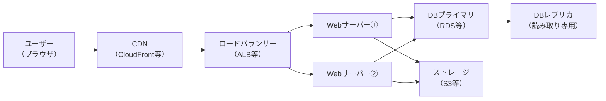

# インフラ構成書

> **目的：** システムを構成するサーバー・ネットワーク・ミドルウェアの全体像を定義する。インフラ担当・外部ベンダー・運用担当が共通の認識を持つための基準文書。
> **更新タイミング：** インフラ構成の変更（スケールアップ・サービス追加・ネットワーク変更）のたびに更新する。

---

## ドキュメント情報

| 項目               | 内容       |
| ------------------ | ---------- |
| **システム名**     |            |
| **文書バージョン** | v1.0       |
| **作成日**         | YYYY-MM-DD |
| **最終更新日**     | YYYY-MM-DD |
| **作成者**         |            |

---

## 1. 構成概要

| 項目                | 内容                                        |
| ------------------- | ------------------------------------------- |
| クラウド / オンプレ | AWS / GCP / Azure / オンプレ / ハイブリッド |
| リージョン          | ap-northeast-1（東京）等                    |
| 可用性方針          | 冗長化あり（マルチAZ）/ シングル構成        |
| 本番URL             | https://〇〇.co.jp                          |
| 管理コンソールURL   | https://console.aws.amazon.com / 等         |

---

## 2. 構成図

> Draw.io（`.drawio.png`）で作成した構成図をここに貼り付ける。

<!-- 構成図がない場合は以下のMermaidで簡易的に表現する -->

---

## 3. サーバー一覧

| サーバーID | 役割                  | ホスト名 / IP            | スペック           | OS                | 台数 | 備考         |
| ---------- | --------------------- | ------------------------ | ------------------ | ----------------- | ---- | ------------ |
| SRV-001    | Webサーバー           | web-01 / 10.0.1.〇〇     | vCPU:〇 / Mem:〇GB | Amazon Linux 2023 | 2    | AZ冗長       |
| SRV-002    | DBサーバー（Primary） | db-primary / 10.0.2.〇〇 | vCPU:〇 / Mem:〇GB | —                 | 1    | RDS managed  |
| SRV-003    | DBサーバー（Replica） | db-replica / 10.0.2.〇〇 | 同上               | —                 | 1    | 読み取り専用 |
| SRV-004    | バッチサーバー        | batch-01 / 10.0.3.〇〇   | vCPU:〇 / Mem:〇GB | Amazon Linux 2023 | 1    |              |

---

## 4. ミドルウェア一覧

| サーバーID | ミドルウェア | バージョン | 役割                         | 設定ファイルパス          |
| ---------- | ------------ | ---------- | ---------------------------- | ------------------------- |
| SRV-001    | Nginx        | 1.〇〇     | リバースプロキシ / HTTPS終端 | `/etc/nginx/nginx.conf`   |
| SRV-001    | PHP-FPM      | 8.〇       | アプリケーション実行         | `/etc/php-fpm.d/www.conf` |
| SRV-002    | PostgreSQL   | 1〇.〇     | RDBMS                        | RDS managed               |

---

## 5. ネットワーク構成

| 名称                           | CIDR / アドレス | 用途                |
| ------------------------------ | --------------- | ------------------- |
| VPC                            | 10.0.0.0/16     | 全体ネットワーク    |
| パブリックサブネット①          | 10.0.0.0/24     | ALB配置（AZ-A）     |
| パブリックサブネット②          | 10.0.1.0/24     | ALB配置（AZ-B）     |
| プライベートサブネット①（Web） | 10.0.2.0/24     | Webサーバー（AZ-A） |
| プライベートサブネット②（Web） | 10.0.3.0/24     | Webサーバー（AZ-B） |
| プライベートサブネット③（DB）  | 10.0.4.0/24     | DBサーバー          |

### セキュリティグループ

| SG名   | 対象        | インバウンド      | アウトバウンド             |
| ------ | ----------- | ----------------- | -------------------------- |
| sg-alb | ALB         | 0.0.0.0/0:443, 80 | VPC内:全て                 |
| sg-web | Webサーバー | sg-alb:80         | 0.0.0.0/0:443（外部API等） |
| sg-db  | DBサーバー  | sg-web:5432       | なし                       |

---

## 6. ストレージ

| 種別                   | サービス名           | 用途                      | 容量・上限             | バックアップ                     |
| ---------------------- | -------------------- | ------------------------- | ---------------------- | -------------------------------- |
| オブジェクトストレージ | S3                   | 添付ファイル・帳票PDF保存 | 無制限（コスト管理要） | バージョニング有効               |
| DBストレージ           | RDS gp3              | アプリケーションDB        | 〇〇GB                 | 自動スナップショット（〇日保持） |
| ログストレージ         | S3 / CloudWatch Logs | アクセスログ・アプリログ  | 〇〇日保持             | —                                |

---

## 7. 外部サービス・依存関係

| サービス名     | 用途       | 提供元       | 備考            |
| -------------- | ---------- | ------------ | --------------- |
| SendGrid / SES | メール送信 | Twilio / AWS | API KEY管理必要 |
| CloudFront     | CDN        | AWS          | SSL証明書: ACM  |
| Route 53       | DNS        | AWS          |                 |

---

## 8. SSL/TLS・ドメイン

| ドメイン   | 証明書                         | 更新方法    | 有効期限   |
| ---------- | ------------------------------ | ----------- | ---------- |
| 〇〇.co.jp | ACM（自動更新）/ Let's Encrypt | 自動 / 手動 | YYYY-MM-DD |

---

## 9. 監視・アラート

| 監視項目                | ツール                  | 通知先        |
| ----------------------- | ----------------------- | ------------- |
| サーバー死活            | CloudWatch / Datadog 等 | Slack #alerts |
| CPU / メモリ / ディスク | 同上                    | Slack #alerts |
| エラーログ              | 同上                    | Slack #alerts |
| SSL証明書期限           | 同上                    | メール        |
