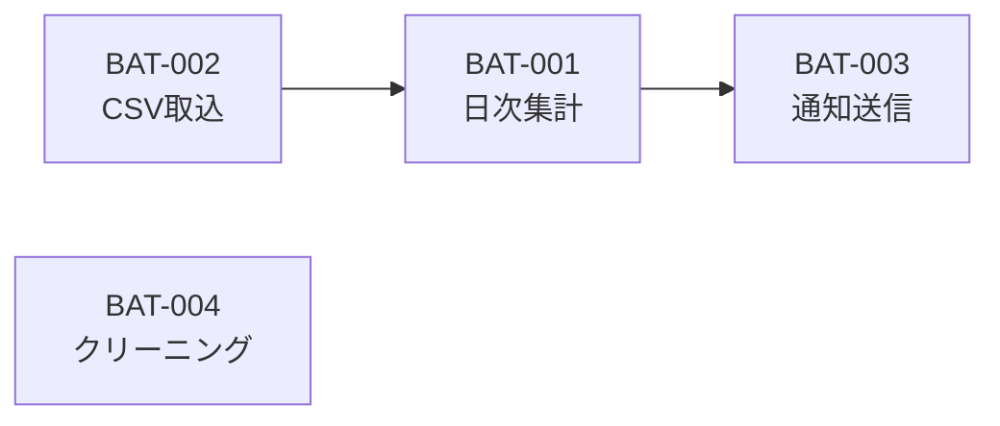
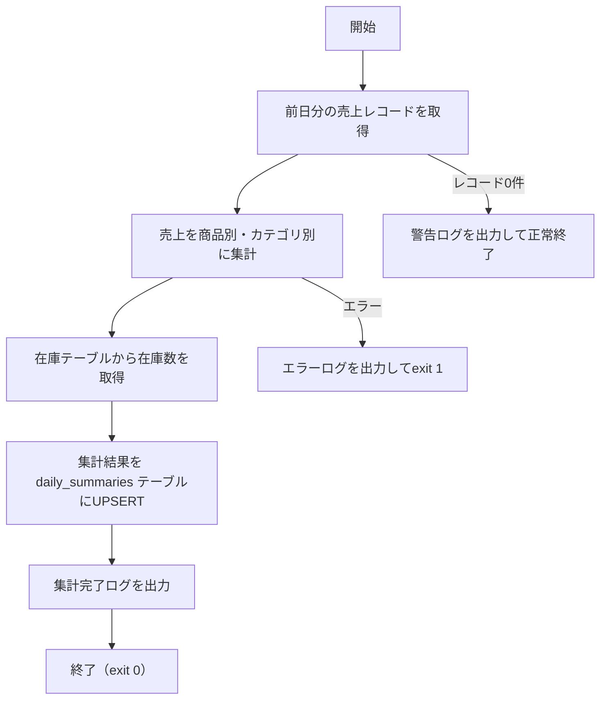

# バッチ処理設計書

> **目的：** システムで動作する定期・非同期バッチ処理の仕様を定義する。起動条件・処理内容・依存関係・エラー対応を網羅し、運用担当が単独で管理できる状態にする。

---

## ドキュメント情報

| 項目               | 内容       |
| ------------------ | ---------- |
| **システム名**     |            |
| **文書バージョン** | v1.0       |
| **作成日**         | YYYY-MM-DD |
| **最終更新日**     | YYYY-MM-DD |
| **作成者**         |            |

---

## 1. バッチ一覧

| バッチID | バッチ名                 | 起動方式 | 実行スケジュール | 実行サーバー | 所要時間目安 | 優先度 |
| -------- | ------------------------ | -------- | ---------------- | ------------ | ------------ | ------ |
| BAT-001  | 日次集計バッチ           | Cron     | 毎日 02:00       | batch-01     | 約10分       | 高     |
| BAT-002  | CSV取込バッチ            | Cron     | 毎日 02:30       | batch-01     | 約5分        | 高     |
| BAT-003  | 通知送信バッチ           | Cron     | 毎日 09:00       | batch-01     | 約3分        | 中     |
| BAT-004  | データクリーニングバッチ | Cron     | 毎週月曜 03:00   | batch-01     | 約15分       | 低     |

---

## 2. バッチ依存関係（実行順序）



> BAT-002 が完了してから BAT-001 が実行される。BAT-001 が失敗した場合、BAT-003 は実行しない。

---

## 3. バッチ詳細

---

### BAT-001：日次集計バッチ

| 項目                 | 内容                                                       |
| -------------------- | ---------------------------------------------------------- |
| **バッチID**         | BAT-001                                                    |
| **バッチ名**         | 日次集計バッチ                                             |
| **目的**             | 前日の売上・在庫データを集計し、レポートテーブルに格納する |
| **起動コマンド**     | `php artisan batch:daily-summary`                          |
| **実行スケジュール** | 毎日 02:00（JST）                                          |
| **実行サーバー**     | batch-01                                                   |
| **実行ユーザー**     | `app-user`                                                 |
| **ログファイルパス** | `/var/log/app/batch/daily-summary-YYYYMMDD.log`            |
| **所要時間目安**     | 通常5〜10分。データ量が〇〇万件を超える場合は最大20分      |
| **タイムアウト設定** | 60分                                                       |

**処理フロー：**



**入出力：**

| 種別 | テーブル / ファイル        | 内容                   |
| ---- | -------------------------- | ---------------------- |
| 入力 | `sales` テーブル           | 売上レコード（前日分） |
| 入力 | `inventory` テーブル       | 在庫数                 |
| 出力 | `daily_summaries` テーブル | 集計結果（UPSERT）     |

**エラー処理：**

| エラー種別   | 対応                             | 通知                        |
| ------------ | -------------------------------- | --------------------------- |
| DB接続失敗   | exit 1（即時終了）               | Slack #alerts + メール      |
| 集計中の例外 | exit 1（途中終了、ロールバック） | Slack #alerts               |
| 0件警告      | exit 0（正常終了）               | Slack #alerts（警告レベル） |
| タイムアウト | プロセスkill → exit 1            | Slack #alerts + メール      |

**再実行手順：**

```bash
# 当日分の再実行
php artisan batch:daily-summary

# 特定日付を指定して再実行
php artisan batch:daily-summary --date=2026-05-10
```

> 再実行時は対象日の既存集計データを一度削除してから再集計する（UPSERT）。

---

### BAT-002：CSV取込バッチ

| 項目                     | 内容                                                             |
| ------------------------ | ---------------------------------------------------------------- |
| **バッチID**             | BAT-002                                                          |
| **バッチ名**             | CSV取込バッチ                                                    |
| **目的**                 | 基幹システムから連携されたCSVを取り込み、salesテーブルに格納する |
| **起動コマンド**         | `php artisan batch:import-csv`                                   |
| **実行スケジュール**     | 毎日 02:30（JST）※BAT-001の前提                                  |
| **監視ディレクトリ**     | `/data/import/sales/`                                            |
| **処理済みアーカイブ先** | `/data/import/sales/done/`                                       |
| **ログファイルパス**     | `/var/log/app/batch/import-csv-YYYYMMDD.log`                     |
| **所要時間目安**         | 約5分                                                            |
| **タイムアウト設定**     | 30分                                                             |

**エラー処理：**

| エラー種別         | 対応                             | 通知                  |
| ------------------ | -------------------------------- | --------------------- |
| ファイル未着       | 警告ログ出力・exit 0             | Slack #alerts（警告） |
| フォーマット不正行 | 該当行スキップ・正常行は処理続行 | ログ出力のみ          |
| DB書き込み失敗     | exit 1（ロールバック）           | Slack #alerts         |

---

### BAT-003：通知送信バッチ

| 項目                 | 内容                                           |
| -------------------- | ---------------------------------------------- |
| **バッチID**         | BAT-003                                        |
| **バッチ名**         | 通知送信バッチ                                 |
| **目的**             | 当日期限の〇〇についてユーザーにメール通知する |
| **起動コマンド**     | `php artisan batch:send-notification`          |
| **実行スケジュール** | 毎日 09:00（JST）                              |
| **所要時間目安**     | 約3分                                          |

---

### BAT-004：データクリーニングバッチ

| 項目                 | 内容                                                              |
| -------------------- | ----------------------------------------------------------------- |
| **バッチID**         | BAT-004                                                           |
| **バッチ名**         | データクリーニングバッチ                                          |
| **目的**             | 〇〇日以上経過した一時データ・ログデータを削除する                |
| **起動コマンド**     | `php artisan batch:cleanup`                                       |
| **実行スケジュール** | 毎週月曜日 03:00（JST）                                           |
| **削除対象**         | `temp_data`テーブル（90日以上）/ アプリケーションログ（90日以上） |

---

## 4. Cron設定

```cron
# /etc/cron.d/app-batch  （app-userで実行）
30 2 * * * app-user /usr/bin/php /var/www/app/artisan batch:import-csv >> /var/log/app/batch/import-csv.log 2>&1
0  2 * * * app-user /usr/bin/php /var/www/app/artisan batch:daily-summary >> /var/log/app/batch/daily-summary.log 2>&1
0  9 * * * app-user /usr/bin/php /var/www/app/artisan batch:send-notification >> /var/log/app/batch/notification.log 2>&1
0  3 * * 1 app-user /usr/bin/php /var/www/app/artisan batch:cleanup >> /var/log/app/batch/cleanup.log 2>&1
```

---

## 5. 監視・アラート

| 監視項目             | 方法                      | 閾値                           | 通知先                 |
| -------------------- | ------------------------- | ------------------------------ | ---------------------- |
| バッチ終了コード     | Cronログ監視 / CloudWatch | exit 1                         | Slack #alerts + メール |
| 実行時間超過         | プロセス監視              | タイムアウト設定値             | Slack #alerts          |
| バッチ未実行（死活） | Cronチェック              | スケジュール通りに実行されない | Slack #alerts          |
