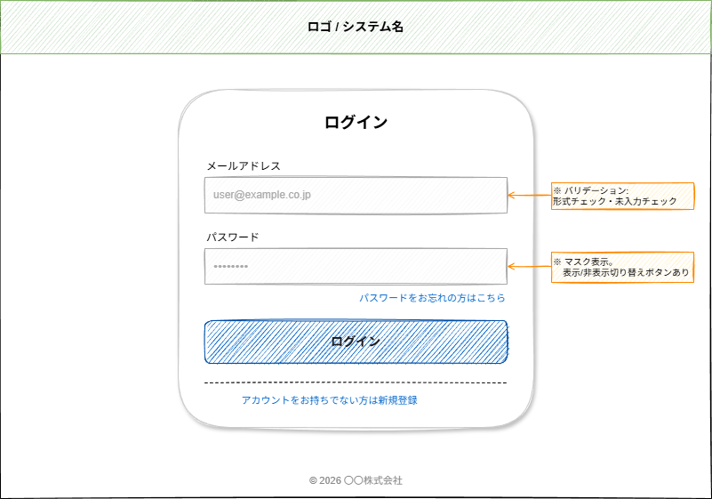

# 画面仕様書：ログイン画面

## ドキュメント情報

| 項目           | 内容         |
| -------------- | ------------ |
| **画面ID**     | SCR-001      |
| **画面名**     | ログイン画面 |
| **URL**        | `/login`     |
| **作成日**     | 2026-05-10   |
| **作成者**     |              |
| **最終更新日** | 2026-05-10   |

---

## ワイヤーフレーム

---

## 画面概要

未認証ユーザーがシステムにログインするための画面。
認証が必要なURLにアクセスした場合、本画面にリダイレクトされる。

---

## 表示条件

| 条件           | 内容                                                 |
| -------------- | ---------------------------------------------------- |
| 表示対象       | 未ログインのすべてのユーザー                         |
| リダイレクト元 | 認証が必要なページに未ログイン状態でアクセスした場合 |

---

## 画面項目定義

| #   | 項目名                 | 種別           | 必須 | 最大文字数 | 初期値 | 備考                                      |
| --- | ---------------------- | -------------- | ---- | ---------- | ------ | ----------------------------------------- |
| 1   | メールアドレス         | テキスト入力   | ○    | 254文字    | なし   | プレースホルダー: `user@example.co.jp`    |
| 2   | パスワード             | パスワード入力 | ○    | 128文字    | なし   | マスク表示。表示/非表示切り替えボタンあり |
| 3   | ログインボタン         | ボタン         | —    | —          | —      | 入力欄がどちらか空の場合はdisabled        |
| 4   | パスワードをお忘れの方 | リンク         | —    | —          | —      | `/password/reset` へ遷移                  |
| 5   | 新規登録               | リンク         | —    | —          | —      | `/register` へ遷移                        |

---

## バリデーション

| #   | 対象             | タイミング | 条件                         | エラーメッセージ                                               |
| --- | ---------------- | ---------- | ---------------------------- | -------------------------------------------------------------- |
| 1   | メールアドレス   | 送信時     | 未入力                       | 「メールアドレスを入力してください」                           |
| 2   | メールアドレス   | 送信時     | メール形式でない             | 「正しいメールアドレスを入力してください」                     |
| 3   | パスワード       | 送信時     | 未入力                       | 「パスワードを入力してください」                               |
| 4   | 認証失敗         | 送信時     | メール or パスワードが不一致 | 「メールアドレスまたはパスワードが正しくありません」           |
| 5   | アカウントロック | 送信時     | 連続〇回失敗                 | 「アカウントがロックされています。〇分後に再試行してください」 |

---

## イベント・アクション

| #   | トリガー                           | 処理                             | 遷移先                                                                      |
| --- | ---------------------------------- | -------------------------------- | --------------------------------------------------------------------------- |
| 1   | ログインボタンクリック             | バリデーション → 認証API呼び出し | 成功: ダッシュボード `/dashboard` 失敗: エラーメッセージ表示（遷移なし） |
| 2   | 「パスワードをお忘れの方」クリック | —                                | `/password/reset`                                                           |
| 3   | 「新規登録」クリック               | —                                | `/register`                                                                 |
| 4   | Enterキー押下（入力欄内）          | ログインボタンクリックと同等     | 同上                                                                        |

---

## 非機能要件

| 項目             | 要件                                                      |
| ---------------- | --------------------------------------------------------- |
| レスポンスタイム | 認証APIのレスポンス: 2秒以内                              |
| セキュリティ     | HTTPS必須 / パスワードはHTTPSで送信 / CSRFトークンを使用  |
| アクセシビリティ | 各入力欄に `label` を関連付ける / Tabキーで操作できること |
| ブラウザ対応     | Chrome（最新）/ Edge（最新）/ Safari（最新）              |

---

## 関連画面・関連ドキュメント

| 種別    | 名称                           | リンク                                      |
| ------- | ------------------------------ | ------------------------------------------- |
| 遷移先  | ダッシュボード                 | SCR-002                                     |
| 遷移先  | パスワードリセット             | SCR-010                                     |
| 遷移先  | 新規登録                       | SCR-011                                     |
| API仕様 | 認証API `POST /api/auth/login` | [API定義書](../04_API定義書テンプレート.md) |
