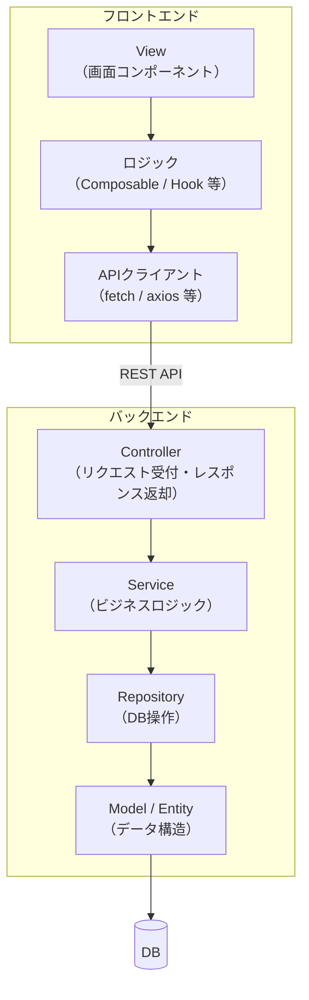
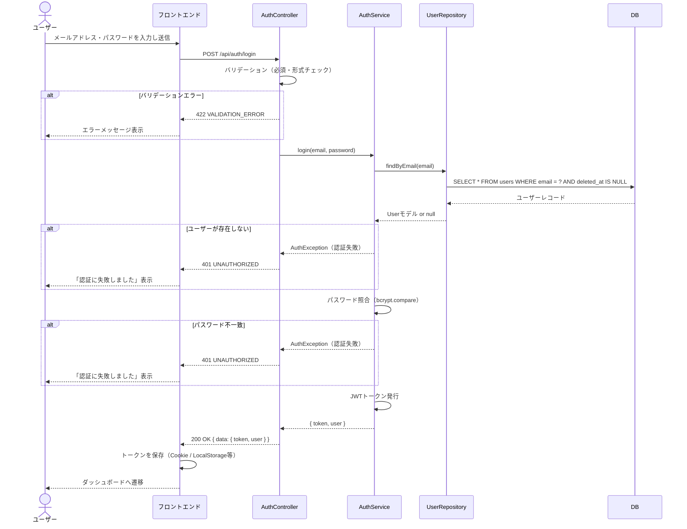
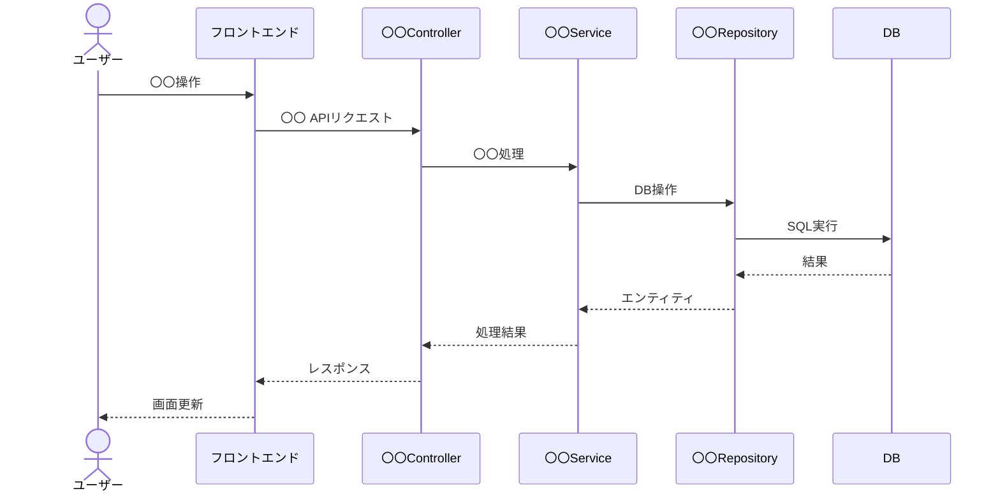

# 詳細設計書

> **位置づけ：** 基本設計書（システム仕様書・画面定義書・DB設計書・API定義書）を受け、「どのように実装するか（How）」を記述する文書。実装担当者が迷わず実装できる粒度を目指す。
> **対象読者：** 実装担当者（フロントエンド・バックエンド）、コードレビュアー

---

## ドキュメント情報

| 項目               | 内容                                    |
| ------------------ | --------------------------------------- |
| **システム名**     |                                         |
| **対象機能**       | （例: ユーザー認証機能 / 〇〇管理機能） |
| **文書バージョン** | v1.0                                    |
| **作成日**         | YYYY-MM-DD                              |
| **最終更新日**     | YYYY-MM-DD                              |
| **作成者**         |                                         |
| **レビュアー**     |                                         |
| **関連文書**       | API定義書 v〇〇 / DB設計書 v〇〇        |

---

## 1. 設計対象の概要

| 項目                 | 内容                   |
| -------------------- | ---------------------- |
| **機能名**           |                        |
| **対応要件（FR#）**  | FR-〇〇〇, FR-〇〇〇   |
| **対応API**          | API-〇〇〇, API-〇〇〇 |
| **対応画面**         | SCR-〇〇〇             |
| **設計の目的・背景** |                        |

---

## 2. クラス・モジュール構成

<!-- レイヤードアーキテクチャ（Controller / Service / Repository / Model 等）を想定した構成例。 -->
<!-- フレームワーク・プロジェクトの構成に合わせて変更する。 -->



### クラス・ファイル一覧

| レイヤー   | クラス名 / ファイル名 | 責務                                                          | 対応API / 画面 |
| ---------- | --------------------- | ------------------------------------------------------------- | -------------- |
| Controller | `〇〇Controller`      | リクエストのバリデーション・Serviceの呼び出し・レスポンス返却 | API-〇〇〇     |
| Service    | `〇〇Service`         | ビジネスロジック（〇〇の算出、外部API連携等）                 |                |
| Repository | `〇〇Repository`      | DBアクセス（SELECT / INSERT / UPDATE / DELETE）               |                |
| Model      | `〇〇Model`           | テーブルとのマッピング・リレーション定義                      |                |

---

## 3. 処理フロー詳細

<!-- 主要な処理について順序図（sequenceDiagram）またはフローチャートで記述する。 -->

### 3.1 〇〇の処理フロー（例: ログイン処理）



### 3.2 〇〇の処理フロー



---

## 4. 関数・メソッド仕様

<!-- 複雑なビジネスロジックを持つ関数・メソッドのみ記述する。単純なCRUD等は省略してよい。 -->

### `〇〇Service.〇〇メソッド()`

| 項目           | 内容                                            |
| -------------- | ----------------------------------------------- |
| **メソッド名** | `calculate〇〇(params: 〇〇Params): 〇〇Result` |
| **目的**       |                                                 |
| **呼び出し元** | `〇〇Controller.〇〇()`                         |
| **副作用**     | DBへの書き込みあり / なし                       |
| **例外**       | `〇〇Exception`（〇〇の場合）                   |

**入力パラメーター**

| パラメーター名 | 型     | 必須 | 説明 |
| -------------- | ------ | ---- | ---- |
| param1         | string | ○    |      |
| param2         | number |      |      |

**処理ロジック**

```
1. param1 を使って〇〇を取得する
2. 〇〇を条件に〇〇を判定する
   - 条件A の場合: 〇〇の計算式を適用する
   - 条件B の場合: 〇〇の計算式を適用する
3. 結果を返却する
```

**返却値**

| 型           | 説明                   |
| ------------ | ---------------------- |
| `〇〇Result` | 〇〇を含むオブジェクト |

---

## 5. バリデーション定義

<!-- API定義書のバリデーションより詳細なルールを記述する。 -->

| フィールド名 | 必須 | 型     | 制約                                            | エラー時の処理 |
| ------------ | ---- | ------ | ----------------------------------------------- | -------------- |
| email        | ○    | string | RFC5322準拠のメール形式、最大255文字            | 422を返す      |
| password     | ○    | string | 〇〇文字以上、英字・数字・記号を各1文字以上含む | 422を返す      |
| 〇〇         |      | string | 最大〇〇文字                                    |                |

---

## 6. エラー処理詳細

| エラー種別           | 発生条件                            | 対応処理                          | ログ出力                         |
| -------------------- | ----------------------------------- | --------------------------------- | -------------------------------- |
| バリデーションエラー | 入力値が制約を満たさない            | 422レスポンスを返す               | INFO                             |
| 認証エラー           | パスワード不一致 / トークン期限切れ | 401レスポンスを返す               | WARN（不正アクセス対策でIP記録） |
| 権限エラー           | ロールが要件を満たさない            | 403レスポンスを返す               | WARN                             |
| DBエラー             | DB接続失敗 / タイムアウト           | 503レスポンスを返す・アラート通知 | ERROR                            |
| 外部APIエラー        | タイムアウト / 接続失敗             | リトライ後に縮退動作              | ERROR                            |

---

## 7. 設計上の注意点・TODO

| #   | 内容 | 担当 | 状況          |
| --- | ---- | ---- | ------------- |
| 1   |      |      | 検討中 / 完了 |
| 2   |      |      |               |
