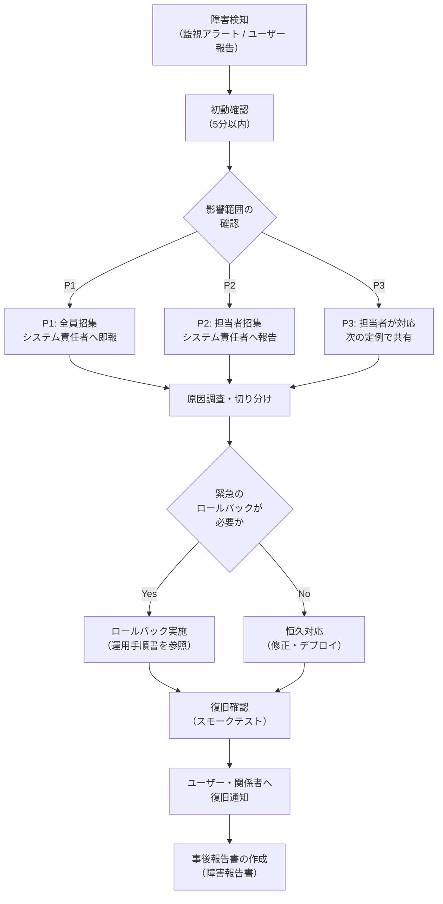

# 障害対応フロー

> **目的：** 障害発生時に冷静かつ迅速に対応できるよう、初動から収束・報告までの手順を標準化する。
> **保管場所：** 障害時にすぐ参照できるよう、チャットツールのブックマークや印刷物として手元に置くこと。

---

## ドキュメント情報

| 項目               | 内容       |
| ------------------ | ---------- |
| **システム名**     |            |
| **文書バージョン** | v1.0       |
| **作成日**         | YYYY-MM-DD |
| **最終更新日**     | YYYY-MM-DD |
| **作成者**         |            |

---

## 緊急連絡先一覧（最初に確認）

| 役割                       | 氏名 | 連絡手段     | 連絡先 | 対応時間                       |
| -------------------------- | ---- | ------------ | ------ | ------------------------------ |
| システム責任者             |      | 電話 / Slack |        | 24時間                         |
| インフラ担当               |      | 電話 / Slack |        | 平日 〇〇〜〇〇 / 緊急時24時間 |
| 開発リーダー               |      | 電話 / Slack |        | 平日 〇〇〜〇〇                |
| クラウド・ベンダーサポート |      | 電話 / Web   |        | 24時間                         |

---

## 障害レベル定義

| レベル           | 定義                                                   | 対応目標時間（RTO）  | 主な対応者                                     |
| ---------------- | ------------------------------------------------------ | -------------------- | ---------------------------------------------- |
| **P1（致命的）** | システム全体が停止、または主要業務が完全に遂行できない | 〇時間以内に復旧     | システム責任者・インフラ担当・開発リーダー全員 |
| **P2（重大）**   | 一部機能が使えないが、回避手段がある                   | 〇営業時間以内に復旧 | インフラ担当 + 開発担当                        |
| **P3（軽微）**   | 影響が一部ユーザーのみ、または表示上の問題             | 次の営業日中に対応   | 開発担当                                       |

---

## 障害対応フロー全体

---

## 1. 障害検知

### 検知パターン

| 検知方法                 | 通知先        | 対応する担当者                    |
| ------------------------ | ------------- | --------------------------------- |
| 監視ツールのアラート     | Slack #alerts | インフラ担当                      |
| ユーザーからの問い合わせ | サポート窓口  | サポート担当 → インフラ担当へ連絡 |
| 社内からの連絡           | 直接連絡      | 受信者がインフラ担当へ連絡        |

---

## 2. 初動確認（5〜10分以内）

| #   | 確認項目                           | 方法                                                        |
| --- | ---------------------------------- | ----------------------------------------------------------- |
| 1   | サービスにアクセスできるか         | ブラウザでURLにアクセス / `curl -I https://〇〇.〇〇.co.jp` |
| 2   | サーバーは起動しているか           | 管理コンソール / `ping`                                     |
| 3   | エラーログに手がかりがあるか       | `tail -n 200 /var/log/app/error.log`                        |
| 4   | DBは応答しているか                 | DB管理ツール / 接続テスト                                   |
| 5   | いつから発生しているか             | 監視ダッシュボードで発生時刻を特定                          |
| 6   | 直近のデプロイ・変更作業はあったか | リリース記録・Git履歴を確認                                 |

---

## 3. 影響範囲の特定

| 確認項目                   | 確認方法                     |
| -------------------------- | ---------------------------- |
| 影響を受けているユーザー数 | 監視ダッシュボード・ログ     |
| 影響を受けている機能・画面 | エラーログ・スタックトレース |
| データの損失・破損の有無   | DBを直接確認                 |
| 外部連携への影響           | 連携先の状態を確認           |

---

## 4. エスカレーション基準

| 状況                           | エスカレーション先                           | タイミング      |
| ------------------------------ | -------------------------------------------- | --------------- |
| P1障害発生                     | システム責任者・全担当者                     | 発見後 **即座** |
| P2障害が〇〇分以内に解決しない | システム責任者                               | 発見後〇〇分    |
| データ損失・漏洩の疑い         | システム責任者・情報セキュリティ担当・経営層 | 発見後 **即座** |
| 原因不明で〇〇分以上解決しない | ベンダーサポートへ問い合わせ                 | 状況に応じて    |

---

## 5. よくある障害パターンと対処

| 症状                          | 考えられる原因                     | 確認方法                             | 対処                                |
| ----------------------------- | ---------------------------------- | ------------------------------------ | ----------------------------------- |
| 画面が表示されない（502/503） | Webサーバー停止 / APサーバー停止   | サーバー状態を確認                   | サービスを再起動する                |
| データベース接続エラー        | DBサーバー停止 / 接続数上限        | DB状態・接続数を確認                 | DBを再起動 / 接続プールをリセット   |
| バッチが失敗する              | バッチのエラー / ディスク容量不足  | バッチログ・ディスク容量を確認       | ログを確認して原因を特定し再実行    |
| 処理が極端に遅い              | 高負荷 / スロークエリ / メモリ不足 | CPU・メモリ・スロークエリログを確認  | スケールアップ / スロークエリを特定 |
| ディスク容量不足              | ログの肥大化 / データ増加          | `df -h` でディスク確認               | 古いログを削除 / ストレージを拡張   |
| SSL証明書エラー               | 証明書の期限切れ                   | `openssl s_client -connect 〇〇:443` | 証明書を更新する                    |

---

## 6. 復旧確認（スモークテスト）

| #   | 確認項目                       | 確認者 | 結果    |
| --- | ------------------------------ | ------ | ------- |
| 1   | トップページが表示される       |        | OK / NG |
| 2   | ログインが正常にできる         |        | OK / NG |
| 3   | 主要な業務操作が一通り動作する |        | OK / NG |
| 4   | エラーログに新たな異常がない   |        | OK / NG |

---

## 7. ユーザーへの通知

| タイミング             | 通知内容                                               | 通知先             | 担当者         |
| ---------------------- | ------------------------------------------------------ | ------------------ | -------------- |
| 障害発生から〇〇分以内 | 「現在〇〇システムに障害が発生しており、対応中です」   | ユーザー全員       | システム責任者 |
| 復旧完了後             | 「〇〇時〇〇分に復旧しました。ご不便をおかけしました」 | ユーザー全員       | システム責任者 |
| 翌営業日まで           | 障害報告書（詳細）                                     | 経営・管理部門・PO | PM             |

---

## 8. 事後対応（障害報告書の作成）

> P1・P2障害は、復旧後〇営業日以内に障害報告書を作成して関係者に共有する。

### 障害報告書テンプレート

| 項目                       | 内容                    |
| -------------------------- | ----------------------- |
| **障害発生日時**           | YYYY-MM-DD HH:MM（JST） |
| **障害復旧日時**           | YYYY-MM-DD HH:MM（JST） |
| **ダウンタイム**           | 〇〇時間〇〇分          |
| **障害レベル**             | P1 / P2 / P3            |
| **影響範囲**               |                         |
| **影響ユーザー数**         | 〇〇名                  |
| **事象の概要**             |                         |
| **根本原因（Root Cause）** |                         |
| **対応内容**               |                         |
| **再発防止策**             |                         |
| **再発防止策の実施期限**   | YYYY-MM-DD              |
| **報告者**                 |                         |
