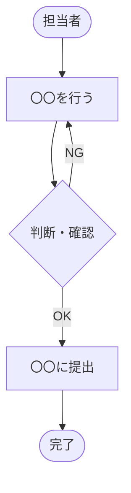

# ヒアリングシート

> **位置づけ：** 要件引き出し（Elicitation）フェーズで使用する。ヒアリング前の準備から記録・合意確認まで一貫して管理する。
> **使い方：** 1回のヒアリングにつき1枚作成する。複数回実施する場合はファイルをコピーして連番をつける。

---

## ドキュメント情報

| 項目               | 内容                                   |
| ------------------ | -------------------------------------- |
| **プロジェクト名** |                                        |
| **ヒアリング回数** | 第 〇 回                               |
| **実施日時**       | YYYY-MM-DD HH:MM〜HH:MM                |
| **実施場所**       | （例）〇〇会議室 / オンライン（Teams） |
| **記録者**         |                                        |
| **作成日**         | YYYY-MM-DD                             |

---

## 1. 参加者

| 所属・役職               | 氏名 | 役割                             |
| ------------------------ | ---- | -------------------------------- |
| （例）発注者・業務担当   |      | ビジネス要件・現状業務の説明     |
| （例）発注者・IT/情シス  |      | 技術的制約・既存システムの説明   |
| （例）受注者・PMまたはSE |      | 要件引き出し・ファシリテーション |
| （例）受注者・記録担当   |      | 議事録・本シートの記録           |

---

## 2. ヒアリング目的・アジェンダ

<!-- 事前にゴールと議題を設定する。ヒアリング当日の冒頭で参加者と共有する。 -->

**今回のゴール：**

<!-- 例）現状の業務フローと課題を把握し、システム化の方向性について合意を得る -->

**アジェンダ：**

| #   | 議題               | 担当 | 時間（目安） |
| --- | ------------------ | ---- | ------------ |
| 1   |                    |      | 〇〇分       |
| 2   |                    |      | 〇〇分       |
| 3   | 次回アクション確認 | 全員 | 5分          |

---

## 3. 事前確認事項

<!-- ヒアリング前に調べておくこと・準備資料を記載する。 -->

| #   | 確認事項                         | 確認方法・参照資料 | 確認済み |
| --- | -------------------------------- | ------------------ | -------- |
| 1   | 組織図・部門構成                 | 発注者から事前入手 | ☐        |
| 2   | 現在使用しているシステム・ツール | 発注者から事前入手 | ☐        |
| 3   | 関連する規程・法規制             | 発注者から事前入手 | ☐        |

---

## 4. 質問リスト

<!-- 引き出し技法：インタビュー（以下）、観察（現場見学）、ワークショップ、プロトタイプ等を組み合わせる。 -->
<!-- ヒアリング中は「なぜ？」を繰り返して表面的な要望の背後にある本質的なニーズを掘り下げる。 -->

### 4.1 背景・目的

| #   | 質問                                                           | 回答・メモ |
| --- | -------------------------------------------------------------- | ---------- |
| 1   | 今回のプロジェクトを始めようと思ったきっかけは何ですか？       |            |
| 2   | このシステムで解決したい最大の課題は何ですか？                 |            |
| 3   | プロジェクトの成功は、1年後にどういう状態で測りますか？（KPI） |            |
| 4   | 経営層・上司からはどのような期待を寄せられていますか？         |            |
| 5   | （自由記述）                                                   |            |

### 4.2 現状の業務（As-Is）

| #   | 質問                                                                     | 回答・メモ |
| --- | ------------------------------------------------------------------------ | ---------- |
| 1   | 現在の業務の流れを順番に教えていただけますか？                           |            |
| 2   | その業務に関わる人（部署・役職）は誰ですか？                             |            |
| 3   | 現状で最も時間・手間がかかっている作業はどれですか？                     |            |
| 4   | ミスや問題が起きやすいポイントはどこですか？                             |            |
| 5   | 現在使用しているシステム・ツール・帳票を教えてください                   |            |
| 6   | 月・週・日のサイクルで発生するイベント（締め日・棚卸し等）はありますか？ |            |
| 7   | （自由記述）                                                             |            |

### 4.3 要求・要件（To-Be）

| #   | 質問                                                                 | 回答・メモ |
| --- | -------------------------------------------------------------------- | ---------- |
| 1   | システムで実現したいことのうち、絶対に必要なものは何ですか？         |            |
| 2   | あると望ましいが、なくても困らないものはありますか？                 |            |
| 3   | スマートフォン・タブレットからの操作は必要ですか？                   |            |
| 4   | 他のシステムとのデータ連携は必要ですか？（連携先・データ内容・頻度） |            |
| 5   | 通知・アラートが必要な場面はありますか？（メール・画面表示等）       |            |
| 6   | 帳票・レポート・CSV出力の必要なものを教えてください                  |            |
| 7   | （自由記述）                                                         |            |

### 4.4 ユーザー・権限

| #   | 質問                                                 | 回答・メモ |
| --- | ---------------------------------------------------- | ---------- |
| 1   | システムを使う人の種類（役割）を教えてください       |            |
| 2   | それぞれ何名くらい使いますか？                       |            |
| 3   | 役割によって見られる情報・できる操作を分けますか？   |            |
| 4   | PCが苦手なユーザーはいますか？ITリテラシーの想定は？ |            |
| 5   | （自由記述）                                         |            |

### 4.5 非機能・制約条件

| #   | 質問                                                                   | 回答・メモ |
| --- | ---------------------------------------------------------------------- | ---------- |
| 1   | 稼働時間帯の要件はありますか？（24時間365日か、平日業務時間帯か）      |            |
| 2   | どのブラウザ・端末に対応する必要がありますか？                         |            |
| 3   | セキュリティ・個人情報保護に関する社内ポリシーや規制はありますか？     |            |
| 4   | 遵守しなければならない法規制はありますか？（労基法・個人情報保護法等） |            |
| 5   | データはどのくらいの期間保存する必要がありますか？                     |            |
| 6   | 予算・スケジュールの上限はありますか？                                 |            |
| 7   | 既存システムとの共存・移行期間の制約はありますか？                     |            |
| 8   | （自由記述）                                                           |            |

### 4.6 優先順位・トレードオフ

<!-- 要求が多い場合、優先度の整理に使う。「AとBが予算内に収まらない場合はどちらを優先しますか？」の形で問う。 -->

| #   | 質問                                                                   | 回答・メモ |
| --- | ---------------------------------------------------------------------- | ---------- |
| 1   | 今回のリリースに間に合わせたい機能と、後でもよい機能を分けるとしたら？ |            |
| 2   | コスト・品質・スケジュールのうち、最も優先するものはどれですか？       |            |
| 3   | 「これだけは絶対に外せない」という条件があれば教えてください           |            |
| 4   | （自由記述）                                                           |            |

---

## 5. ヒアリング記録

<!-- ヒアリング当日はここに記録していく。発言者が特定できる場合は氏名・役職を添える。 -->

### 5.1 主要な発言・決定事項

| #   | 発言者 | 内容 | 種別                             |
| --- | ------ | ---- | -------------------------------- |
| 1   |        |      | 要件 / 制約 / 課題 / 決定 / 懸念 |
| 2   |        |      |                                  |
| 3   |        |      |                                  |

### 5.2 未解決・持ち帰り事項

| #   | 内容 | 担当者 | 回答期限 | ステータス             |
| --- | ---- | ------ | -------- | ---------------------- |
| 1   |      |        |          | 未対応 / 対応中 / 完了 |
| 2   |      |        |          |                        |

### 5.3 引き出した要件（ドラフト）

<!-- ヒアリングで浮かび上がった要件を速報で記録する。後で要件定義書に転記・整理する。 -->

| #   | 要件（ドラフト） | 種別                            | 優先度       | 備考 |
| --- | ---------------- | ------------------------------- | ------------ | ---- |
| 1   |                  | 機能 / 非機能 / 制約 / ビジネス | 高 / 中 / 低 |      |
| 2   |                  |                                 |              |      |

---

## 6. 業務フロー図（ヒアリングで把握した内容）

<!-- ヒアリング中・後にその場で書き起こす。後で要件定義書の3.1節に清書する。 -->

---

## 7. 合意・承認

<!-- ヒアリング終了後、参加者に内容を確認してもらい、齟齬がないことを確認する。 -->
<!-- メールでの確認でも可。「内容に相違があれば〇日以内にご連絡ください」の形が一般的。 -->

| 項目     | 内容                                                    |
| -------- | ------------------------------------------------------- |
| 確認方法 | 本シートをメールで送付 / 次回ヒアリング冒頭で読み合わせ |
| 確認期限 | YYYY-MM-DD                                              |
| 合意状況 | 未確認 / 確認済み（YYYY-MM-DD）                         |

---

## 8. 次回アクション

| #   | アクション               | 担当者 | 期限       |
| --- | ------------------------ | ------ | ---------- |
| 1   |                          |        | YYYY-MM-DD |
| 2   | 次回ヒアリングの日程調整 |        | YYYY-MM-DD |
