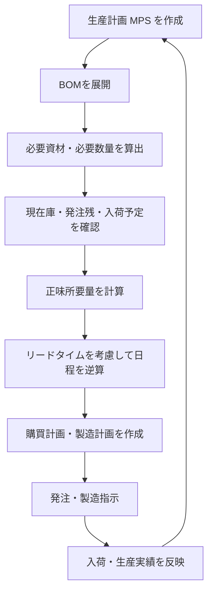

# MRPとは

MRP（Material Requirements Planning：資材所要量計画）は、  
**生産計画を実現するために必要な資材や部品を、必要な量だけ・必要な時期に揃えるための計画手法**です。

完成品の生産予定をもとに、部品構成表（BOM）を展開し、現在庫や発注残、リードタイムを考慮して、  
購買や製造の計画を作成します。

---

## MRPの目的

MRPの主な目的は、次の3つです。

- 必要な資材を必要な時期までに確保する
- 過剰在庫を減らす
- 生産遅延や欠品を防ぐ

---

## MRPで使う主な情報

MRPでは主に以下の情報を使います。

- **生産計画情報（MPS / Master Production Schedule）**
  - 何を、いつまでに、どれだけ作るか
- **部品構成表（BOM / Bill of Materials）**
  - 製品を構成する部品や材料の一覧
- **在庫情報**
  - 現在庫、安全在庫、引当済在庫など
- **入荷予定・発注残**
  - すでに発注している資材や製造予定
- **リードタイム**
  - 発注してから入荷するまで、または製造完了までに必要な日数

---

## MRPの基本的な考え方

MRPは、完成品に必要な部品を順番に分解しながら、  
各部品について「不足する量」と「必要なタイミング」を計算します。

大まかな流れは以下の通りです。

1. 完成品の生産計画を確認する
2. BOMを展開して必要部品を洗い出す
3. 現在庫や入荷予定を差し引く
4. 不足分を求める
5. リードタイムを逆算して、発注日や製造開始日を決める

---

## 流れ

