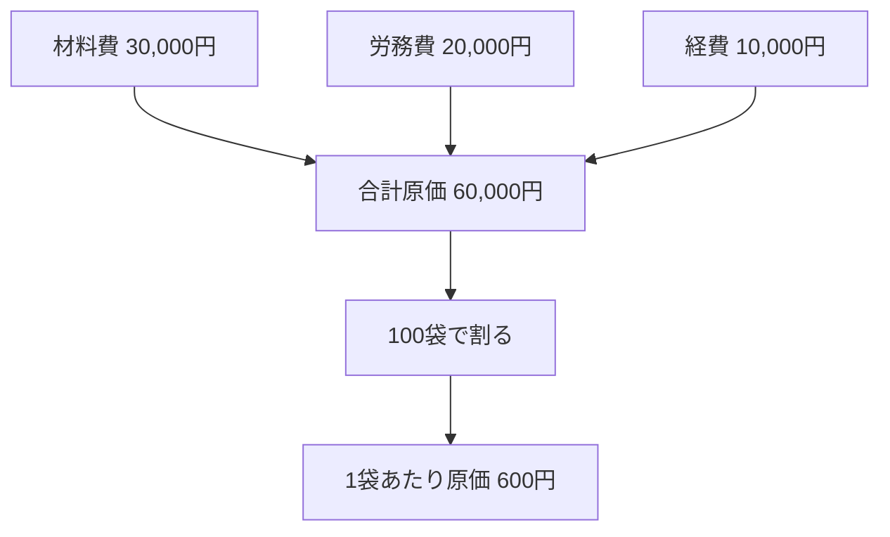
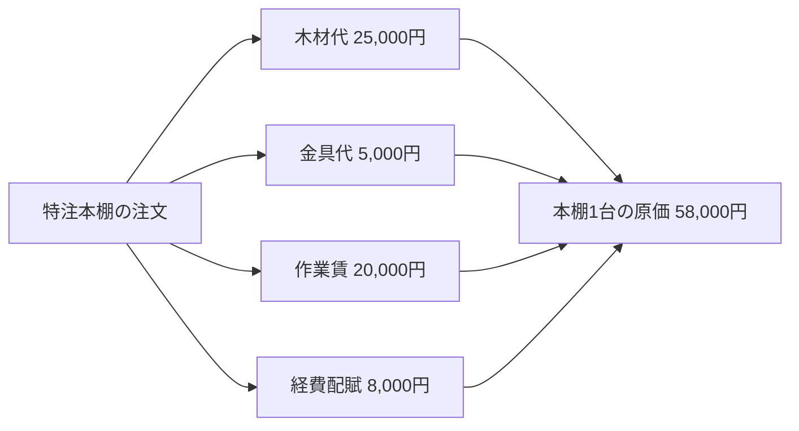
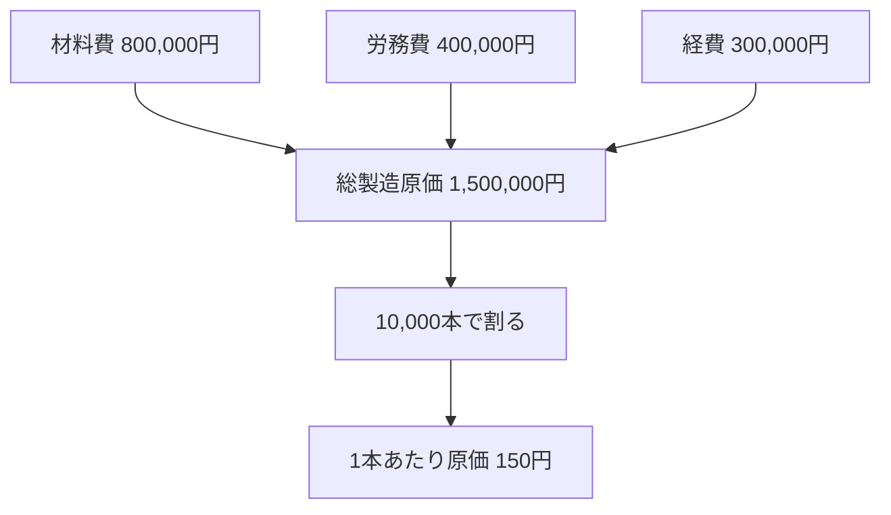
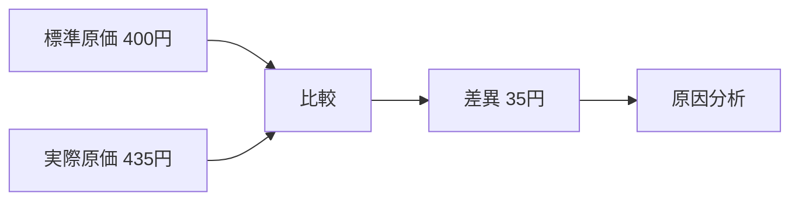
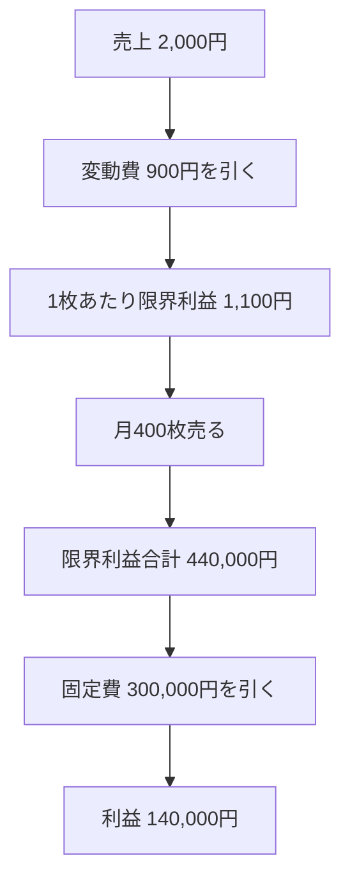
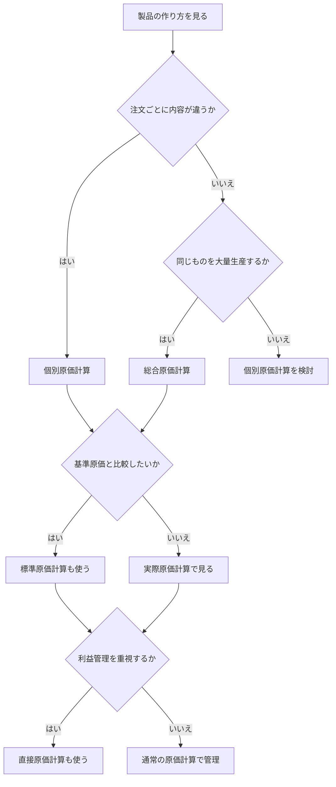

# 原価計算の具体例つきメモ

## 1. 原価計算とは

原価計算は、  
**「その製品を作るのにいくらかかったのかを計算すること」**  
です。

たとえば、製品を作るときには次のようなお金がかかります。

- 材料費
- 労務費
- 経費

---

## 2. まずは一番シンプルな例

### 例: クッキー100袋を作る

1か月でクッキーを100袋作ったとします。

- 小麦粉・砂糖・バターなどの材料費: 30,000円
- 作業した人の人件費: 20,000円
- オーブンの電気代や包装代などの経費: 10,000円

合計は

`30,000 + 20,000 + 10,000 = 60,000円`

100袋作ったので、

`1袋あたり原価 = 60,000円 ÷ 100袋 = 600円`

になります。

---

## 3. 原価計算の流れをクッキーで見る

---

## 4. 個別原価計算の具体例

個別原価計算は、  
**注文ごとに別々に原価を計算する方法** です。

### 例: オーダーメイド本棚

お客さんから「特注の本棚を1台作ってください」と注文を受けたとします。

この本棚1台にかかった費用が次の通りです。

- 木材代: 25,000円
- 金具代: 5,000円
- 職人の作業時間 10時間 × 2,000円 = 20,000円
- 工房の電気代や工具消耗などの経費配賦: 8,000円

合計は

`25,000 + 5,000 + 20,000 + 8,000 = 58,000円`

この本棚1台の原価は **58,000円** です。

### ポイント
この場合は「本棚A」と「本棚B」で仕様が違うので、  
**1件ずつ別々に計算する** のが自然です。

### 向いている製品例
- オーダーメイド家具
- 特注機械
- 建設工事
- 試作品

---

## 5. 総合原価計算の具体例

総合原価計算は、  
**同じ製品をたくさん作るときにまとめて計算する方法** です。

### 例: ペットボトル飲料

1か月で同じお茶を10,000本作ったとします。

- 茶葉や水、容器などの材料費: 800,000円
- 工場作業員の労務費: 400,000円
- 工場の電気代や機械の減価償却費などの経費: 300,000円

合計は

`800,000 + 400,000 + 300,000 = 1,500,000円`

10,000本作ったので、

`1本あたり原価 = 1,500,000円 ÷ 10,000本 = 150円`

になります。

### ポイント
この場合、お茶1本ごとに個別管理するより、  
**期間全体でまとめて計算する** ほうが自然です。

### 向いている製品例
- 飲料
- お菓子
- 紙
- 化学製品
- ネジや部品の大量生産

---

## 6. 標準原価計算の具体例

標準原価計算は、  
**本来これくらいで作れるはずという基準を先に決めておく方法** です。

### 例: お弁当1個

お弁当1個の標準原価を次のように決めたとします。

- ごはん・おかず材料: 250円
- 調理・盛り付けの人件費: 100円
- 容器代・光熱費など: 50円

標準原価は

`250 + 100 + 50 = 400円`

です。

ところが実際には、

- 材料費: 270円
- 人件費: 110円
- 経費: 55円

かかったとすると、実際原価は

`270 + 110 + 55 = 435円`

です。

差異は

`435円 - 400円 = 35円`

になります。

### このとき考えること
- 材料が高くなったのか
- 作業時間が長引いたのか
- 包装や光熱費が増えたのか

を分析して改善します。

### 向いている製品例
- 食品
- 日用品
- 毎日同じように作る工業製品

---

## 7. 直接原価計算の具体例

直接原価計算は、  
**変動費と固定費を分けて利益を見やすくする方法** です。

### 例: Tシャツ販売

Tシャツ1枚を販売するとします。

- 販売価格: 2,000円

1枚売れるごとに増える費用（変動費）
- 生地代: 500円
- 印刷代: 300円
- 包装代: 100円

変動費合計は

`500 + 300 + 100 = 900円`

なので、

`限界利益 = 2,000円 - 900円 = 1,100円`

です。

ここから、毎月固定でかかる費用を引きます。

- 店舗家賃: 100,000円
- 正社員給料: 150,000円
- 固定の広告費: 50,000円

固定費合計は

`300,000円`

もし1か月に400枚売れたら、

`限界利益合計 = 1,100円 × 400枚 = 440,000円`

最終利益は

`440,000円 - 300,000円 = 140,000円`

になります。

### ポイント
この方法は、  
**何枚売れば黒字になるか** を考えるときに便利です。

---

## 8. 4つの方法を製品例で見比べる

| 方法         | どんな考え方か                         | 製品例                        |
| ------------ | -------------------------------------- | ----------------------------- |
| 個別原価計算 | 注文ごとに計算する                     | 特注本棚、注文住宅、試作品    |
| 総合原価計算 | 同じ製品をまとめて計算する             | お茶、クッキー、紙、ネジ      |
| 標準原価計算 | 先に基準を決めて差を見る               | お弁当、食品、量産品          |
| 直接原価計算 | 利益管理のために変動費と固定費を分ける | Tシャツ、カフェ商品、通販商品 |

---

## 9. どれを選べばよいか

---

## 10. 最後にかなり簡単にまとめると

### 個別原価計算
**特注本棚みたいに、1件ずつ違うものを作るときの計算**

### 総合原価計算
**ペットボトル飲料みたいに、同じものを大量に作るときの計算**

### 標準原価計算
**お弁当みたいに、基準を決めて実際との差を見る計算**

### 直接原価計算
**Tシャツ販売みたいに、利益を見やすくするための計算**

---

## 11. 参考リンク

- [企業会計審議会 原価計算基準（ASBJ）](https://www.asb-j.jp/jp/accounting_standards_system/details.html?topics_id=156)
- [企業会計原則・同注解（ASBJ）](https://www.asb-j.jp/jp/accounting_standards_system/details.html?topics_id=81)
- [棚卸資産の評価に関する会計基準（ASBJ）](https://www.asb-j.jp/jp/accounting_standards_system/details.html?topics_id=24)
- [中小企業庁 直接原価方式による損益計算書の作成・計算手順](https://www.chusho.meti.go.jp/bcp/contents/level_c/bcpgl_05c_4_3.html)
