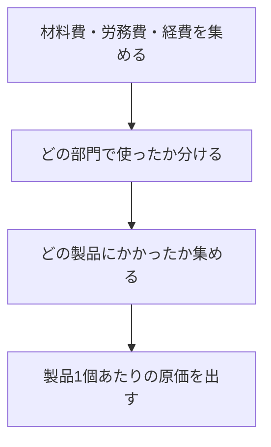
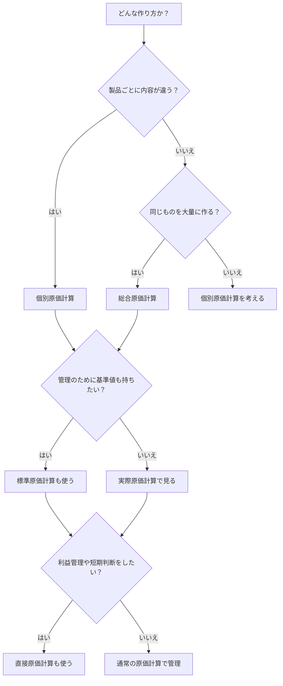
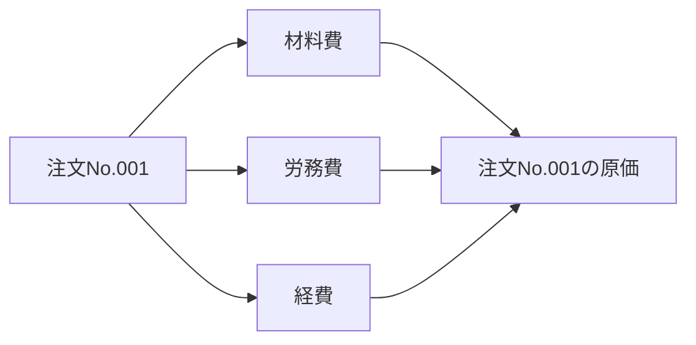
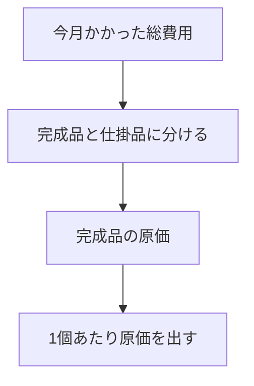
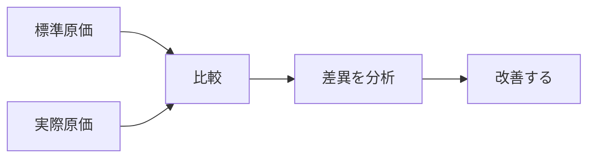
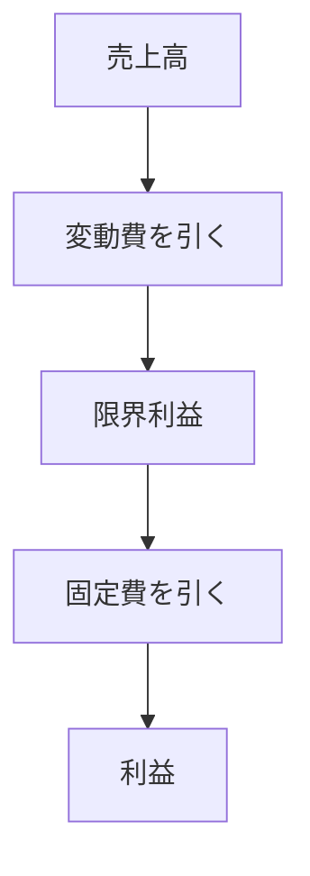
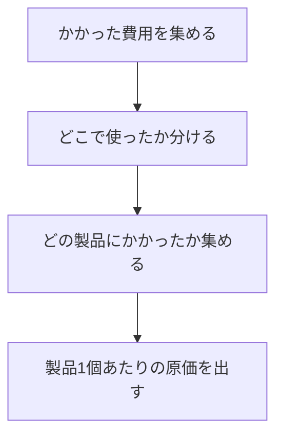

# 原価計算をざっくり理解するメモ

## 1. まず一言でいうと

原価計算は、  
**「製品を作るのにかかったお金を、順番に集めて、最後に製品1個あたりいくらかを出すこと」**  
です。

たとえば、作るのにかかったものを大きく分けると次の3つです。

- 材料費
- 労務費（人件費）
- 経費（電気代・減価償却費・外注費など）

---

## 2. いちばん大事な全体像

---

## 3. 3ステップで考える

### ステップ1: 費目別計算
まずは、かかったお金を種類ごとに分けます。

- 材料費
- 労務費
- 経費

### ステップ2: 部門別計算
次に、その費用がどの部門で発生したかを分けます。

- 製造1課
- 製造2課
- 組立部門
- 検査部門
- 修繕部門

### ステップ3: 製品別計算
最後に、その部門の費用を製品に割り当てます。

- 製品Aにいくらかかったか
- 製品Bにいくらかかったか

---

## 4. いちばん簡単なイメージ

たとえば1か月で次の費用がかかったとします。

- 材料費: 100万円
- 労務費: 50万円
- 経費: 30万円

合計は

`180万円`

この月に完成した製品が100個なら、

`1個あたり原価 = 180万円 ÷ 100個 = 1.8万円`

というイメージです。

---

## 5. 原価計算の代表的な方法

原価計算にはいくつか方法がありますが、最初は次の4つだけ押さえると分かりやすいです。

- 個別原価計算
- 総合原価計算
- 標準原価計算
- 直接原価計算

---

## 6. どれを使うのかの見分け方

---

## 7. それぞれを超ざっくり説明

### 7-1. 個別原価計算
**1件ごと・注文ごとに原価を集める方法** です。

向いているもの:
- 特注品
- オーダーメイド
- 工事
- 試作品

イメージ:
- A社向けの機械1台
- B社向けの機械1台

この2台は別物なので、  
**案件ごとに別々に原価を集める** ほうが自然です。

---

### 7-2. 総合原価計算
**同じものを大量に作るときに、期間全体でまとめて原価を集める方法** です。

向いているもの:
- 飲料
- 食品
- 紙
- 化学製品
- 同一部品の大量生産

イメージ:
- 今月かかった総費用 = 500万円
- 今月完成した数量 = 1,000個

すると

`1個あたり原価 = 500万円 ÷ 1,000個 = 5,000円`

となります。

---

### 7-3. 標準原価計算
**あらかじめ「本来これくらいで作れるはず」という基準原価を決めておく方法** です。

目的:
- 原価管理
- 予算管理
- 差異分析

イメージ:
- 本来は1個1,000円で作れるはず
- 実際は1個1,100円かかった

すると

`差異 = 1,100円 - 1,000円 = 100円`

となり、  
**なぜ高くなったのか** を分析します。

---

### 7-4. 直接原価計算
**変動費と固定費を分けて、まず変動費だけで利益を見やすくする方法** です。

よく見る形:

`売上高 - 変動費 = 限界利益`

そのあとで

`限界利益 - 固定費 = 利益`

と考えます。

向いている場面:
- 利益管理
- 採算判断
- 損益分岐点分析
- 短期の意思決定

---

## 8. 実際原価計算と標準原価計算の違い

### 実際原価計算
実際にかかった金額で計算する方法です。

- 実績ベース
- 財務会計とつながりやすい
- 確定まで少し時間がかかることがある

### 標準原価計算
先に基準を決めておいて、実際との差をみる方法です。

- 管理しやすい
- 改善しやすい
- 予算とつなげやすい

---

## 9. 最低限の覚え方

迷ったら、次のように覚えると整理しやすいです。

### 個別原価計算
**バラバラな製品を、1件ずつ計算する**

### 総合原価計算
**同じ製品を、まとめて計算する**

### 標準原価計算
**先に基準を決めて、実際との差を見る**

### 直接原価計算
**変動費と固定費を分けて、利益を見やすくする**

---

## 10. まずはここだけ覚えればOK

原価計算の本質は、まずこの1本です。

つまり、

- **何の費用か分ける**
- **どの部門か分ける**
- **どの製品か分ける**

この順番で考えれば、原価計算の大枠はつかめます。

---

## 11. 参考リンク

- [企業会計審議会 原価計算基準（ASBJ）](https://www.asb-j.jp/jp/accounting_standards_system/details.html?topics_id=156)
- [企業会計原則・同注解（ASBJ）](https://www.asb-j.jp/jp/accounting_standards_system/details.html?topics_id=81)
- [棚卸資産の評価に関する会計基準（ASBJ）](https://www.asb-j.jp/jp/accounting_standards_system/details.html?topics_id=24)
- [中小企業庁 直接原価方式による損益計算書の作成・計算手順](https://www.chusho.meti.go.jp/bcp/contents/level_c/bcpgl_05c_4_3.html)
